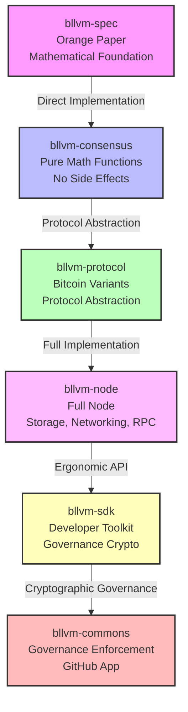
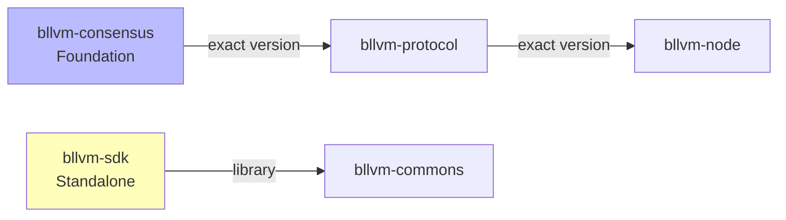
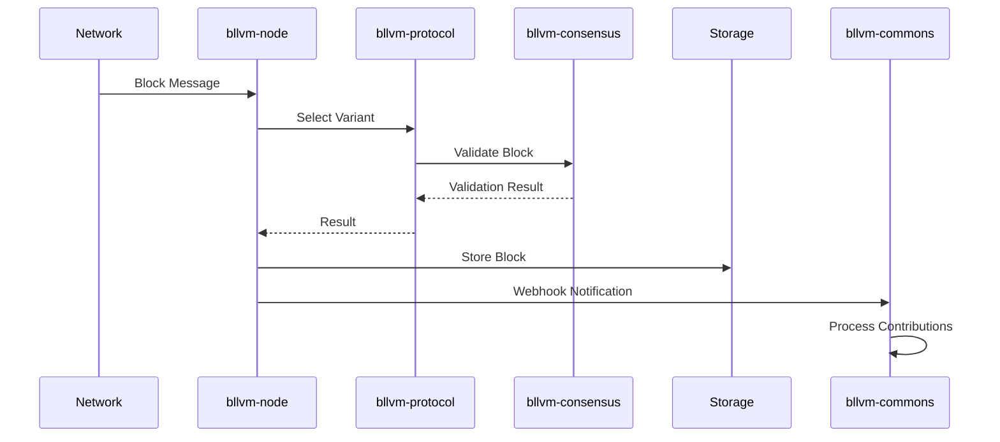
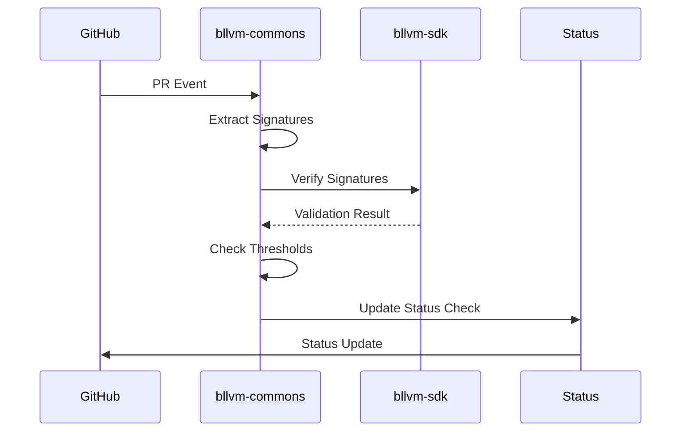

# Bitcoin Commons Architecture

## Overview

Bitcoin Commons implements a 6-tier layered architecture that builds from mathematical foundations to full implementation with cryptographic governance.

## Architecture Stack

## Tier Descriptions

### Tier 1: bllvm-spec

**Purpose**: Mathematical foundation defining Bitcoin consensus rules.

**Repository**: `bllvm-spec/`

**Type**: Documentation and specification (Orange Paper)

**Key Characteristics**:
- Timeless consensus rules
- Mathematical specifications
- No implementation dependencies

**Governance**: Layer 1 (Constitutional - 6-of-7 maintainers, 180 days)

---

### Tier 2: bllvm-consensus

**Purpose**: Pure mathematical implementation of Orange Paper functions.

**Repository**: `bllvm-consensus/`

**Type**: Rust library (pure functions, no side effects)

**Key Functions**:
- `CheckTransaction`: Transaction structure validation
- `ConnectBlock`: Block connection and validation
- `EvalScript`: Script execution engine
- `VerifyScript`: Script verification
- `GetBlockSubsidy`: Block reward calculation
- `GetNextWorkRequired`: Difficulty adjustment
- `CheckProofOfWork`: PoW verification

**Dependencies**: None (foundation layer)

**Governance**: Layer 2 (Constitutional - 6-of-7 maintainers, 180 days)

**Formal Verification**: Kani model checking, property-based testing

---

### Tier 3: bllvm-protocol

**Purpose**: Protocol abstraction layer enabling multiple Bitcoin variants.

**Repository**: `bllvm-protocol/`

**Type**: Rust library

**Supported Variants**:
- BitcoinV1 (mainnet)
- Testnet3
- Regtest

**Key Components**:
- Network parameter abstraction
- Protocol version management
- Variant-specific validation rules
- Genesis block definitions

**Dependencies**: `bllvm-consensus` (exact version)

**Governance**: Layer 3 (Implementation - 4-of-5 maintainers, 90 days)

---

### Tier 4: bllvm-node

**Purpose**: Full Bitcoin node implementation.

**Repository**: `bllvm-node/`

**Type**: Rust binary (full node)

**Components**:
- Block validation and storage
- UTXO set management
- P2P networking
- RPC server
- Mining support
- Module system

**Storage Backends**:
- Redb (default, production)
- Sled (legacy, deprecated)

**Dependencies**: `bllvm-protocol`, `bllvm-consensus` (exact versions)

**Governance**: Layer 4 (Application - 3-of-5 maintainers, 60 days)

---

### Tier 5: bllvm-sdk

**Purpose**: Developer toolkit for governance and module composition.

**Repository**: `bllvm-sdk/`

**Type**: Rust library and CLI tools

**Components**:
- Governance cryptographic primitives
- Key generation and management
- Message signing and verification
- Multisig operations
- Binary signing tools
- Module composition framework

**CLI Tools**:
- `bllvm-keygen`: Generate governance keypairs
- `bllvm-sign`: Sign governance messages
- `bllvm-verify`: Verify signatures
- `bllvm-sign-binary`: Sign binaries and checksums
- `bllvm-verify-binary`: Verify binary signatures
- `bllvm-aggregate-signatures`: Aggregate multisig signatures
- `bllvm-compose`: Compose module configurations

**Dependencies**: Standalone (no consensus dependencies)

**Governance**: Layer 5 (Extension - 2-of-3 maintainers, 14 days)

---

### Tier 6: bllvm-commons

**Purpose**: Cryptographic governance enforcement engine.

**Repository**: `bllvm-commons/`

**Type**: Rust service (GitHub App)

**Components**:
- GitHub integration (webhooks, status checks)
- Signature verification
- Economic node registry
- Veto signal collection
- Governance fork tracking
- Audit logging
- Nostr integration (transparency)
- OpenTimestamps integration (anchoring)

**Dependencies**: `bllvm-sdk`

**Governance**: Layer 5 (Extension - 2-of-3 maintainers, 14 days)

---

## Dependency Graph

**Build Order**:
1. `bllvm-consensus` (foundation)
2. `bllvm-sdk` (parallel with consensus)
3. `bllvm-protocol` (depends on consensus)
4. `bllvm-node` (depends on protocol + consensus)
5. `bllvm-commons` (depends on SDK)

---

## Component Interaction

### Data Flow

**Block Processing**:

**Governance Flow**:

### Integration Points

**bllvm-node ↔ bllvm-commons**:
- Block webhook: `bllvm-node` notifies `bllvm-commons` of new blocks
- Node registry: Nodes register Bitcoin addresses for fee forwarding attribution

**bllvm-commons ↔ bllvm-sdk**:
- Cryptographic operations: Signing, verification, multisig
- Key management: Key generation and rotation

**bllvm-node ↔ bllvm-protocol**:
- Protocol abstraction: Network variant selection
- Validation delegation: Protocol-specific rules

**bllvm-protocol ↔ bllvm-consensus**:
- Consensus validation: All consensus decisions delegated to consensus layer
- Pure function calls: No side effects, deterministic results

---

## Design Principles

### Separation of Concerns

Each tier has a single, well-defined responsibility:
- **Tier 1**: Mathematical specification
- **Tier 2**: Mathematical implementation
- **Tier 3**: Protocol abstraction
- **Tier 4**: Infrastructure and orchestration
- **Tier 5**: Developer tooling
- **Tier 6**: Governance enforcement

### Dependency Direction

Dependencies flow downward only:
- Higher tiers depend on lower tiers
- Lower tiers never depend on higher tiers
- Enables independent evolution of tiers

### Formal Verification

Consensus-critical code (Tier 2) uses:
- Kani model checking for mathematical proofs
- Property-based testing for edge case discovery
- Comprehensive test coverage

### Governance Model

Each tier has governance requirements:
- Lower tiers (1-2): Constitutional (6-of-7, 180 days)
- Middle tiers (3-4): Implementation (3-5 of 5, 60-90 days)
- Upper tiers (5-6): Extension (2-of-3, 14 days)

---

## Related Documentation

- [Integration Guide](INTEGRATION.md) - Cross-repo integration details
- [Deployment Guide](DEPLOYMENT.md) - Multi-component deployment
- [Configuration Guide](CONFIGURATION.md) - Unified configuration
- Component-specific docs in each repository's `docs/` directory
