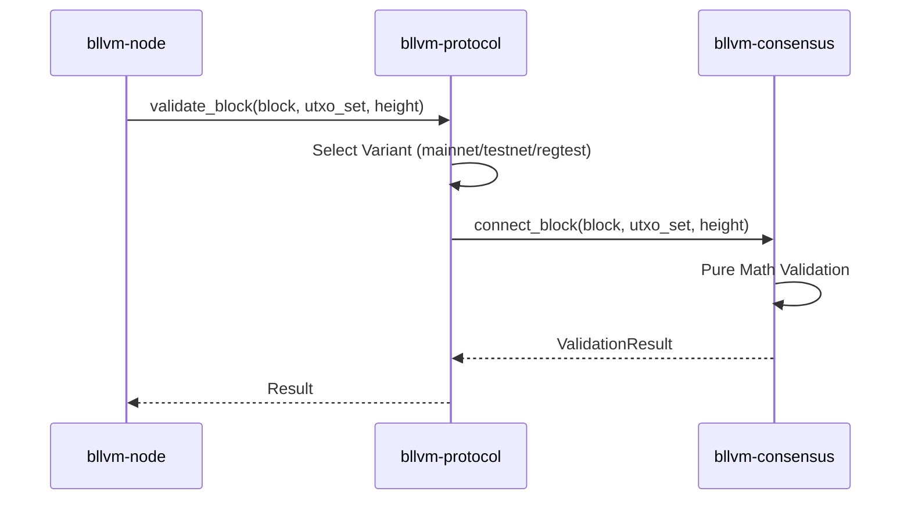
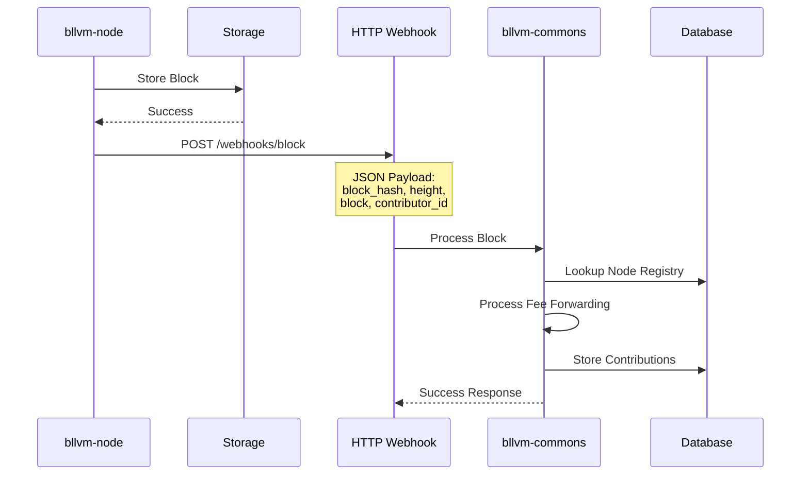
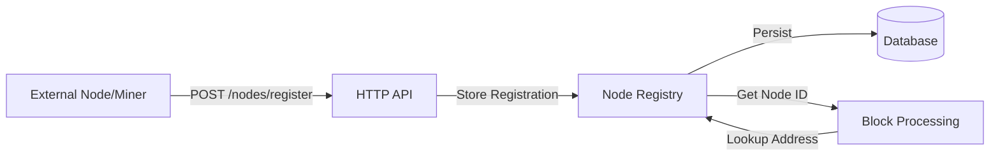
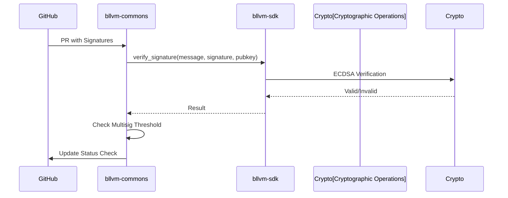
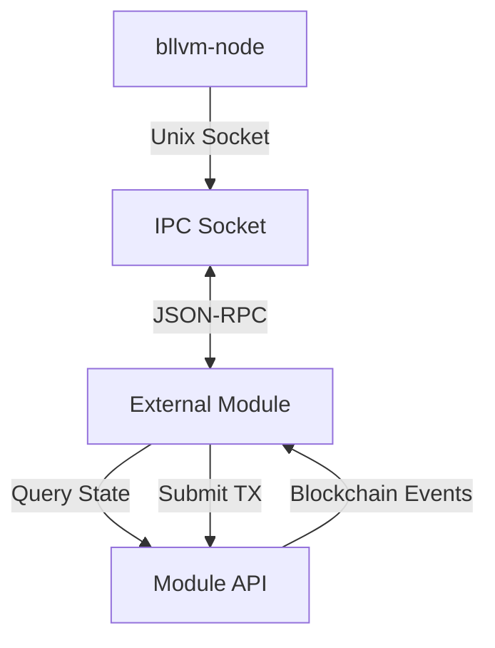
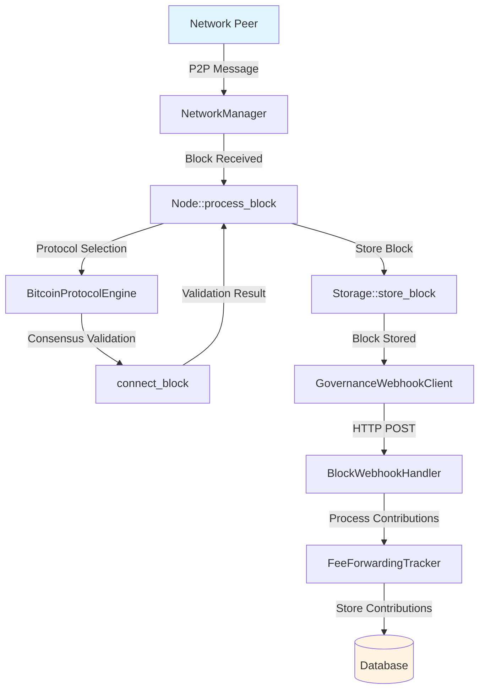
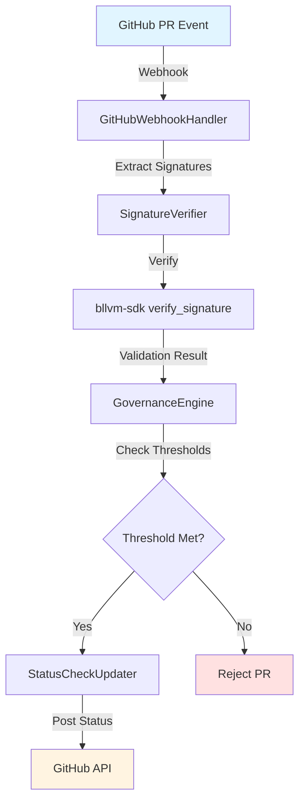

# Cross-Repository Integration

## Overview

Bitcoin Commons components integrate through well-defined interfaces and protocols. This document describes integration points, data flows, and interaction patterns.

## Integration Patterns

### 1. Consensus Validation Integration

**Pattern**: `bllvm-node` → `bllvm-protocol` → `bllvm-consensus`



**Flow**:
1. `bllvm-node` receives block from network
2. `bllvm-protocol` selects appropriate variant (mainnet/testnet/regtest)
3. `bllvm-consensus` performs pure mathematical validation
4. Results flow back through layers

**Interface**: Pure function calls, no side effects

---

### 2. Governance Webhook Integration

**Pattern**: `bllvm-node` → `bllvm-commons` (HTTP webhook)



**Flow**:
1. `bllvm-node` validates and stores block
2. `bllvm-node` sends HTTP POST to `bllvm-commons` webhook endpoint
3. `bllvm-commons` processes block for fee forwarding tracking
4. `bllvm-commons` looks up node ID from node registry
5. Contributions attributed to registered node

**Endpoint**: `POST /webhooks/block`

**Payload**:
```json
{
  "block_hash": "hex-encoded-block-hash",
  "block_height": 123456,
  "block": { /* bllvm_protocol::Block as JSON */ },
  "contributor_id": "node-id-001"
}
```

**Configuration**:
- `bllvm-node`: `governance.webhook_url`, `governance.node_id`
- `bllvm-commons`: Receives webhook, processes block

---

### 3. Node Registry Integration

**Pattern**: External nodes → `bllvm-commons` (HTTP API)



**Flow**:
1. Node/miner registers with `bllvm-commons` via API
2. Node provides Bitcoin addresses for fee forwarding
3. `bllvm-commons` stores registration in database
4. When blocks are processed, addresses are looked up
5. Contributions attributed to registered node

**Endpoints**:
- `POST /nodes/register` - Register node
- `GET /nodes/:node_id` - Get node details
- `GET /nodes` - List all nodes

**Database Schema**:
- `node_registry` table: Node registrations
- `address_to_node` table: Fast address lookup

---

### 4. Cryptographic Operations Integration

**Pattern**: `bllvm-commons` → `bllvm-sdk` (library calls)



**Flow**:
1. `bllvm-commons` receives governance action (PR approval, etc.)
2. `bllvm-commons` uses `bllvm-sdk` for signature verification
3. `bllvm-sdk` performs cryptographic operations
4. Results returned to `bllvm-commons` for decision making

**Operations**:
- Signature verification: `bllvm_sdk::governance::verify_signature()`
- Multisig validation: `bllvm_sdk::governance::validate_multisig()`
- Key management: `bllvm_sdk::governance::GovernanceKeypair`

---

### 5. Module System Integration

**Pattern**: External modules → `bllvm-node` (IPC/API)



**Flow**:
1. Module registers with `bllvm-node` module system
2. Module receives blockchain events via IPC
3. Module can query blockchain state via API
4. Module can submit transactions via API

**Interfaces**:
- IPC protocol: JSON-RPC over Unix sockets
- API: Rust trait-based (`ModuleApi`, `BlockchainApi`)
- Security: Process sandboxing, resource limits

---

## Data Flow Diagrams

### Block Processing Flow



### Governance Flow



---

## Interface Contracts

### Consensus Interface

**Provider**: `bllvm-consensus`

**Consumer**: `bllvm-protocol`, `bllvm-node`

**Contract**:
- Pure functions: No side effects, deterministic
- Error handling: Returns `Result<T, ConsensusError>`
- Thread safety: All functions are thread-safe
- Performance: Optimized for production use

### Protocol Interface

**Provider**: `bllvm-protocol`

**Consumer**: `bllvm-node`

**Contract**:
- Variant abstraction: Supports multiple Bitcoin variants
- Network parameters: Variant-specific constants
- Genesis blocks: Variant-specific genesis
- Validation delegation: Delegates to consensus layer

### Governance Interface

**Provider**: `bllvm-sdk`

**Consumer**: `bllvm-commons`

**Contract**:
- Cryptographic operations: Signing, verification, multisig
- Key management: Generation, storage, rotation
- Message formats: Standardized governance messages
- Thread safety: All operations are thread-safe

---

## Error Handling

### Consensus Errors

Consensus validation errors propagate upward:
- `bllvm-consensus` returns `ConsensusError`
- `bllvm-protocol` wraps in `ProtocolError`
- `bllvm-node` handles and logs

### Network Errors

Network errors are handled at the node level:
- Connection failures: Retry with exponential backoff
- Protocol errors: Log and disconnect peer
- Timeout errors: Retry or mark peer as unreachable

### Governance Errors

Governance errors are handled gracefully:
- Signature verification failures: Log and reject
- Multisig threshold not met: Update status check
- Database errors: Log and continue (non-critical)

---

## Configuration Integration

### Unified Configuration

Components share configuration through:
- Environment variables: `GOVERNANCE_WEBHOOK_URL`, `DATABASE_URL`
- Config files: Component-specific TOML/JSON
- Default values: Sensible defaults for all options

### Configuration Hierarchy

1. Default values (built-in)
2. Config file (component-specific)
3. Environment variables (override)
4. Command-line arguments (highest priority)

---

## Testing Integration

### Integration Test Patterns

**Component Integration Tests**:
- Test component interactions in isolation
- Mock dependencies where appropriate
- Verify interface contracts

**End-to-End Tests**:
- Test full system workflows
- Use test fixtures and test data
- Verify cross-component behavior

**Property-Based Tests**:
- Test component interactions with random data
- Discover edge cases in integration
- Verify invariants hold across components

---

## Related Documentation

- [Architecture](ARCHITECTURE.md) - System architecture overview
- [Deployment](DEPLOYMENT.md) - Deployment configuration
- [Configuration](CONFIGURATION.md) - Configuration details
- Component-specific integration docs in each repository
