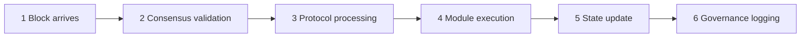

```mermaid
flowchart LR
  A["1 Block arrives"] --> B["2 Consensus validation"]
  B --> C["3 Protocol processing"]
  C --> D["4 Module execution"]
  D --> E["5 State update"]
  E --> F["6 Governance logging"]
```
