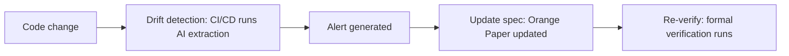

```mermaid
flowchart LR
  C[Code change] --> D["Drift detection: CI/CD runs AI extraction"]
  D --> A[Alert generated]
  A --> U["Update spec: Orange Paper updated"]
  U --> R["Re-verify: formal verification runs"]
```
