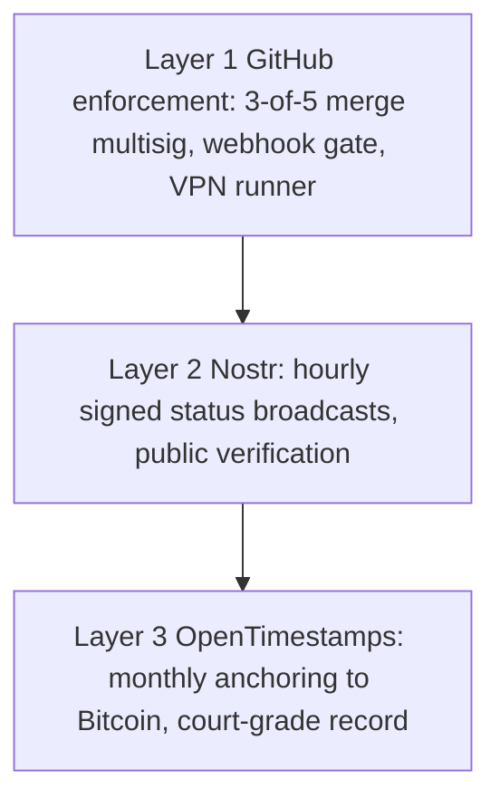

```mermaid
flowchart TB
  G["Layer 1 GitHub enforcement: 3-of-5 merge multisig, webhook gate, VPN runner"]
  N["Layer 2 Nostr: hourly signed status broadcasts, public verification"]
  O["Layer 3 OpenTimestamps: monthly anchoring to Bitcoin, court-grade record"]
  G --> N --> O
```
