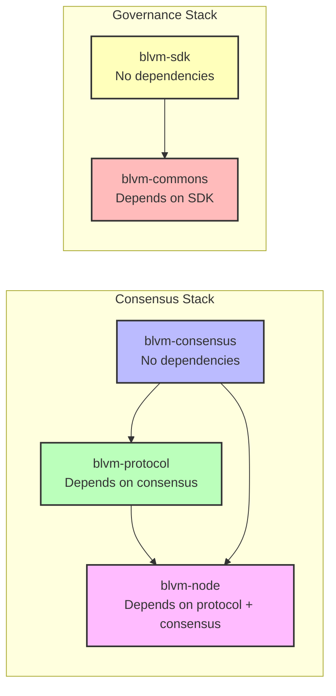
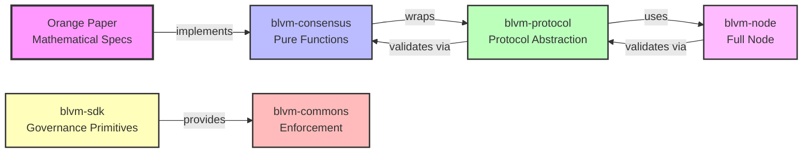

# Component Relationships

BLVM implements a 6-tier layered architecture where each tier builds upon the previous one.

## Dependency Graph

## Layer Descriptions

### Tier 1: [Orange Paper](../reference/orange-paper.md) (blvm-spec)
- **Purpose**: Mathematical foundation - timeless consensus rules
- **Type**: Documentation and specification
- **Governance**: Layer 1 (Constitutional - 6-of-7 maintainers, 180 days, see [Layer-Tier Model](../governance/layer-tier-model.md))

### Tier 2: [Consensus Layer](../consensus/overview.md) (blvm-consensus)
- **Purpose**: Pure mathematical implementation of [Orange Paper](../reference/orange-paper.md) functions
- **Type**: Rust library (pure functions, no side effects)
- **Dependencies**: None (foundation layer)
- **Governance**: Layer 2 (Constitutional - 6-of-7 maintainers, 180 days, see [Layer-Tier Model](../governance/layer-tier-model.md))
- **Key Functions**: CheckTransaction, ConnectBlock, EvalScript, VerifyScript

### Tier 3: [Protocol Layer](../protocol/overview.md) (blvm-protocol)
- **Purpose**: Protocol abstraction layer for multiple Bitcoin variants
- **Type**: Rust library
- **Dependencies**: [blvm-consensus](../consensus/overview.md) (exact version)
- **Governance**: Layer 3 (Implementation - 4-of-5 maintainers, 90 days, see [Layer-Tier Model](../governance/layer-tier-model.md))
- **Supports**: mainnet, testnet, regtest, and additional protocol variants

### Tier 4: [Node Implementation](../node/overview.md) (blvm-node)
- **Purpose**: Minimal, production-ready Bitcoin implementation
- **Type**: Rust binaries (full node)
- **Dependencies**: [blvm-protocol](../protocol/overview.md), [blvm-consensus](../consensus/overview.md) (exact versions)
- **Governance**: Layer 4 (Application - 3-of-5 maintainers, 60 days, see [Layer-Tier Model](../governance/layer-tier-model.md))
- **Components**: Block validation, [storage](../node/storage-backends.md), [P2P networking](../node/transport-abstraction.md), [RPC](../node/rpc-api.md), [mining](../node/mining.md)

### Tier 5: [Developer SDK](../sdk/overview.md) (blvm-sdk)
- **Purpose**: Developer toolkit and governance cryptographic primitives
- **Type**: Rust library and CLI tools
- **Dependencies**: Standalone (no consensus dependencies)
- **Governance**: Layer 5 (Extension - 2-of-3 maintainers, 14 days, see [Layer-Tier Model](../governance/layer-tier-model.md))
- **Components**: Key generation, signing, verification, [multisig operations](../governance/multisig-configuration.md)

### Tier 6: Governance Infrastructure (blvm-commons)
- **Purpose**: Cryptographic governance enforcement
- **Type**: Rust service (GitHub App)
- **Dependencies**: blvm-sdk
- **Governance**: Layer 5 (Extension - 2-of-3 maintainers, 14 days)
- **Components**: GitHub integration, signature verification, status checks

## Data Flow

*Figure: End-to-end data flow through Reference Node, Consensus Proof, Protocol Engine, modules, and governance.*

1. **Orange Paper** provides mathematical consensus specifications
2. **blvm-consensus** directly implements mathematical functions
3. **blvm-protocol** wraps blvm-consensus with protocol-specific parameters
4. **blvm-node** uses blvm-protocol and blvm-consensus for validation
5. **blvm-sdk** provides governance primitives
6. **blvm-commons** uses blvm-sdk for cryptographic operations

## Cross-Layer Validation

- Dependencies between layers are strictly enforced
- Consensus rule modifications are prevented in application layers
- Equivalence proofs required between [Orange Paper](../reference/orange-paper.md) and [blvm-consensus](../consensus/overview.md)
- Version coordination ensures compatibility across layers

## See Also

- [System Overview](system-overview.md) - High-level architecture overview
- [Design Philosophy](design-philosophy.md) - Core design principles
- [Consensus Architecture](../consensus/architecture.md) - Consensus layer details
- [Protocol Architecture](../protocol/architecture.md) - Protocol layer details
- [Node Overview](../node/overview.md) - Node implementation details

