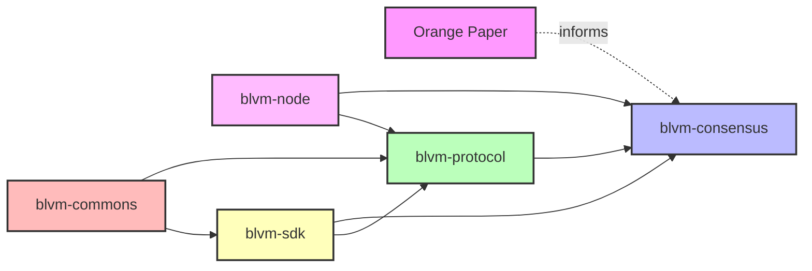
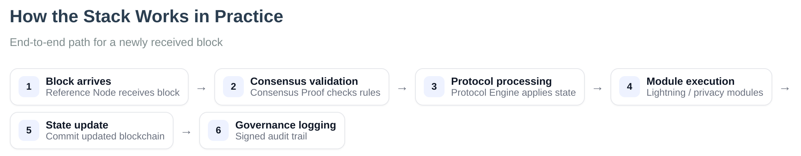

# Component Relationships

BLVM implements a 6-tier layered architecture where each tier builds upon the previous one.

## Dependency Graph

Edges point **from a crate toward a crate it depends on** (library import direction). The Orange Paper is not a Rust crate; it **informs** consensus (dotted).

```mermaid
flowchart LR
    OP[Orange Paper]
    C[blvm-consensus]
    P[blvm-protocol]
    N[blvm-node]
    S[blvm-sdk]
    G[blvm-commons]

    OP -.->|informs| C
    P --> C
    N --> P
    N --> C
    S --> P
    S --> C
    G --> S
    G --> P

    style OP fill:#f9f,stroke:#333,stroke-width:2px
    style C fill:#bbf,stroke:#333,stroke-width:2px
    style P fill:#bfb,stroke:#333,stroke-width:2px
    style N fill:#fbf,stroke:#333,stroke-width:2px
    style S fill:#ffb,stroke:#333,stroke-width:2px
    style G fill:#fbb,stroke:#333,stroke-width:2px
```

**blvm-primitives** (types, serialization, crypto) sits under **blvm-consensus** and **blvm-protocol**; it is not shown as its own tier here.

## Layer Descriptions

### Tier 1: [Orange Paper](../reference/orange-paper.md) (blvm-spec)
- **Purpose**: Mathematical foundation - timeless consensus rules
- **Type**: Documentation and specification
- **Governance**: Layer 1 (Constitutional - 6-of-7 maintainers, 180 days, see [Layer-Tier Model](../governance/layer-tier-model.md))

### Tier 2: [Consensus Layer](../consensus/overview.md) (blvm-consensus)
- **Purpose**: Pure mathematical implementation of [Orange Paper](../reference/orange-paper.md) functions
- **Type**: Rust library (pure functions, no side effects)
- **Dependencies**: **[blvm-primitives](https://github.com/BTCDecoded/blvm-primitives)** (shared types, serialization, consensus crypto); pinned transitive crates as in `Cargo.toml`
- **Governance**: Layer 2 (Constitutional - 6-of-7 maintainers, 180 days, see [Layer-Tier Model](../governance/layer-tier-model.md))
- **Key Functions**: CheckTransaction, ConnectBlock, EvalScript, VerifyScript

### Tier 3: [Protocol Layer](../protocol/overview.md) (blvm-protocol)
- **Purpose**: Protocol abstraction layer for multiple Bitcoin variants
- **Type**: Rust library
- **Dependencies**: [blvm-consensus](../consensus/overview.md) and **[blvm-primitives](https://github.com/BTCDecoded/blvm-primitives)** (exact / ranged versions per `Cargo.toml`)
- **Governance**: Layer 3 (Implementation - 4-of-5 maintainers, 90 days, see [Layer-Tier Model](../governance/layer-tier-model.md))
- **Supports**: mainnet, testnet, regtest, and additional protocol variants

### Tier 4: [Node Implementation](../node/overview.md) (blvm-node)
- **Purpose**: Minimal reference **full node**—non-consensus infrastructure only; deploy with [security hardening](../security/security-controls.md) and check [System Status](https://github.com/BTCDecoded/.github/blob/main/SYSTEM_STATUS.md) for governance and maturity
- **Type**: Rust binaries (full node)
- **Dependencies**: [blvm-protocol](../protocol/overview.md), [blvm-consensus](../consensus/overview.md) (exact versions)
- **Governance**: Layer 4 (Application - 3-of-5 maintainers, 60 days, see [Layer-Tier Model](../governance/layer-tier-model.md))
- **Components**: Block validation, [storage](../node/storage-backends.md), [P2P networking](../node/transport-abstraction.md), [RPC](../node/rpc-api.md), [mining](../node/mining.md)

### Tier 5: [Developer SDK](../sdk/overview.md) (blvm-sdk)
- **Purpose**: Developer toolkit and governance cryptographic primitives
- **Type**: Rust library and CLI tools
- **Dependencies**: Declares **`blvm-protocol`** and **`blvm-consensus`** on crates.io (for composition and module tooling); optional **`blvm-node`** via the default **`node`** feature. See the crate `Cargo.toml`.
- **Governance**: Layer 5 (Extension - 2-of-3 maintainers, 14 days, see [Layer-Tier Model](../governance/layer-tier-model.md))
- **Components**: Key generation, signing, verification, [multisig operations](../governance/multisig-configuration.md)

### Tier 6: Governance Infrastructure (blvm-commons)
- **Purpose**: Cryptographic governance enforcement
- **Type**: Rust service (GitHub App / server binaries)
- **Dependencies**: **`blvm-sdk`**, **`blvm-protocol`** (see `blvm-commons` / `Cargo.toml`)
- **Governance**: Layer 5 (Extension - 2-of-3 maintainers, 14 days)
- **Components**: GitHub integration, signature verification, status checks

## Data flow

The dependency graph above is the accurate picture for **crate dependencies**. At runtime, **blocks and transactions** flow through the node, which calls into **protocol** and **consensus** libraries to validate; the Orange Paper remains the **specification** those libraries implement.

*Figure: Operational view (IBD, validation, modules, governance). For **which crate depends on which**, use the dependency graph in this page.*

1. **Orange Paper** specifies consensus rules.
2. **blvm-consensus** implements those rules (pure functions).
3. **blvm-protocol** layers network parameters, wire helpers, and protocol policy on top of consensus types.
4. **blvm-node** runs networking, storage, RPC, and orchestration; validation calls into protocol + consensus.
5. **blvm-sdk** supplies governance crypto, composition, and (optional) node integration for modules.
6. **blvm-commons** runs governance enforcement services using **blvm-sdk** and **blvm-protocol** types.

## Cross-Layer Validation

- Dependencies between layers are strictly enforced in the **crate graph** (no application layer should reimplement consensus).
- Consensus rule modifications are prevented in application layers by design (validation calls into **blvm-consensus**).
- The [Orange Paper](../reference/orange-paper.md) is the specification; **blvm-consensus** is checked with [formal verification](../consensus/formal-verification.md), tests, and review—not a single “one-shot” equivalence proof of the whole spec.
- Version coordination (Cargo / release sets) keeps compatible crate versions together.

## See Also

- [System Overview](system-overview.md) - High-level architecture overview
- [Design Philosophy](design-philosophy.md) - Core design principles
- [Consensus Architecture](../consensus/architecture.md) - Consensus layer details
- [Protocol Architecture](../protocol/architecture.md) - Protocol layer details
- [Node Overview](../node/overview.md) - Node implementation details

