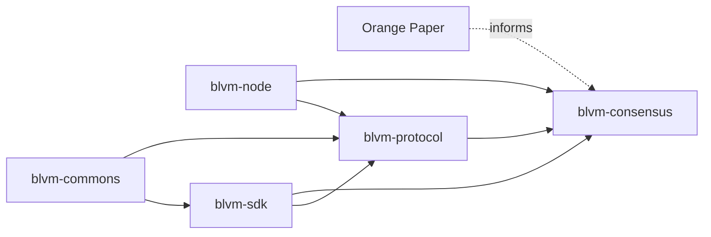

# Crate dependencies

BLVM is a **six-layer stack**. **Stack layer** means architecture position, not [governance repository layers](../governance/layer-tier-model.md) or governance **tiers** (PR classification). Layer descriptions and the stack diagram: [Stack overview](system-overview.md).

## Dependency Graph

Edges point **from a crate toward a crate it depends on** (library import direction). The Orange Paper is not a Rust crate; it **informs** consensus (dotted).

```mermaid
flowchart LR
 OP[Orange Paper]
 C[blvm-consensus]
 P[blvm-protocol]
 N[blvm-node]
 S[blvm-sdk]
 G[blvm-commons]

 OP -.->|informs| C
 P --> C
 N --> P
 N --> C
 S --> P
 S --> C
 G --> S
 G --> P
```

**blvm-primitives** (types, serialization, crypto) sits under **blvm-consensus** and **blvm-protocol**; it is not shown as its own stack layer here.

## Governance repository layers by crate

| Stack layer | Crate | Governance layer |
|-------------|-------|------------------|
| 1 | blvm-spec (Orange Paper) | Layer 1: [[gov:layer_1_signatures]], [[gov:layer_1_review_days]] days |
| 2 | blvm-consensus | Layer 2: [[gov:layer_2_signatures]], [[gov:layer_2_review_days]] days |
| 3 | blvm-protocol | Layer 3: [[gov:layer_3_signatures]], [[gov:layer_3_review_days]] days |
| 4 | blvm-node | Layer 4: [[gov:layer_4_signatures]], [[gov:layer_4_review_days]] days |
| 5 | blvm-sdk | Layer 5: [[gov:layer_5_signatures]], [[gov:layer_5_review_days]] days |
| 6 | blvm-commons | Layer 5: [[gov:layer_5_signatures]], [[gov:layer_5_review_days]] days |

See [Governance layers and tiers](../governance/layer-tier-model.md) for how layers combine with PR tiers.

## Data flow

The dependency graph above is the accurate picture for **crate dependencies**. At runtime, **blocks and transactions** flow through the node, which calls into **protocol** and **consensus** libraries to validate; the Orange Paper remains the **specification** those libraries implement.

*Figure: Operational view (IBD, validation, modules, governance). For **which crate depends on which**, use the dependency graph in this page.*

1. **Orange Paper** specifies consensus rules.
2. **blvm-consensus** implements those rules (pure functions).
3. **blvm-protocol** layers network parameters, wire helpers, and protocol policy on top of consensus types.
4. **blvm-node** runs networking, storage, RPC, and orchestration; validation calls into protocol + consensus.
5. **blvm-sdk** supplies governance crypto, composition, and (optional) node integration for modules.
6. **blvm-commons** runs governance enforcement services using **blvm-sdk** and **blvm-protocol** types.

## Cross-Layer Validation

- Dependencies between layers are strictly enforced in the **crate graph** (no application layer should reimplement consensus).
- Consensus rule modifications are prevented in application layers by design (validation calls into **blvm-consensus**).
- The [Orange Paper](../reference/orange-paper.md) is the specification; **blvm-consensus** is checked with [formal verification](../consensus/formal-verification.md), tests, and review, not a single “one-shot” equivalence proof of the whole spec.
- Version coordination (Cargo / release sets) keeps compatible crate versions together.

## See Also

- [Stack overview](system-overview.md) - Six-layer stack and component summary
- [Design Philosophy](design-philosophy.md) - Core design principles
- [Consensus Overview](../consensus/overview.md) - Consensus layer details
- [Protocol Overview](../protocol/overview.md) - Protocol layer details
- [Node Overview](../node/overview.md) - Node implementation details

