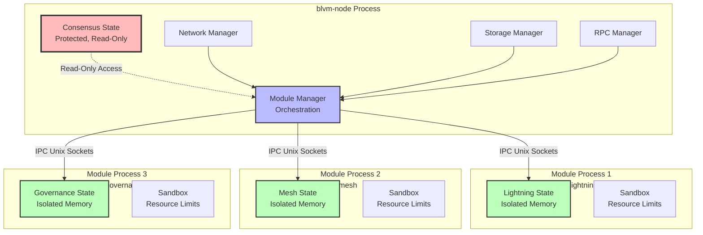

# Module System

## Overview

The module system supports optional features ([Lightning Network](../modules/lightning.md), [merge mining](../node/mining-stratum-v2.md), privacy enhancements) without affecting consensus or base node stability. Modules run in separate processes with [IPC communication](module-ipc-protocol.md), providing security through isolation.

## Available Modules

The following modules are available for blvm-node:

- **[Lightning Network Module](../modules/lightning.md)** - Lightning Network payment processing, invoice verification, payment routing, and channel management
- **[Commons Mesh Module](../modules/mesh.md)** - Payment-gated mesh networking with routing fees, traffic classification, and anti-monopoly protection
- **[Governance Module](../modules/governance.md)** - Governance webhook integration, economic node tracking, and veto system integration
- **[Stratum V2 Module](../modules/stratum-v2.md)** - Stratum V2 mining protocol support, mining pool management, and merge mining coordination

For detailed documentation on each module, see the [Modules](../modules/overview.md) section.

## Architecture

### Process Isolation

Each module runs in a separate process with isolated memory. The base node consensus state is protected and read-only to modules.



**Code**: ```1:37:blvm-node/src/module/mod.rs```

## Core Components

### ModuleManager

Orchestrates all modules, handling lifecycle, runtime loading/unloading/reloading, and coordination.

**Features:**
- Module discovery and loading
- Process spawning and monitoring
- IPC server management
- Event subscription management
- Dependency resolution
- Registry integration

**Code**: ```1:520:blvm-node/src/module/manager.rs```

### Process Isolation

Modules run in separate processes via `ModuleProcessSpawner`:

- Separate memory space
- Isolated execution environment
- Resource limits enforced
- Crash containment

**Code**: ```1:132:blvm-node/src/module/process/spawner.rs```

### IPC Communication

Modules communicate with the base node via Unix domain sockets (Unix) or named pipes (Windows):

- Request/response protocol
- Event subscription system
- Correlation IDs for async operations
- Type-safe message serialization

**Code**: ```1:234:blvm-node/src/module/ipc/protocol.rs```

### Security Sandbox

Modules run in sandboxed environments with:

- Resource limits (CPU, memory, file descriptors)
- Filesystem restrictions
- Network restrictions
- Permission-based API access

**Code**: ```1:60:blvm-node/src/module/sandbox/network.rs```

### Permission System

Modules request capabilities that are validated before API access:

- `ReadBlockchain` - Read-only blockchain access
- `ReadUTXO` - Query UTXO set (read-only)
- `ReadChainState` - Query chain state (height, tip)
- `SubscribeEvents` - Subscribe to node events
- `SendTransactions` - Submit transactions to mempool

**Code**: ```1:184:blvm-node/src/module/security/permissions.rs```

## Module Lifecycle

```
Discovery → Verification → Loading → Execution → Monitoring
    │            │            │           │            │
    │            │            │           │            │
    ▼            ▼            ▼           ▼            ▼
Registry    Signer      Loader      Process      Monitor
```

### Discovery

Modules discovered through:
- Local filesystem (`modules/` directory)
- Module registry (REST API)
- Manual installation

**Code**: ```1:200:blvm-node/src/module/registry/discovery.rs```

### Verification

Each module verified through:
- Hash verification (binary integrity)
- Signature verification (multisig maintainer signatures)
- Permission checking (capability validation)
- Compatibility checking (version requirements)

**Code**: ```1:200:blvm-node/src/module/validation/manifest_validator.rs```

### Loading

Module loaded into isolated process:
- Sandbox creation (resource limits)
- IPC connection establishment
- API subscription setup

**Code**: ```159:235:blvm-node/src/module/manager.rs```

### Execution

Module runs in isolated process:
- Separate memory space
- Resource limits enforced
- IPC communication only
- Event subscription active

### Monitoring

Module health monitored:
- Process status tracking
- Resource usage monitoring
- Error tracking
- Crash isolation

**Code**: ```1:100:blvm-node/src/module/process/monitor.rs```

## Security Model

### Consensus Isolation

Modules cannot:
- Modify consensus rules
- Modify UTXO set
- Access node private keys
- Bypass security boundaries
- Affect other modules

**Guarantee**: Module failures are isolated and cannot affect consensus.

### Crash Containment

Module crashes are isolated and do not affect the base node. The `ModuleProcessMonitor` detects crashes and automatically removes failed modules.

**Code**: ```144:153:blvm-node/src/module/manager.rs```

### Security Flow

```
Module Binary
    │
    ├─→ Hash Verification ──→ Integrity Check
    │
    ├─→ Signature Verification ──→ Multisig Check ──→ Maintainer Verification
    │
    ├─→ Permission Check ──→ Capability Validation
    │
    └─→ Sandbox Creation ──→ Resource Limits ──→ Isolation
```

## Module Manifest

Module manifests use TOML format:

```toml
# Module Identity
name = "lightning-network"
version = "1.2.3"
description = "Lightning Network implementation"
author = "Alice <alice@example.com>"

# Governance
[governance]
tier = "application"
maintainers = ["alice", "bob", "charlie"]
threshold = "2-of-3"
review_period_days = 14

# Signatures
[signatures]
maintainers = [
    { name = "alice", key = "02abc...", signature = "..." },
    { name = "bob", key = "03def...", signature = "..." }
]
threshold = "2-of-3"

# Binary
[binary]
hash = "sha256:abc123..."
size = 1234567
download_url = "https://registry.bitcoincommons.org/modules/lightning-network/1.2.3"

# Dependencies
[dependencies]
"blvm-node" = ">=1.0.0"
"another-module" = ">=0.5.0"

# Compatibility
[compatibility]
min_consensus_version = "1.0.0"
min_protocol_version = "1.0.0"
min_node_version = "1.0.0"
tested_with = ["1.0.0", "1.1.0"]

# Capabilities
capabilities = [
    "read_blockchain",
    "subscribe_events"
]
```

**Code**: ```1:200:blvm-node/src/module/registry/manifest.rs```

## API Hub

The `ModuleApiHub` routes API requests from modules to the appropriate handlers:

- Blockchain API (blocks, headers, transactions)
- Governance API (proposals, votes)
- Communication API (P2P messaging)

**Code**: ```1:200:blvm-node/src/module/api/hub.rs```

## Event System

The module event system provides a comprehensive, consistent, and reliable way for modules to receive notifications about node state changes, blockchain events, and system lifecycle events.

### Event Subscription

Modules subscribe to events they need during initialization:

```rust
let event_types = vec![
    EventType::NewBlock,
    EventType::NewTransaction,
    EventType::ModuleLoaded,
    EventType::ConfigLoaded,
    EventType::EconomicNodeRegistered,
];
client.subscribe_events(event_types).await?;
```

### Event Categories

**Core Blockchain Events:**
- `NewBlock` - Block connected to chain
- `NewTransaction` - Transaction in mempool
- `BlockDisconnected` - Block disconnected (reorg)
- `ChainReorg` - Chain reorganization

**Module Lifecycle Events:**
- `ModuleLoaded` - Module loaded (published after subscription)
- `ModuleUnloaded` - Module unloaded
- `ModuleCrashed` - Module crashed

**Configuration Events:**
- `ConfigLoaded` - Node configuration loaded/changed

**Node Lifecycle Events:**
- `NodeStartupCompleted` - Node fully operational
- `NodeShutdown` - Node shutting down
- `NodeShutdownCompleted` - Shutdown complete

**Maintenance Events:**
- `DataMaintenance` - Unified cleanup/flush event (replaces StorageFlush + DataCleanup)
- `MaintenanceStarted` - Maintenance started
- `MaintenanceCompleted` - Maintenance completed
- `HealthCheck` - Health check performed

**Resource Management Events:**
- `DiskSpaceLow` - Disk space low
- `ResourceLimitWarning` - Resource limit warning

**Governance Events:**
- `EconomicNodeRegistered` - Economic node registered
- `EconomicNodeStatus` - Status query/response
- `EconomicNodeForkDecision` - Fork decision made
- `EconomicNodeVeto` - Veto signal sent
- `GovernanceProposalCreated` - Proposal created
- `GovernanceProposalVoted` - Vote cast
- `GovernanceProposalMerged` - Proposal merged

**Network Events:**
- `PeerConnected` - Peer connected
- `PeerDisconnected` - Peer disconnected
- `MessageReceived` - Network message received
- `BroadcastStarted` - Broadcast started
- `BroadcastCompleted` - Broadcast completed

### Event Delivery Guarantees

**At-Most-Once Delivery:**
- Events are delivered at most once per subscriber
- If channel is full, event is dropped (not retried)
- If channel is closed, module is removed from subscriptions

**Best-Effort Delivery:**
- Events are delivered on a best-effort basis
- No guaranteed delivery (modules can be slow/dead)
- Statistics track delivery success/failure rates

**Ordering Guarantees:**
- Events are delivered in order per module (single channel)
- No cross-module ordering guarantees
- ModuleLoaded events are ordered: subscription → ModuleLoaded

### Event Timing and Consistency

**ModuleLoaded Event Timing:**
- `ModuleLoaded` events are **only published AFTER a module has subscribed** (after startup is complete)
- This ensures modules are fully ready before receiving ModuleLoaded events
- Hotloaded modules automatically receive all already-loaded modules when subscribing

**Event Flow:**
1. Module process is spawned
2. Module connects via IPC and sends Handshake
3. Module sends `SubscribeEvents` request
4. **At subscription time**:
   - Module receives `ModuleLoaded` events for all already-loaded modules (hotloaded modules get existing modules)
   - `ModuleLoaded` is published for the newly subscribing module (if it's loaded)
5. Module is now fully operational

### Event Delivery Reliability

**Channel Buffering:**
- 100-event buffer per module (prevents unbounded memory growth)
- Non-blocking delivery (publisher never blocks)
- Channel full events are tracked in statistics

**Error Handling:**
- **Channel Full**: Event dropped with warning, module subscription NOT removed (module is slow, not dead)
- **Channel Closed**: Module subscription removed, statistics track failed delivery
- **Serialization Errors**: Event dropped with warning, module subscription NOT removed

**Delivery Statistics:**
- Track success/failure/channel-full counts per module
- Available via `EventManager::get_delivery_stats()`
- Useful for monitoring and debugging

**Code**: ```1:274:blvm-node/src/module/api/events.rs```

For detailed event system documentation, see:
- [Event System Integration](event-system-integration.md) - Complete integration guide
- [Event Consistency](event-consistency.md) - Event timing and consistency guarantees
- [Janitorial Events](janitorial-events.md) - Maintenance and lifecycle events

## Module Registry

Modules can be discovered and installed from a module registry:

- REST API client for module discovery
- Binary download and verification
- Dependency resolution
- Signature verification

**Code**: ```1:200:blvm-node/src/module/registry/client.rs```

## Usage

### Loading a Module

```rust
use blvm_node::module::{ModuleManager, ModuleMetadata};

let mut manager = ModuleManager::new(
    modules_dir,
    data_dir,
    socket_dir,
);

manager.start(socket_path, node_api).await?;

manager.load_module(
    "lightning-network",
    binary_path,
    metadata,
    config,
).await?;
```

### Auto-Discovery

```rust
// Automatically discover and load all modules
manager.auto_load_modules().await?;
```

**Code**: ```306:391:blvm-node/src/module/manager.rs```

## Benefits

1. **Consensus Isolation**: Modules cannot affect consensus rules
2. **Crash Containment**: Module failures don't affect base node
3. **Security**: Process isolation and permission system
4. **Extensibility**: Add features without consensus changes
5. **Flexibility**: Load/unload modules at runtime
6. **Governance**: Modules subject to governance approval

## Use Cases

- **Lightning Network**: Payment channel management
- **Merge Mining**: Auxiliary chain support
- **Privacy Enhancements**: Transaction mixing, coinjoin
- **Alternative Mempool Policies**: Custom transaction selection
- **Smart Contracts**: Layer 2 contract execution

## Components

The module system includes:
- Process isolation
- IPC communication
- Security sandboxing
- Permission system
- Module registry
- Event system
- API hub

**Location**: `blvm-node/src/module/`

## IPC Communication

Modules communicate with the node via the Module IPC Protocol:

- **Protocol**: Length-delimited binary messages over Unix domain sockets
- **Message Types**: Requests, Responses, Events, Logs
- **Security**: Process isolation, permission-based API access, resource sandboxing
- **Performance**: Persistent connections, concurrent requests, correlation IDs

For detailed protocol documentation, see [Module IPC Protocol](module-ipc-protocol.md).

## See Also

- [Module IPC Protocol](module-ipc-protocol.md) - Complete IPC protocol documentation
- [Modules Overview](../modules/overview.md) - Overview of all available modules
- [Lightning Network Module](../modules/lightning.md) - Lightning Network payment processing
- [Commons Mesh Module](../modules/mesh.md) - Payment-gated mesh networking
- [Governance Module](../modules/governance.md) - Governance webhook integration
- [Stratum V2 Module](../modules/stratum-v2.md) - Stratum V2 mining protocol
- [Module Development](../sdk/module-development.md) - Guide for developing custom modules

