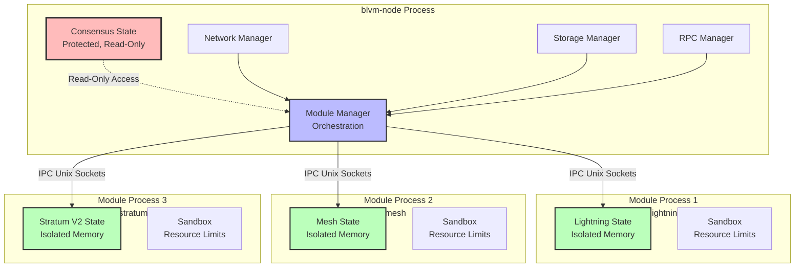

# Module system (design)

## Overview

Optional features ([Lightning Network](../modules/lightning.md), [merge mining](../node/mining-stratum-v2.md), privacy relays) run in separate processes with [IPC communication](module-ipc-protocol.md).

Registry-backed modules (**blvm-zmq**, **blvm-miniscript**, **blvm-governance**, **blvm-fibre**, optional **blvm-marketplace**) bootstrap from **`[modules].registry_url`** (`registry/modules.json`) when pinned under **`[modules]`**: see [Module catalog](../modules/overview.md).

## Available modules

- **[Lightning Network Module](../modules/lightning.md)**: Lightning payment processing
- **[Commons Mesh Module](../modules/mesh.md)**: Payment-gated mesh overlay; four JSON-RPC methods when `blvm-mesh` is loaded
- **[Stratum V2 Module](../modules/stratum-v2.md)**: Stratum V2 mining protocol
- **[Datum Module](../modules/datum.md)**: DATUM Gateway mining protocol
- **blvm-zmq**: [ZMQ module](../modules/zmq.md)
- **blvm-miniscript**: [Miniscript module](../modules/miniscript.md)
- **blvm-governance**: [Governance module](../modules/governance-module.md)
- **blvm-fibre**: [FIBRE module](../modules/fibre.md)
- **blvm-marketplace**: [Marketplace module](../modules/marketplace-module.md) (optional; registry bootstrap usually does not need it)

For detailed documentation on each module, see the [Modules](../modules/overview.md) section.

**Writing modules:** Use the **SDK declarative style** (blvm-sdk attribute macros and `run_module!`) to define CLI, RPC, and event handling in one impl block without manual IPC loops; see [Building modules](../sdk/module-development.md#sdk-declarative-style-recommended). Alternatively use the integration API or low-level IPC for custom control.

## Architecture

### Process Isolation

Each module runs in a separate process with isolated memory. The base node consensus state is protected and read-only to modules.


```mermaid
graph TB
 subgraph "blvm-node Process"
 CS[Consensus State<br/>Protected, Read-Only]
 MM[Module Manager<br/>Orchestration]
 NM[Network Manager]
 SM[Storage Manager]
 RM[RPC Manager]
 end
 
 subgraph "Module Process 1<br/>blvm-lightning"
 LS[Lightning State<br/>Isolated Memory]
 SB1[Sandbox<br/>Resource Limits]
 end
 
 subgraph "Module Process 2<br/>blvm-mesh"
 MS[Mesh State<br/>Isolated Memory]
 SB2[Sandbox<br/>Resource Limits]
 end
 
 subgraph "Module Process 3<br/>blvm-stratum-v2"
 SS[Stratum V2 State<br/>Isolated Memory]
 SB3[Sandbox<br/>Resource Limits]
 end
 
 MM -->|IPC Unix Sockets| LS
 MM -->|IPC Unix Sockets| MS
 MM -->|IPC Unix Sockets| SS
 
 CS -.->|Read-Only Access| MM
 NM --> MM
 SM --> MM
 RM --> MM
 
 style CS fill:#fbb,stroke:#333,stroke-width:3px
 style MM fill:#bbf,stroke:#333,stroke-width:2px
 style LS fill:#bfb,stroke:#333,stroke-width:2px
 style MS fill:#bfb,stroke:#333,stroke-width:2px
 style SS fill:#bfb,stroke:#333,stroke-width:2px
```


## Core Components

### ModuleManager

Orchestrates all modules, handling lifecycle, runtime loading/unloading/reloading, and coordination.

**Features:**
- Module discovery and loading
- Process spawning and monitoring
- IPC server management
- Event subscription management
- Dependency resolution
- Registry integration


### Process Isolation

Modules run in separate processes via `ModuleProcessSpawner`:

- Separate memory space
- Isolated execution environment
- Resource limits enforced
- Crash containment


### IPC Communication

Modules communicate with the base node via Unix domain sockets (Unix) or named pipes (Windows):

- Request/response protocol
- Event subscription system (`SubscribeEvents` / `EventType`: node → module notifications)
- Correlation IDs for async operations
- Type-safe message serialization
- **Targeted node control** (module → node): `NodeAPI` / IPC also exposes bounded **writes** that are not consensus changes: e.g. P2P **serve denylists** (block/tx `getdata` policy), **`get_sync_status`**, **`ban_peer`**, and **block-serve maintenance mode**. Details: [Module IPC Protocol](module-ipc-protocol.md), [Module development](../sdk/module-development.md#querying-node-data).


### Security Sandbox

Modules run in sandboxed environments with:

- Resource limits (CPU, memory, file descriptors)
- Filesystem restrictions
- Network restrictions
- Permission-based API access


### Permission System

Modules request capabilities that are validated before API access. Capabilities use snake_case in `module.toml` (e.g., `read_blockchain`) and map to `Permission` enum variants (e.g., `ReadBlockchain`).

**Core Permissions:**
- `read_blockchain` / `ReadBlockchain` - Read-only blockchain access (blocks, headers, transactions)
- `read_utxo` / `ReadUTXO` - Query UTXO set (read-only)
- `read_chain_state` / `ReadChainState` - Query chain state (height, tip)
- `subscribe_events` / `SubscribeEvents` - Subscribe to node events
- `send_transactions` / `SendTransactions` - Submit transactions to mempool (future: may be restricted)

**Mempool & Network Permissions:**
- `read_mempool` / `ReadMempool` - Read mempool data (transactions, size, fee estimates)
- `read_network` / `ReadNetwork` - Read network data (peers, stats)
- `network_access` / `NetworkAccess` - Send network packets (mesh packets, etc.)

**Lightning & Payment Permissions:**
- `read_lightning` / `ReadLightning` - Read Lightning network data
- `read_payment` / `ReadPayment` - Read payment data

**Storage Permissions:**
- `read_storage` / `ReadStorage` - Read from module storage
- `write_storage` / `WriteStorage` - Write to module storage
- `manage_storage` / `ManageStorage` - Manage storage (create/delete trees, manage quotas)

**Filesystem Permissions:**
- `read_filesystem` / `ReadFilesystem` - Read files from module data directory
- `write_filesystem` / `WriteFilesystem` - Write files to module data directory
- `manage_filesystem` / `ManageFilesystem` - Manage filesystem (create/delete directories, manage quotas)

**RPC & Timers Permissions:**
- `register_rpc_endpoint` / `RegisterRpcEndpoint` - Register RPC endpoints
- `manage_timers` / `ManageTimers` - Manage timers and scheduled tasks

**Metrics Permissions:**
- `report_metrics` / `ReportMetrics` - Report metrics
- `read_metrics` / `ReadMetrics` - Read metrics

**Module Communication Permissions:**
- `discover_modules` / `DiscoverModules` - Discover other modules
- `publish_events` / `PublishEvents` - Publish events to other modules
- `call_module` / `CallModule` - Call other modules' APIs
- `register_module_api` / `RegisterModuleApi` - Register in-process module API, or (spawned) send method descriptor so the node installs **`IpcForwardingModuleAPI`**


## Module Lifecycle

```
Discovery → Verification → Loading → Execution → Monitoring
 │ │ │ │ │
 │ │ │ │ │
 ▼ ▼ ▼ ▼ ▼
Registry Signer Loader Process Monitor
```

### Discovery

Modules are discovered through:

1. **Local filesystem**: scan **`[modules].modules_dir`** for `module.toml` + binaries
2. **Registry bootstrap**: when **`[modules].registry_url`** is set and a module is pinned (inline `blvm-zmq = "0.1.*"` etc.), missing versions are downloaded from GitHub Releases (see [Installing modules](../modules/overview.md#installing-modules))
3. **Runtime load**: **`loadmodule`** / **`blvm load`** after the node is running (admin RPC)
4. **Optional marketplace**: **`blvm-marketplace`** module for paid installs and legacy registry URL fallback; **`loadmodule`** remote auto-fetch is **opt-in and off by default**


### Verification

Each module verified through:
- Hash verification (binary integrity)
- Signature verification (multisig maintainer signatures)
- Permission checking (capability validation)
- Compatibility checking (version requirements)


### Loading

Module loaded into isolated process:
- Sandbox creation (resource limits)
- IPC connection establishment
- API subscription setup


### Execution

Module runs in isolated process:
- Separate memory space
- Resource limits enforced
- IPC communication only
- Event subscription active

### Monitoring

Module health monitored:
- Process status tracking
- Resource usage monitoring
- Error tracking
- Crash isolation


## Security Model

### Consensus Isolation

Modules cannot:
- Modify consensus rules
- Modify UTXO set
- Access node private keys
- Bypass security boundaries
- Affect other modules

**Guarantee**: Module failures are isolated and cannot affect consensus.

### Crash Containment

Module crashes are isolated and do not affect the base node. The `ModuleProcessMonitor` detects crashes and automatically removes failed modules.


### Security Flow

```
Module Binary
 │
 ├─→ Hash Verification ──→ Integrity Check
 │
 ├─→ Signature Verification ──→ Multisig Check ──→ Maintainer Verification
 │
 ├─→ Permission Check ──→ Capability Validation
 │
 └─→ Sandbox Creation ──→ Resource Limits ──→ Isolation
```

## Module Manifest

Module manifests use TOML format:

```toml
# Module Identity (manifest `name` must match [modules] pin and [modules.<name>] tables)
name = "blvm-lightning"
version = "1.2.3"
description = "Lightning Network implementation"
author = "Alice <alice@example.com>"

# Governance
[governance]
tier = "application"
maintainers = ["alice", "bob", "charlie"]
threshold = "[[gov:layer_5_signatures]]"
review_period_days = [[gov:layer_5_review_days]]

# Signatures
[signatures]
maintainers = [
 { name = "alice", key = "02abc...", signature = "..." },
 { name = "bob", key = "03def...", signature = "..." }
]
threshold = "[[gov:layer_5_signatures]]"

# Binary
[binary]
hash = "sha256:abc123..."
size = 1234567
download_url = "https://github.com/BTCDecoded/blvm-lightning/releases/download/v1.2.3/blvm-lightning"

# Dependencies
[dependencies]
"blvm-node" = ">=1.0.0"
"another-module" = ">=0.5.0"

# Compatibility
[compatibility]
min_consensus_version = "1.0.0"
min_protocol_version = "1.0.0"
min_node_version = "1.0.0"
tested_with = ["1.0.0", "1.1.0"]

# Capabilities
capabilities = [
 "read_blockchain",
 "subscribe_events"
]
```


## API Hub

The `ModuleApiHub` routes API requests from modules to the appropriate handlers:

- Blockchain API (blocks, headers, transactions)
- Governance API (proposals, votes)
- Communication API (P2P messaging)


## Event System

Modules subscribe to node state changes, blockchain events, and system lifecycle events through the event system.

### Event Subscription

Modules subscribe to events they need during initialization:

```rust
let event_types = vec![
 EventType::NewBlock,
 EventType::NewTransaction,
 EventType::ModuleLoaded,
 EventType::ConfigLoaded,
];
client.subscribe_events(event_types).await?;
```

### Event Categories

Catalog of shared **`EventType`** variants on the node bus. **Individual modules subscribe/publish subsets only**: see each [module page](../modules/overview.md) (e.g. `blvm-lightning` does not emit `ChannelOpened`; `blvm-stratum-v2` does not emit `MiningPoolConnected`).
- `NewBlock` - Block connected to chain
- `NewTransaction` - Transaction in mempool
- `BlockDisconnected` - Block disconnected (reorg)
- `ChainReorg` - Chain reorganization

**Payment Events:**
- `PaymentRequestCreated` - Payment request created
- `PaymentSettled` - Payment settled (confirmed on-chain)
- `PaymentFailed` - Payment failed
- `PaymentVerified` - Lightning payment verified
- `PaymentRouteFound` - Payment route discovered
- `PaymentRouteFailed` - Payment routing failed
- `ChannelOpened` - Lightning channel opened
- `ChannelClosed` - Lightning channel closed

**Mining Events:**
- `BlockMined` - Block mined successfully
- `BlockTemplateUpdated` - Block template updated
- `MiningDifficultyChanged` - Mining difficulty changed
- `MiningJobCreated` - Mining job created
- `ShareSubmitted` - Mining share submitted
- `MergeMiningReward` - Merge mining reward received
- `MiningPoolConnected` - Mining pool connected
- `MiningPoolDisconnected` - Mining pool disconnected

**Mesh Networking Events:**
- `MeshPacketReceived` - Mesh packet received from network

**Stratum V2 Events:**
- `StratumV2MessageReceived` - Stratum V2 message received from network

**Module Lifecycle Events:**
- `ModuleLoaded` - Module loaded (published after subscription)
- `ModuleUnloaded` - Module unloaded
- `ModuleCrashed` - Module crashed
- `ModuleDiscovered` - Module discovered
- `ModuleInstalled` - Module installed
- `ModuleUpdated` - Module updated
- `ModuleRemoved` - Module removed

**Configuration Events:**
- `ConfigLoaded` - Node configuration loaded/changed

**Node Lifecycle Events:**
- `NodeStartupCompleted` - Node fully operational
- `NodeShutdown` - Node shutting down
- `NodeShutdownCompleted` - Shutdown complete

**Maintenance Events:**
- `DataMaintenance` - Unified cleanup/flush event (replaces StorageFlush + DataCleanup)
- `MaintenanceStarted` - Maintenance started
- `MaintenanceCompleted` - Maintenance completed
- `HealthCheck` - Health check performed

**Resource Management Events:**
- `DiskSpaceLow` - Disk space low
- `ResourceLimitWarning` - Resource limit warning

**Governance Events:**
- `GovernanceProposalCreated` - Proposal created
- `GovernanceProposalVoted` - Vote cast
- `GovernanceProposalMerged` - Proposal merged
- `GovernanceForkDetected` - Governance fork detected
- `WebhookSent` - Webhook sent
- `WebhookFailed` - Webhook delivery failed

**Network Events:**
- `PeerConnected` - Peer connected
- `PeerDisconnected` - Peer disconnected
- `PeerBanned` - Peer banned
- `PeerUnbanned` - Peer unbanned
- `MessageReceived` - Network message received
- `MessageSent` - Network message sent
- `BroadcastStarted` - Broadcast started
- `BroadcastCompleted` - Broadcast completed
- `RouteDiscovered` - Route discovered
- `RouteFailed` - Route failed
- `ConnectionAttempt` - Connection attempt (success/failure)
- `AddressDiscovered` - New peer address discovered
- `AddressExpired` - Peer address expired
- `NetworkPartition` - Network partition detected
- `NetworkReconnected` - Network partition reconnected
- `DoSAttackDetected` - DoS attack detected
- `RateLimitExceeded` - Rate limit exceeded

**Consensus Events:**
- `BlockValidationStarted` - Block validation started
- `BlockValidationCompleted` - Block validation completed (success/failure)
- `ScriptVerificationStarted` - Script verification started
- `ScriptVerificationCompleted` - Script verification completed
- `UTXOValidationStarted` - UTXO validation started
- `UTXOValidationCompleted` - UTXO validation completed
- `DifficultyAdjusted` - Network difficulty adjusted
- `SoftForkActivated` - Soft fork activated (SegWit, Taproot, CTV, etc.)
- `SoftForkLockedIn` - Soft fork locked in (BIP9)
- `ConsensusRuleViolation` - Consensus rule violation detected

**Sync Events:**
- `HeadersSyncStarted` - Headers sync started
- `HeadersSyncProgress` - Headers sync progress update
- `HeadersSyncCompleted` - Headers sync completed
- `BlockSyncStarted` - Block sync started (IBD)
- `BlockSyncProgress` - Block sync progress update
- `BlockSyncCompleted` - Block sync completed

**Mempool Events:**
- `MempoolTransactionAdded` - Transaction added to mempool
- `MempoolTransactionRemoved` - Transaction removed from mempool
- `FeeRateChanged` - Fee rate changed

**Additional Event Categories:**
- Dandelion++ Events (DandelionStemStarted, DandelionStemAdvanced, DandelionFluffed, etc.)
- Compact Blocks Events (CompactBlockReceived, BlockReconstructionStarted, etc.)
- FIBRE Events (FibreBlockEncoded, FibreBlockSent, CompanionUdpPeerRegistered / CompanionUdpPeerUnregistered for NODE_FIBRE companion UDP)
- Package Relay Events (PackageReceived, PackageRejected)
- UTXO Commitments Events (UtxoCommitmentReceived, UtxoCommitmentVerified)
- Ban List Sharing Events (BanListShared, BanListReceived)

For a complete list of all event types, see [EventType enum](https://github.com/BTCDecoded/blvm-node/blob/main/src/module/traits.rs).

Delivery guarantees, timing (`ModuleLoaded` ordering), backpressure, and monitoring: [Module events](module-events.md). Maintenance payloads: [Janitorial events](janitorial-events.md).

## Module Registry

Two related mechanisms:

| Mechanism | Purpose |
|-----------|---------|
| **`[modules].registry_url` bootstrap** | Built into the node: download pinned modules from `modules.json` + GitHub Releases when not on disk |
| **`blvm-marketplace` module** | Optional: registry proxy, module payments, and opt-in **`loadmodule`** auto-fetch via IPC |

Bootstrap does **not** require the marketplace module for standard pins (`blvm-zmq`, `blvm-miniscript`, …). See [Marketplace module](../modules/marketplace-module.md).

Verification at install time includes release checksums (`sha256sums.txt` on module tags) when using bootstrap; additional signature/multisig policy is deployment-specific.


## Usage

### Loading a Module

```rust
use blvm_node::module::{ModuleManager, ModuleMetadata};

let mut manager = ModuleManager::new(
 modules_dir,
 data_dir,
 socket_dir,
);

manager.start(socket_path, node_api).await?;

manager.load_module(
 "blvm-lightning",
 binary_path,
 metadata,
 config,
).await?;
```

### Auto-Discovery

```rust
// Automatically discover and load all modules
manager.auto_load_modules().await?;
```


## Benefits

1. **Consensus Isolation**: Modules cannot affect consensus rules
2. **Crash Containment**: Module failures don't affect base node
3. **Security**: Process isolation and permission system
4. **Extensibility**: Add features without consensus changes
5. **Flexibility**: Load/unload modules at runtime
6. **Governance**: Modules subject to governance approval

## Use Cases

- **Lightning Network**: Payment channel management
- **Merge Mining**: Auxiliary chain support
- **Privacy Enhancements**: Transaction mixing, coinjoin
- **Alternative Mempool Policies**: Custom transaction selection
- **Smart Contracts**: Layer 2 contract execution

## Components

The module system includes:
- Process isolation
- IPC communication
- Security sandboxing
- Permission system
- Module registry
- Event system
- API hub


## IPC Communication

Modules communicate with the node via the Module IPC Protocol:

- **Protocol**: Length-delimited binary messages over Unix domain sockets
- **Message Types**: Requests, Responses, Events, Logs
- **Security**: Process isolation, permission-based API access, resource sandboxing
- **Performance**: Persistent connections, concurrent requests, correlation IDs

### Integration Approaches

There are two approaches for modules to integrate with the node:

#### 1. ModuleIntegration (Recommended for New Modules)

The `ModuleIntegration` API wraps connect, subscribe, and RPC helpers:

```rust
use blvm_node::module::integration::ModuleIntegration;

// Connect to node (socket_path must be PathBuf)
let socket_path = std::path::PathBuf::from(socket_path);
let mut integration = ModuleIntegration::connect(
 socket_path,
 module_id,
 module_name,
 version,
).await?;

// Subscribe to events
integration.subscribe_events(event_types).await?;

// Get NodeAPI
let node_api = integration.node_api();

// Get event receiver
let mut event_receiver = integration.event_receiver();
```

**Benefits:**
- One API for connect, subscribe, and RPC calls
- Automatic handshake and connection management
- Simplified event subscription
- Direct access to NodeAPI and event receiver

**Used by:** `blvm-mesh` and its submodules (`blvm-onion`, `blvm-mining-pool`, `blvm-messaging`, `blvm-bridge`)

#### 2. ModuleClient + NodeApiIpc (Legacy Approach)

The traditional approach uses separate components:

```rust
use blvm_node::module::ipc::client::ModuleIpcClient;
use blvm_node::module::api::node_api::NodeApiIpc;

// Connect to IPC socket
let mut ipc_client = ModuleIpcClient::connect(&socket_path).await?;

// Perform handshake manually
let handshake_request = RequestMessage { /* ... */ };
let response = ipc_client.request(handshake_request).await?;

// Create NodeAPI wrapper
// NodeApiIpc requires Arc<Mutex<ModuleIpcClient>> and module_id
let ipc_client_arc = Arc::new(tokio::sync::Mutex::new(ipc_client));
let node_api = Arc::new(NodeApiIpc::new(ipc_client_arc, "my-module".to_string()));

// Create ModuleClient for event subscription
let mut client = ModuleClient::connect(/* ... */).await?;
client.subscribe_events(event_types).await?;
let mut event_receiver = client.event_receiver();
```

**Benefits:**
- More granular control over IPC communication
- Direct access to IPC client for custom requests
- Established, stable API

**Used by:** `blvm-lightning`, `blvm-stratum-v2`, `blvm-datum`, `blvm-miningos`

**Migration:** New modules should use `ModuleIntegration`. Existing modules can continue using `ModuleClient` + `NodeApiIpc`, but migration to `ModuleIntegration` is recommended for consistency and simplicity.

For detailed protocol documentation, see [Module IPC Protocol](module-ipc-protocol.md).

## Source

- [mod.rs](https://github.com/BTCDecoded/blvm-node/blob/main/src/module/mod.rs)
- [manager.rs](https://github.com/BTCDecoded/blvm-node/blob/main/src/module/manager.rs)
- [spawner.rs](https://github.com/BTCDecoded/blvm-node/blob/main/src/module/process/spawner.rs)
- [protocol.rs](https://github.com/BTCDecoded/blvm-node/blob/main/src/module/ipc/protocol.rs)
- [network.rs](https://github.com/BTCDecoded/blvm-node/blob/main/src/module/sandbox/network.rs)
- [permissions.rs](https://github.com/BTCDecoded/blvm-node/blob/main/src/module/security/permissions.rs)
- [discovery.rs](https://github.com/BTCDecoded/blvm-node/blob/main/src/module/registry/discovery.rs)
- [manifest_validator.rs](https://github.com/BTCDecoded/blvm-node/blob/main/src/module/validation/manifest_validator.rs)
- [monitor.rs](https://github.com/BTCDecoded/blvm-node/blob/main/src/module/process/monitor.rs)
- [manifest.rs](https://github.com/BTCDecoded/blvm-node/blob/main/src/module/registry/manifest.rs)
- [hub.rs](https://github.com/BTCDecoded/blvm-node/blob/main/src/module/api/hub.rs)
- [events.rs](https://github.com/BTCDecoded/blvm-node/blob/main/src/module/api/events.rs)
- [client.rs](https://github.com/BTCDecoded/blvm-node/blob/main/src/module/registry/client.rs)
- [blvm-node/src/module/](https://github.com/BTCDecoded/blvm-node/tree/main/src/module/)
## See Also

- [Module IPC Protocol](module-ipc-protocol.md) - Complete IPC protocol documentation
- [Module catalog](../modules/overview.md) - Overview of all available modules
- [Lightning Network Module](../modules/lightning.md) - Lightning Network payment processing
- [Commons Mesh Module](../modules/mesh.md) - Payment-gated mesh networking
- [Stratum V2 Module](../modules/stratum-v2.md) - Stratum V2 mining protocol
- [Datum Module](../modules/datum.md) - DATUM Gateway mining protocol
- [Building modules](../sdk/module-development.md) - Guide for developing custom modules
