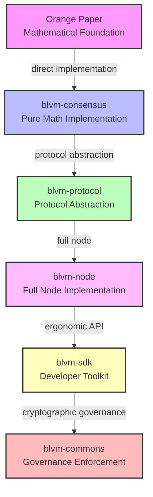

# System Overview

Bitcoin Commons is a Bitcoin implementation ecosystem with six tiers building on the [Orange Paper](../reference/orange-paper.md) mathematical specifications. The system implements consensus rules directly from the spec, provides protocol abstraction, delivers a minimal reference implementation, and includes a developer SDK.

## 6-Tier Component Architecture

## BLVM Stack Architecture

*Figure: BLVM architecture showing blvm-spec (Orange Paper) as the foundation, blvm-consensus as the core implementation with verification paths (blvm-spec-lock proofs, spec drift detection, hash verification), and dependent components (blvm-protocol, blvm-node, blvm-sdk) building on the verified consensus layer.*

## Tiered Architecture

*Figure: Tiered architecture: Tier 1 = Orange Paper + Consensus Proof (mathematical foundation); Tier 2 = Protocol Engine (protocol abstraction); Tier 3 = Reference Node (complete implementation); Tier 4 = Developer SDK + Governance (developer toolkit + governance enforcement).*

## Component Overview

### Tier 1: [Orange Paper](../reference/orange-paper.md) (Mathematical Foundation)
- Mathematical specifications for Bitcoin consensus rules
- Source of truth for all implementations
- Timeless, immutable consensus rules

### Tier 2: [blvm-consensus](../consensus/overview.md) (Pure Math Implementation)
- Direct implementation of [Orange Paper](../reference/orange-paper.md) functions
- [Formal proofs](../consensus/formal-verification.md) verify mathematical correctness
- Side-effect-free, deterministic functions
- Consensus-critical dependencies pinned to exact versions

**Code**: [README.md](https://github.com/BTCDecoded/blvm-consensus/blob/main/README.md#L1-L260)

### Tier 3: [blvm-protocol](../protocol/overview.md) (Protocol Abstraction)
- Bitcoin protocol abstraction for multiple variants
- Supports mainnet, testnet, regtest
- Commons-specific protocol extensions ([UTXO commitments](../consensus/utxo-commitments.md), ban list sharing)
- BIP implementations (BIP152, BIP157, BIP158, BIP173/350/351)

**Code**: [README.md](https://github.com/BTCDecoded/blvm-protocol/blob/main/README.md#L1-L344)

### Tier 4: [blvm-node](../node/overview.md) (Node Implementation)
- Minimal, production-ready Bitcoin node
- [Storage layer](../node/storage-backends.md) (database abstraction with multiple backends)
- Network manager ([multi-transport](../node/transport-abstraction.md): TCP, QUIC, Iroh)
- [RPC server](../node/rpc-api.md) (JSON-RPC 2.0 with Bitcoin Core compatibility)
- [Module system](../architecture/module-system.md) (process-isolated runtime modules)
- Payment processing with CTV (CheckTemplateVerify) support
- RBF and mempool policies (4 configurable modes)
- Advanced indexing (address and value range indexing)
- [Mining coordination](../node/mining-stratum-v2.md) (Stratum V2, merge mining)
- P2P governance message relay
- Governance integration (webhooks, user signaling)
- ZeroMQ notifications (optional)

**Code**: [README.md](https://github.com/BTCDecoded/blvm-node/blob/main/README.md#L1-L178)

### Tier 5: [blvm-sdk](../sdk/overview.md) (Developer Toolkit)
- Governance primitives (key management, signatures, [multisig](../governance/multisig-configuration.md))
- CLI tools (blvm-keygen, blvm-sign, blvm-verify)
- [Composition framework](../architecture/module-system.md) (declarative node composition)
- Bitcoin-compatible signing standards

**Code**: [README.md](https://github.com/BTCDecoded/blvm-sdk/blob/main/README.md#L1-L130)

### Tier 6: blvm-commons (Governance Enforcement)
- GitHub App for governance enforcement
- Cryptographic signature verification
- Multisig threshold enforcement
- Audit trail management
- OpenTimestamps integration

## Data Flow

1. **Orange Paper** provides mathematical consensus specifications
2. **blvm-consensus** directly implements mathematical functions
3. **blvm-protocol** wraps blvm-consensus with protocol-specific parameters
4. **blvm-node** uses blvm-protocol and blvm-consensus for validation
5. **blvm-sdk** provides governance primitives
6. **blvm-commons** uses blvm-sdk for cryptographic operations

## Cross-Layer Validation

- Dependencies between layers are strictly enforced
- Consensus rule modifications are prevented in application layers
- Equivalence proofs required between Orange Paper and blvm-consensus
- Version coordination ensures compatibility across layers

## Key Features

### Mathematical Rigor
- Direct implementation of [Orange Paper](../reference/orange-paper.md) specifications
- [Formal verification](../consensus/formal-verification.md) with [blvm-spec-lock model checking](../consensus/formal-verification.md)
- [Property-based testing](../development/property-based-testing.md) for mathematical invariants
- [PLACEHOLDER_NUMBER proofs](../consensus/formal-verification.md) verify critical consensus functions

### Protocol Abstraction
- Multiple Bitcoin variants (mainnet, testnet, regtest)
- Commons-specific protocol extensions
- BIP implementations (BIP152, BIP157, BIP158)
- Protocol evolution support

### Production Ready
- Bitcoin node functionality
- [Performance optimizations](../node/performance.md) (PGO, parallel validation)
- [Multiple storage backends](../node/storage-backends.md) with automatic fallback
- [Multi-transport networking](../node/transport-abstraction.md) (TCP, QUIC, Iroh)
- Payment processing infrastructure
- REST API alongside [JSON-RPC](../node/rpc-api.md)

### Governance Infrastructure
- [Cryptographic governance primitives](../governance/overview.md)
- [Multisig threshold enforcement](../governance/multisig-configuration.md)
- [Transparent audit trails](../governance/audit-trails.md)
- [Forkable governance rules](../governance/governance-fork.md)

## See Also

- [Component Relationships](component-relationships.md) - Detailed component interactions
- [Design Philosophy](design-philosophy.md) - Core design principles
- [Module System](module-system.md) - Module system architecture
- [Node Overview](../node/overview.md) - Node implementation details
- [Consensus Overview](../consensus/overview.md) - Consensus layer details
- [Protocol Overview](../protocol/overview.md) - Protocol layer details

