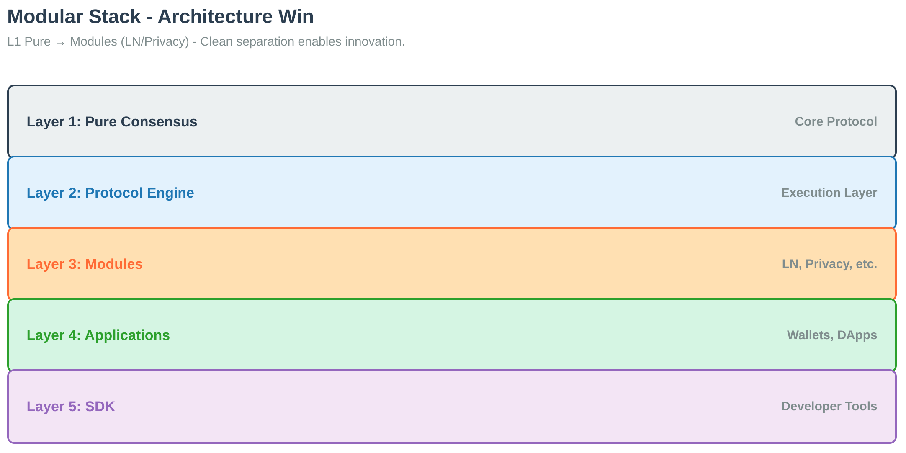

# System Overview

{{#include ../../../DESIGN.md}}

## Architecture Overview

Bitcoin Commons uses two distinct classification systems:

1. **6-Tier Technical Architecture**: Repository layers (Orange Paper → consensus → protocol → node → SDK → commons)
2. **5-Tier Governance System**: Action classification (Routine → Feature → Consensus-Adjacent → Emergency → Governance)

These are different dimensions: technical layers vs governance action types. When both apply, the most restrictive requirement wins.

## BLLVM Stack Architecture

*Figure: BLLVM architecture showing bllvm-spec (Orange Paper) as the foundation, bllvm-consensus as the core implementation with verification paths (Kani proofs, spec drift detection, hash verification), and dependent components (bllvm-protocol, bllvm-node, bllvm-sdk) building on the verified consensus layer.*

## Tiered Architecture

*Figure: Tiered architecture: Tier 1 = Orange Paper + Consensus Proof (mathematical foundation); Tier 2 = Protocol Engine (protocol abstraction); Tier 3 = Reference Node (complete implementation); Tier 4 = Developer SDK + Governance (developer toolkit + governance enforcement).*

