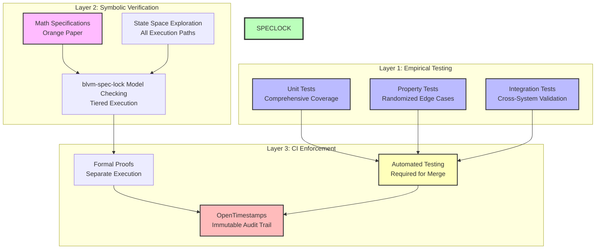

# Formal Verification

The consensus layer implements formal verification for Bitcoin consensus rules using a multi-layered approach combining mathematical specifications, symbolic verification, and property-based testing.

## Verification Stack

Verification approach follows: **"Rust + Tests + Math Specs = Source of Truth"**



### Layer 1: Empirical Testing
- **Unit tests**: Comprehensive test coverage for all consensus functions
- **Property-based tests**: Randomized testing with `proptest` to discover edge cases
- **Integration tests**: Cross-system validation between consensus components

### Layer 2: Symbolic Verification
- **blvm-spec-lock**: Custom locking implementation for formal verification with tiered execution
- **Mathematical specifications**: Formal documentation of consensus rules
- **State space exploration**: Verification of all possible execution paths

### Layer 3: CI Enforcement
- **Automated testing**: All tests must pass before merge
- **Formal proofs**: Run separately with tiered execution (strong/medium/slow tiers)
- **OpenTimestamps audit logging**: Immutable proof of verification artifacts

## Verification Statistics

### Formal Proofs

All critical consensus functions are verified across multiple files with tiered execution system (strong/medium/slow tiers).

**Verification Command**:
```bash
# blvm-spec-lock verification
```

**Tier System**:
- **Strong Tier**: Critical consensus proofs (AWS spot instance integration)
- **Medium Tier**: Important proofs (parallel execution)
- **Slow Tier**: Comprehensive coverage proofs

**Infrastructure**:
- AWS spot instance integration for expensive proof execution
- Parallel proof execution with tiered scheduling
- Automated proof verification in CI/CD

### Property-Based Tests

Property-based tests in `tests/consensus_property_tests.rs` cover economic rules, proof of work, transaction validation, script execution, performance, deterministic execution, integer overflow safety, temporal/state transitions, compositional verification, and SHA256 correctness.

**Verification Command**:
```bash
cargo test --test consensus_property_tests
```

### Runtime Assertions

Runtime assertions provide invariant checking during execution.

**Runtime Invariant Feature Flag**:
- `#[cfg(any(debug_assertions, feature = "runtime-invariants"))]` enables assertions
- `src/block.rs`: Supply invariant checks in `connect_block`

**Verification**: Runtime assertions execute during debug builds and can be enabled in production with `--features runtime-invariants`.

### Fuzz Targets (libFuzzer)

Fuzz targets include:
1. `block_validation.rs`
2. `compact_block_reconstruction.rs`
3. `differential_fuzzing.rs`
4. `economic_validation.rs`
5. `mempool_operations.rs`
6. `pow_validation.rs`
7. `script_execution.rs`
8. `script_opcodes.rs`
9. `segwit_validation.rs`
10. `serialization.rs`
11. `transaction_validation.rs`
12. `utxo_commitments.rs`

**Location**: `fuzz/fuzz_targets/`

**Verification Command**:
```bash
cd fuzz
cargo +nightly fuzz run transaction_validation
```

### MIRI Runtime Checks

**Status**: Integrated in CI

**Location**: `.github/workflows/verify.yml`

**Checks**:
- Property tests under MIRI
- Critical unit tests under MIRI
- Undefined behavior detection

**Verification Command**:
```bash
cargo +nightly miri test --test consensus_property_tests
```

### Mathematical Specifications

Multiple functions have complete formal documentation

**Location**: `docs/MATHEMATICAL_SPECIFICATIONS_COMPLETE.md`

**Documented Functions**:
- Economic: `get_block_subsidy`, `total_supply`, `calculate_fee`
- Proof of Work: `expand_target`, `compress_target`, `check_proof_of_work`
- Transaction: `check_transaction`, `is_coinbase`
- Block: `connect_block`, `apply_transaction`
- Script: `eval_script`, `verify_script`
- Reorganization: `calculate_chain_work`, `should_reorganize`
- Cryptographic: `SHA256`

## Mathematical Specifications

### Chain Selection (`src/reorganization.rs`)

**Mathematical Specification:**
```
∀ chains C₁, C₂: work(C₁) > work(C₂) ⇒ select(C₁)
```

**Invariants:**
- Selected chain has maximum cumulative work
- Work calculation is deterministic
- Empty chains are rejected
- Chain work is always non-negative

**Verified Functions:**
- `should_reorganize`: Proves longest chain selection
- `calculate_chain_work`: Verifies cumulative work calculation
- `expand_target`: Handles difficulty target edge cases

### Block Subsidy (`src/economic.rs`)

**Mathematical Specification:**
```
∀ h ∈ ℕ: subsidy(h) = 50 * 10^8 * 2^(-⌊h/210000⌋) if ⌊h/210000⌋ < 64 else 0
```

**Invariants:**
- Subsidy halves every 210,000 blocks
- After 64 halvings, subsidy becomes 0
- Subsidy is always non-negative
- Total supply approaches 21M BTC asymptotically

**Verified Functions:**
- `get_block_subsidy`: Verifies halving schedule
- `total_supply`: Proves monotonic increase
- `validate_supply_limit`: Ensures supply cap compliance

### Proof of Work (`src/pow.rs`)

**Mathematical Specification:**
```
∀ header H: CheckProofOfWork(H) = SHA256(SHA256(H)) < ExpandTarget(H.bits)
```

**Target Compression/Expansion:**
```
∀ bits ∈ [0x03000000, 0x1d00ffff]:
  Let expanded = expand_target(bits)
  Let compressed = compress_target(expanded)
  Let re_expanded = expand_target(compressed)
  
  Then:
  - re_expanded ≤ expanded (compression truncates, never increases)
  - re_expanded.0[2] = expanded.0[2] ∧ re_expanded.0[3] = expanded.0[3]
    (significant bits preserved exactly)
  - Precision loss in words 0, 1 is acceptable (compact format limitation)
```

**Invariants:**
- Hash must be less than target for valid proof of work
- Target expansion handles edge cases correctly
- Target compression preserves significant bits (words 2, 3) exactly
- Target compression may lose precision in lower bits (words 0, 1)
- Difficulty adjustment respects bounds [0.25, 4.0]
- Work calculation is deterministic

**Verified Functions:**
- `check_proof_of_work`: Verifies hash < target
- `expand_target`: Handles compact target representation
- `compress_target`: Implements Bitcoin Core GetCompact() exactly
- `target_expand_compress_round_trip`: **Formally verified** - proves significant bits preserved
- `get_next_work_required`: Respects difficulty bounds

### Transaction Validation (`src/transaction.rs`)

**Mathematical Specification:**
```
∀ tx ∈ 𝒯𝒳: CheckTransaction(tx) = valid ⟺ 
  (|tx.inputs| > 0 ∧ |tx.outputs| > 0 ∧ 
   ∀o ∈ tx.outputs: 0 ≤ o.value ≤ M_max ∧
   |tx.inputs| ≤ M_max_inputs ∧ |tx.outputs| ≤ M_max_outputs ∧
   |tx| ≤ M_max_tx_size)
```

**Invariants:**
- Valid transactions have non-empty inputs and outputs
- Output values are bounded [0, MAX_MONEY]
- Input/output counts respect limits
- Transaction size respects limits
- Coinbase transactions have special validation rules

**Verified Functions:**
- `check_transaction`: Validates structure rules
- `check_tx_inputs`: Handles coinbase correctly
- `is_coinbase`: Correctly identifies coinbase transactions

### Block Connection (`src/block.rs`)

**Mathematical Specification:**
```
∀ block B, UTXO set US, height h: ConnectBlock(B, US, h) = (valid, US') ⟺
  (ValidateHeader(B.header) ∧ 
   ∀ tx ∈ B.transactions: CheckTransaction(tx) ∧ CheckTxInputs(tx, US, h) ∧
   VerifyScripts(tx, US) ∧
   CoinbaseOutput ≤ TotalFees + GetBlockSubsidy(h) ∧
   US' = ApplyTransactions(B.transactions, US))
```

**Invariants:**
- Valid blocks have valid headers and transactions
- UTXO set consistency is preserved
- Coinbase output respects economic rules
- Transaction application is atomic

**Verified Functions:**
- `connect_block`: Validates complete block
- `apply_transaction`: Preserves UTXO consistency
- `calculate_tx_id`: Deterministic transaction identification

## Verification Tools

### blvm-spec-lock

**Purpose**: Custom locking implementation for formal verification

**Usage**: blvm-spec-lock verification

**Coverage**: All verified functions

**Strategy**: Custom locking mechanism ensures specification compliance

### Proptest Property Testing

**Purpose**: Randomized testing to discover edge cases

**Usage**: `cargo test` (runs automatically)

**Coverage**: All `proptest!` macros

**Strategy**: Generates random inputs within specified bounds

**Example:**
```rust
proptest! {
    #[test]
    fn prop_function_invariant(input in strategy) {
        let result = function_under_test(input);
        prop_assert!(result.property_holds());
    }
}
```

## CI Integration

### Verification Workflow

The `.github/workflows/verify.yml` workflow enforces verification:

1. **Unit & Property Tests** (required)
   - `cargo test --all-features`
   - Must pass for CI to succeed

2. **blvm-spec-lock Verification** (release verification)
   - blvm-spec-lock verification
   - Verifies all locked functions
   - Full verification run before each release
   - Slower runs may be deferred between major releases
   - Not required for merge

3. **OpenTimestamps Audit** (non-blocking)
   - Collect verification artifacts
   - Timestamp proof bundle with `ots stamp`
   - Upload artifacts for transparency

### Local Development

**Run all tests:**
```bash
cargo test --all-features
```

**Run blvm-spec-lock verification:**
```bash
# blvm-spec-lock verification
```

**Run specific verification:**
```bash
cargo test --test property_tests
# blvm-spec-lock verification
```

## Verification Coverage

Critical consensus functions are formally verified or property-tested across economic rules, proof of work, transaction validation, block validation, script execution, chain reorganization, cryptographic operations, mempool, SegWit, and serialization, using formal proofs, property tests, runtime assertions, and fuzz targets.

## Network Protocol Verification

Network protocol message parsing, serialization, and processing are formally verified using blvm-spec-lock, extending verification beyond consensus to the network layer.

**Verified Properties**: Message header parsing (magic, command, length, checksum), checksum validation, size limit enforcement, round-trip properties (`parse(serialize(msg)) == msg`).

**Verified Messages**: Phase 1: Version, VerAck, Ping, Pong. Phase 2: Transaction, Block, Headers, Inv, GetData, GetHeaders.

**Mathematical Specifications**: Round-trip property `∀ msg: parse(serialize(msg)) = msg`, checksum validation rejects invalid checksums, size limits enforced for all messages.

Verification runs automatically in CI. Proofs excluded from release builds via `verify` feature.

## Consensus Coverage Comparison


*Figure: Consensus coverage comparison: Bitcoin Core achieves coverage through testing alone. Bitcoin Commons achieves formal verification coverage (blvm-spec-lock) plus comprehensive test coverage. Commons uses consensus-focused test files with extensive test functions compared to Core's total files. The mathematical specification enables both formal verification and comprehensive testing.*

## Proof Maintenance Cost


*Figure: Proof maintenance cost: proofs changed per change by area; highlights refactor hotspots; Commons aims for lower proof churn than Core.*

## Spec Drift vs Test Coverage


*Figure: Spec drift decreases as test coverage increases. Higher test coverage reduces the likelihood of specification drift over time.*

## Network Protocol Verification

Network protocol message parsing, serialization, and processing are formally verified using blvm-spec-lock, extending verification beyond consensus to the network layer. See [Network Protocol](../protocol/network-protocol.md) for transport details.

**Verified Properties**: Message header parsing (magic, command, length, checksum), checksum validation, size limit enforcement, round-trip properties (`parse(serialize(msg)) == msg`).

**Verified Messages**: Phase 1: Version, VerAck, Ping, Pong. Phase 2: Transaction, Block, Headers, Inv, GetData, GetHeaders.

**Mathematical Specifications**: Round-trip property `∀ msg: parse(serialize(msg)) = msg`, checksum validation rejects invalid checksums, size limits enforced for all messages.

Verification runs automatically in CI. Proofs excluded from release builds via `verify` feature.


## See Also

- [Consensus Overview](overview.md) - Consensus layer introduction
- [Consensus Architecture](architecture.md) - Consensus layer design
- [Mathematical Specifications](mathematical-specifications.md) - Mathematical spec details
- [Mathematical Correctness](mathematical-correctness.md) - Correctness guarantees
- [Property-Based Testing](../development/property-based-testing.md) - Property-based testing
- [Fuzzing](../development/fuzzing.md) - Fuzzing infrastructure
- [Testing Infrastructure](../development/testing.md) - Complete testing overview
