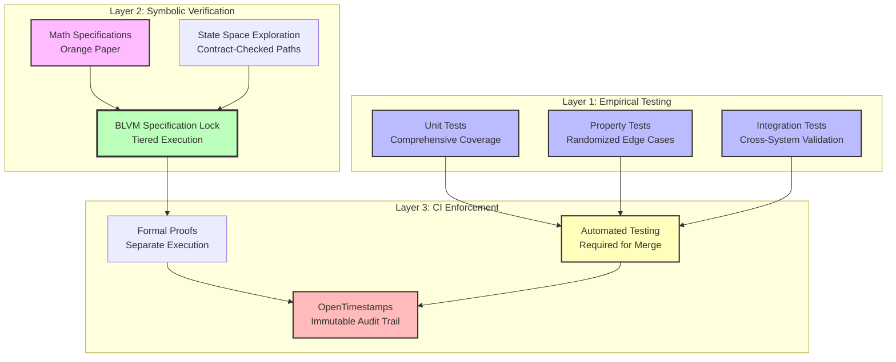
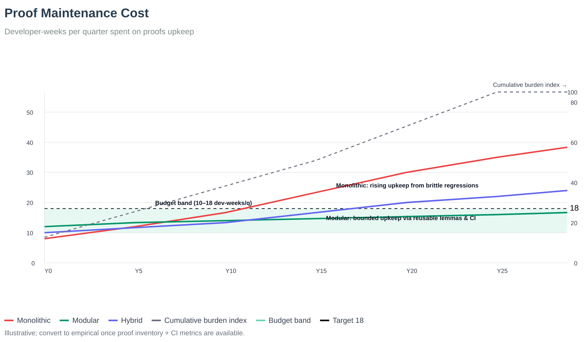
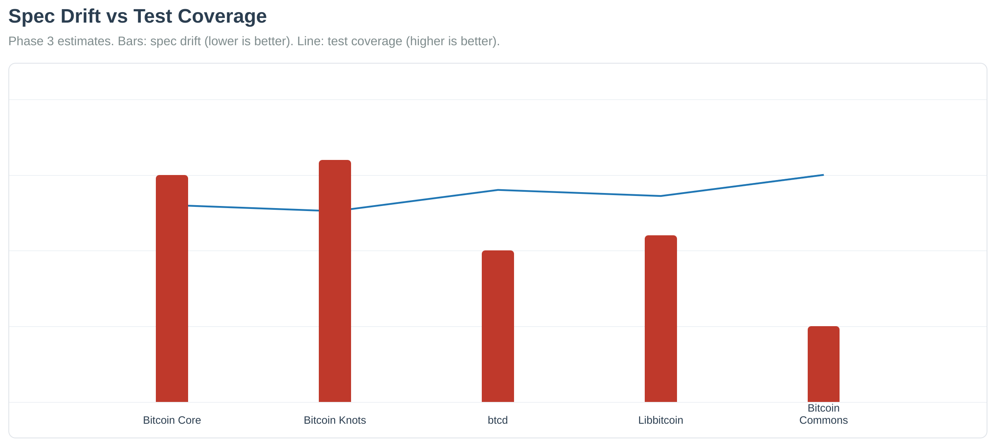

# Formal Verification

**blvm-consensus** combines the Orange Paper (normative math spec), **BLVM Specification Lock** (Z3-backed proofs on spec-locked consensus code), and a large automated test suite. Proof scope and limits: [PROOF_LIMITATIONS.md](https://github.com/BTCDecoded/blvm-consensus/blob/main/docs/PROOF_LIMITATIONS.md).

## Verification Stack

Verification approach follows: **"Rust + Tests + Math Specs = Source of Truth"**


```mermaid
graph TB
    subgraph "Layer 1: Empirical Testing"
        UT[Unit Tests<br/>Comprehensive Coverage]
        PT[Property Tests<br/>Randomized Edge Cases]
        IT[Integration Tests<br/>Cross-System Validation]
    end
    
    subgraph "Layer 2: Symbolic Verification"
        SPECLOCK[BLVM Specification Lock<br/>Tiered Execution]
        SPEC[Math Specifications<br/>Orange Paper]
        SSE[State Space Exploration<br/>Contract-Checked Paths]
    end
    
    subgraph "Layer 3: CI Enforcement"
        AUTO[Automated Testing<br/>Required for Merge]
        PROOF[Formal Proofs<br/>Separate Execution]
        OTS[OpenTimestamps<br/>Immutable Audit Trail]
    end
    
    UT --> AUTO
    PT --> AUTO
    IT --> AUTO
    
    SPECLOCK --> PROOF
    SPEC --> SPECLOCK
    SSE --> SPECLOCK
    
    PROOF --> OTS
    AUTO --> OTS
    
    style UT fill:#bbf,stroke:#333,stroke-width:2px
    style PT fill:#bbf,stroke:#333,stroke-width:2px
    style IT fill:#bbf,stroke:#333,stroke-width:2px
    style SPECLOCK fill:#bfb,stroke:#333,stroke-width:3px
    style SPEC fill:#fbf,stroke:#333,stroke-width:2px
    style AUTO fill:#ffb,stroke:#333,stroke-width:2px
    style OTS fill:#fbb,stroke:#333,stroke-width:2px
```

### Layer 1: Empirical Testing
- **Unit tests**: Broad coverage across consensus modules and public APIs
- **Property-based tests**: Randomized testing with `proptest` to discover edge cases
- **Integration tests**: Cross-system validation between consensus components

### Layer 2: Symbolic Verification
- **BLVM Specification Lock**: Z3-backed proofs on spec-locked functions; tiered execution (strong/medium/slow)
- **Mathematical specifications**: Orange Paper and inline consensus specs
- **State space exploration**: Paths relevant to spec-lock contracts

### Layer 3: CI Enforcement
- **Automated testing**: Required for merge
- **BLVM Specification Lock**: Tiered runs; policy in [VERIFICATION.md](https://github.com/BTCDecoded/blvm-consensus/blob/main/docs/VERIFICATION.md)
- **OpenTimestamps audit logging**: Optional timestamps of verification artifacts

## Verification Statistics

### Formal Proofs

**BLVM Specification Lock** checks spec-locked functions in tiers (strong/medium/slow). Current inventory and policy: [VERIFICATION.md](https://github.com/BTCDecoded/blvm-consensus/blob/main/docs/VERIFICATION.md).

**Verification Command**:
```bash
# Run BLVM Specification Lock verification
cargo spec-lock verify
```

For tiered execution:
```bash
# Run all Z3 proofs (uses tiered execution)
cargo spec-lock verify

# Run specific tier
cargo spec-lock verify --tier strong
```

**Tier System**:
- **Strong Tier**: Critical consensus proofs (AWS spot instance integration)
- **Medium Tier**: Important proofs (parallel execution)
- **Slow Tier**: Comprehensive coverage proofs

**Infrastructure**:
- AWS spot instance integration for expensive proof execution
- Parallel proof execution with tiered scheduling
- Automated proof verification in CI/CD

### Property-Based Tests

Property-based tests in `tests/consensus_property_tests.rs` cover economic rules, proof of work, transaction validation, script execution, performance, deterministic execution, integer overflow safety, temporal/state transitions, compositional verification, and SHA256 correctness.

**Verification Command**:
```bash
cargo test --test consensus_property_tests
```

### Runtime Assertions

Runtime assertions provide invariant checking during execution.

**Runtime Invariant Feature Flag**:
- `#[cfg(any(debug_assertions, feature = "runtime-invariants"))]` enables assertions
- `src/block/mod.rs`: Supply invariant checks in `connect_block`

**Verification**: Runtime assertions execute during debug builds and can be enabled in production with `--features runtime-invariants`.

### Fuzz targets (libFuzzer)

Harnesses live under `fuzz/fuzz_targets/`; names are registered in `fuzz/Cargo.toml`. Overview: [Fuzzing](../development/fuzzing.md).

```bash
cd fuzz
cargo +nightly fuzz run <target_name>
```

### MIRI Runtime Checks

**Status**: Integrated in CI

**Location**: `.github/workflows/verify.yml`

**Checks**:
- Property tests under MIRI
- Critical unit tests under MIRI
- Undefined behavior detection

**Verification Command**:
```bash
cargo +nightly miri test --test consensus_property_tests
```

### Mathematical Specifications

Multiple functions have formal documentation aligned with the Orange Paper and consensus crate sources (there is no separate shipped `MATHEMATICAL_SPECIFICATIONS_COMPLETE.md` in this book).

**Documented Functions**:
- Economic: `get_block_subsidy`, `total_supply`, `calculate_fee`
- Proof of Work: `expand_target`, `compress_target`, `check_proof_of_work`
- Transaction: `check_transaction`, `is_coinbase`
- Block: `connect_block`, `apply_transaction`
- Script: `eval_script`, `verify_script`
- Reorganization: `calculate_chain_work`, `should_reorganize`
- Cryptographic: `SHA256`

## Mathematical Specifications

The formulas and **invariants** below state intended consensus behavior from the Orange Paper. **Key functions** tie this spec to the implementation through tests and **BLVM Specification Lock** where those functions are spec-locked. Coverage: [VERIFICATION.md](https://github.com/BTCDecoded/blvm-consensus/blob/main/docs/VERIFICATION.md), [PROOF_LIMITATIONS.md](https://github.com/BTCDecoded/blvm-consensus/blob/main/docs/PROOF_LIMITATIONS.md).

### Chain Selection (`src/reorganization.rs`)

**Mathematical Specification:**
```
∀ chains C₁, C₂: work(C₁) > work(C₂) ⇒ select(C₁)
```

**Invariants:**
- Selected chain has maximum cumulative work
- Work calculation is deterministic
- Empty chains are rejected
- Chain work is always non-negative

**Key functions:**
- `should_reorganize` — longest-work chain selection
- `calculate_chain_work` — cumulative work
- `expand_target` — difficulty target edge cases

### Block Subsidy (`src/economic.rs`)

**Mathematical Specification:**
```
∀ h ∈ ℕ: subsidy(h) = 50 * 10^8 * 2^(-⌊h/210000⌋) if ⌊h/210000⌋ < 64 else 0
```

**Invariants:**
- Subsidy halves every 210,000 blocks
- After 64 halvings, subsidy becomes 0
- Subsidy is always non-negative
- Total supply approaches 21M BTC asymptotically

**Key functions:**
- `get_block_subsidy` — halving schedule
- `total_supply` — supply monotonicity
- `validate_supply_limit` — supply cap

### Proof of Work (`src/pow.rs`)

**Mathematical Specification:**
```
∀ header H: CheckProofOfWork(H) = SHA256(SHA256(H)) < ExpandTarget(H.bits)
```

**Target Compression/Expansion:**
```
∀ bits ∈ [0x03000000, 0x1d00ffff]:
  Let expanded = expand_target(bits)
  Let compressed = compress_target(expanded)
  Let re_expanded = expand_target(compressed)
  
  Then:
  - re_expanded ≤ expanded (compression truncates, never increases)
  - re_expanded.0[2] = expanded.0[2] ∧ re_expanded.0[3] = expanded.0[3]
    (significant bits preserved exactly)
  - Precision loss in words 0, 1 is acceptable (compact format limitation)
```

**Invariants:**
- Hash must be less than target for valid proof of work
- Target expansion handles edge cases correctly
- Target compression preserves significant bits (words 2, 3) exactly
- Target compression may lose precision in lower bits (words 0, 1)
- Difficulty adjustment respects bounds [0.25, 4.0]
- Work calculation is deterministic

**Key functions:**
- `check_proof_of_work` — hash vs target
- `expand_target` / `compress_target` — compact difficulty encoding
- `target_expand_compress_round_trip` — compact round-trip properties
- `get_next_work_required` — difficulty adjustment bounds

### Transaction Validation (`src/transaction.rs`)

**Mathematical Specification:**
```
∀ tx ∈ 𝒯𝒳: CheckTransaction(tx) = valid ⟺ 
  (|tx.inputs| > 0 ∧ |tx.outputs| > 0 ∧ 
   ∀o ∈ tx.outputs: 0 ≤ o.value ≤ M_max ∧
   |tx.inputs| ≤ M_max_inputs ∧ |tx.outputs| ≤ M_max_outputs ∧
   |tx| ≤ M_max_tx_size)
```

**Invariants:**
- Valid transactions have non-empty inputs and outputs
- Output values are bounded [0, MAX_MONEY]
- Input/output counts respect limits
- Transaction size respects limits
- Coinbase transactions have special validation rules

**Key functions:**
- `check_transaction` — structural validity
- `check_tx_inputs` — input checks including coinbase
- `is_coinbase` — coinbase detection

### Block Connection (`src/block/mod.rs`)

**Mathematical Specification:**
```
∀ block B, UTXO set US, height h: ConnectBlock(B, US, h) = (valid, US') ⟺
  (ValidateHeader(B.header) ∧ 
   ∀ tx ∈ B.transactions: CheckTransaction(tx) ∧ CheckTxInputs(tx, US, h) ∧
   VerifyScripts(tx, US) ∧
   CoinbaseOutput ≤ TotalFees + GetBlockSubsidy(h) ∧
   US' = ApplyTransactions(B.transactions, US))
```

**Invariants:**
- Valid blocks have valid headers and transactions
- UTXO set consistency is preserved
- Coinbase output respects economic rules
- Transaction application is atomic

**Key functions:**
- `connect_block` — full block validation
- `apply_transaction` — UTXO updates
- `calculate_tx_id` — transaction id

## Verification Tools

### BLVM Specification Lock

**Purpose**: Z3-backed **BLVM Specification Lock** proofs for spec-locked Rust functions against Orange Paper contracts.

**Usage**: `cargo spec-lock verify`

**Coverage**: Spec-locked functions (`#[spec_locked]` and related tooling).

**Details**: [PROOF_LIMITATIONS.md](https://github.com/BTCDecoded/blvm-consensus/blob/main/docs/PROOF_LIMITATIONS.md)

### Proptest Property Testing

**Purpose**: Randomized testing to discover edge cases

**Usage**: `cargo test` (runs automatically)

**Coverage**: Property tests using `proptest!` and related harnesses in the crate

**Strategy**: Generates random inputs within specified bounds

**Example:**
```rust
proptest! {
    #[test]
    fn prop_function_invariant(input in strategy) {
        let result = function_under_test(input);
        prop_assert!(result.property_holds());
    }
}
```

## CI Integration

### Verification Workflow

The `.github/workflows/verify.yml` workflow runs verification jobs such as:

1. **Unit & Property Tests** (required)
   - `cargo test --all-features`
   - Must pass for CI to succeed

2. **BLVM Specification Lock Verification** (release- or tier-gated)
   - `cargo spec-lock verify`
   - Z3 obligations for `#[spec_locked]` functions in the workflow
   - Full verification run before each release
   - Slower tiers can be deferred between major releases
   - Not required for merge

3. **OpenTimestamps Audit** (non-blocking)
   - Collect verification artifacts
   - Timestamp proof bundle with `ots stamp`
   - Upload artifacts for transparency

### Local Development

**Run all tests:**
```bash
cargo test --all-features
```

**Run BLVM Specification Lock verification:**
```bash
cargo spec-lock verify
```

**Run specific verification:**
```bash
cargo test --test property_tests
cargo spec-lock verify --proof <function_name>
```

## Verification Coverage

Consensus combines **BLVM Specification Lock**, property tests, fuzzing, and integration tests across economic rules, PoW, transactions, blocks, scripts, reorg, crypto, mempool, SegWit, and serialization. [PROOF_LIMITATIONS.md](https://github.com/BTCDecoded/blvm-consensus/blob/main/docs/PROOF_LIMITATIONS.md) documents what formal proofs do and do not cover.

## Network Protocol Verification

**blvm-protocol** can use the same **BLVM Specification Lock** machinery for wire messages: headers, checksums, size limits, and round-trip properties for the message types in scope.

**Proof targets**: Header layout (magic, command, length, checksum), checksum validation, size limits, `parse(serialize(msg)) == msg` for covered messages.

**Message tiers:** Tier 1: Version, VerAck, Ping, Pong. Tier 2: Transaction, Block, Headers, Inv, GetData, GetHeaders.

Use the `verify` feature for full protocol verification builds; see **blvm-protocol** crate docs.

## Consensus Coverage Comparison


*Figure: Baseline: broad tests and review. Bitcoin Commons adds **BLVM Specification Lock** and Orange Paper–driven methodology on top.*

## Proof Maintenance Cost


*Figure: Proof maintenance cost: proofs changed per change by area; highlights refactor hotspots.*

## Spec Drift vs Test Coverage


*Figure: Spec drift decreases as test coverage increases. Higher test coverage reduces the likelihood of specification drift over time.*

See also [Network Protocol](../protocol/network-protocol.md) for transport and wire-format documentation.

## See Also

- [Consensus Overview](overview.md) - Consensus layer introduction
- [Consensus Architecture](architecture.md) - Consensus layer design
- [Mathematical Specifications](mathematical-specifications.md) - Mathematical spec details
- [Mathematical Correctness](mathematical-correctness.md) - Correctness guarantees
- [Property-Based Testing](../development/property-based-testing.md) - Property-based testing
- [Fuzzing](../development/fuzzing.md) - Fuzzing infrastructure
- [Testing Infrastructure](../development/testing.md) - Complete testing overview
