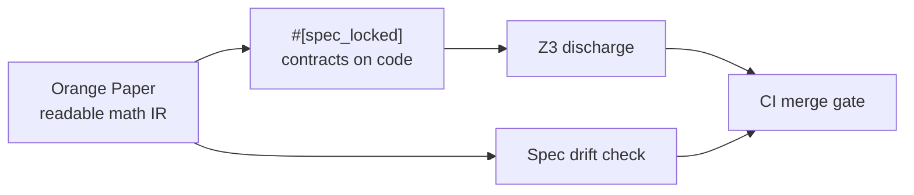
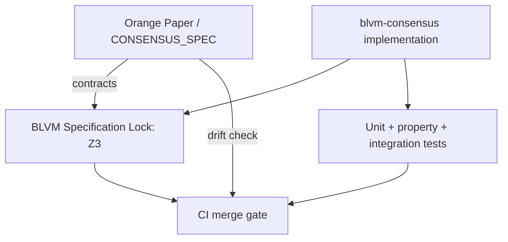

# Formal Verification

How BLVM checks consensus against the [Orange Paper](../reference/orange-paper.md): spec-lock methodology, coverage, CI gates, and tooling. For what **blvm-consensus** implements and how it relates to the spec, see [Consensus Overview](overview.md).

**BLVM Specification Lock** binds `#[spec_locked]` Rust functions to Orange Paper contracts and discharges obligations with Z3. Empirical layers ([testing](../development/testing.md), [differential testing](../development/differential-testing.md), fuzz, MIRI) stress the same surface from complementary angles. Together: **Rust + Tests + Math Specs = Source of Truth**.

Inventory and verification policy: [consensus verification guide](https://github.com/BTCDecoded/blvm-consensus/blob/main/docs/VERIFICATION.md), [spec-lock coverage inventory](https://github.com/BTCDecoded/blvm-spec-lock/blob/main/SPEC_LOCK_COVERAGE.md), and [proof limitations](https://github.com/BTCDecoded/blvm-consensus/blob/main/docs/PROOF_LIMITATIONS.md).

## What formal verification delivers


```mermaid
flowchart LR
 OP[Orange Paper<br/>readable math IR]
 ANN["#[spec_locked]<br/>contracts on code"]
 Z3[Z3 discharge]
 DRIFT[Spec drift check]
 CI[CI merge gate]
 OP --> ANN
 ANN --> Z3
 OP --> DRIFT
 Z3 --> CI
 DRIFT --> CI
```

**A human-auditable source of meaning.** Consensus rules live in the Orange Paper first. Reviewers, including mathematicians who never read the node, can argue about subsidy, PoW, and script semantics in the same language the proofs use.

**Proofs locked to the functions they protect.** Annotation with `#[spec_locked]` attaches Orange Paper contracts to concrete Rust. Change the code, and the obligations travel with it: proofs are not a detached appendix that drifts from the implementation.

**Machine-checked alignment on merge.** Z3 verifies those contracts on every change. CI runs **`check-drift`** then **`verify`** on self-hosted runners, so a PR that softens a rule or breaks a proven invariant fails the gate instead of shipping as “still green on unit tests.”

**Growing, measurable coverage.** Spec-lock covers **251** `#[spec_locked]` functions across the stack (**240** in **blvm-consensus**, **5** in **blvm-node**, **6** in **blvm-protocol**) and **~433** parseable obligations (reconfirm with `cargo spec-lock coverage`).

**Confidence to evolve.** Proven bounds feed [optimization passes](overview.md#optimization-passes). Refactors and performance work land against the same contracts. Future implementations can share the Orange Paper as common IR; each codebase earns trust by locking to that IR, not by copying another node’s source.

**A full assurance stack.** Specification Lock answers: *does this function still mean what the Orange Paper says?* Property tests, fuzzing, MIRI, and differential testing against Bitcoin Core answer complementary questions about edge cases, undefined behavior, and historical mainnet agreement. Each layer strengthens the others; none is ornamental.

Consensus verification operates on **public** block data. Secret-path constant-time cryptography (signing, ECDH, MuSig secrets) lives in [blvm-secp256k1](https://github.com/BTCDecoded/blvm-secp256k1/blob/main/TIMING.md), a deliberate split so conformance proofs and timing discipline each have the right home.

## Verification Stack


```mermaid
flowchart TB
 SPEC[Orange Paper / CONSENSUS_SPEC]
 CODE[blvm-consensus implementation]
 SPEC -->|contracts| LOCK[BLVM Specification Lock: Z3]
 CODE --> LOCK
 CODE --> TEST[Unit + property + integration tests]
 LOCK --> GATE[CI merge gate]
 TEST --> GATE
 SPEC -->|drift check| GATE
```

### Layer 1: Empirical Testing
- **Unit tests**: Broad coverage across consensus modules and public APIs
- **Property-based tests**: Randomized testing with `proptest` to discover edge cases
- **Integration tests**: Cross-system validation between consensus components

### Layer 2: Symbolic Verification
- **BLVM Specification Lock**: Z3-backed proofs on spec-locked functions
- **Mathematical specifications**: [in-book digest](mathematical-specifications.md) and Orange Paper contracts
- **State space exploration**: Paths relevant to spec-lock contracts

### Layer 3: CI Enforcement
- **Automated testing**: Required for merge
- **BLVM Specification Lock**: Required on merge; see [verification policy](https://github.com/BTCDecoded/blvm-consensus/blob/main/docs/VERIFICATION.md)
- **OpenTimestamps audit logging**: Optional timestamps of verification artifacts

### Verify JSON semantics (`blvm-spec-lock`)

`cargo spec-lock verify` emits structured status per function. **Failed** means the proof obligation did not pass: CI gates on these when strict mode is enabled. **Partial** marks obligations demoted or skipped (timeout, translation gap, advisory tier): read the log and [verify JSON format](https://github.com/BTCDecoded/blvm-spec-lock/blob/main/docs/VERIFY_JSON.md) for jq filters; treat **Passed** under explicit policy as the release signal.

## Verification Statistics

### Formal Proofs

**BLVM Specification Lock** runs a single **`verify`** pass over all spec-locked functions and merged `F_*` formula registry rows.

**Coverage snapshot** (count `#[spec_locked]` in source; re-run `cargo spec-lock coverage` for contract totals):

| Crate | Spec-locked functions |
|-------|----------------------:|
| **blvm-consensus** | 240 |
| **blvm-node** | 5 |
| **blvm-protocol** | 6 |
| **Total** | **251** |

**Parseable obligations:** **~433** (reconfirm with `cargo spec-lock coverage --spec-path …`).

**Verification Command** (clone **[blvm-spec](https://github.com/BTCDecoded/blvm-spec)** next to the crate so `../blvm-spec` exists, or set **`SPEC_LOCK_SPEC_PATH`**):

```bash
# Install CLI (matches library floor; picks latest published 0.1.x)
cargo install blvm-spec-lock --version '>=0.1, <1' --locked --features z3

export SPEC_LOCK_STRICT=1
export SPEC_LOCK_Z3_TIMEOUT_SECS=120   # overrides --timeout when set

cargo spec-lock check-drift \
  --crate-path . \
  --spec-path ../blvm-spec/PROTOCOL.md ../blvm-spec/ARCHITECTURE.md \
  --scoped-unparseables

cargo spec-lock verify \
  --crate-path . \
  --spec-path ../blvm-spec/PROTOCOL.md ../blvm-spec/ARCHITECTURE.md \
  --timeout 120 \
  --format human \
  --json-out spec_lock_verify.json
```

**Common filters** (same `verify` subcommand):

```bash
cargo spec-lock verify --name get_block_subsidy --crate-path . --spec-path ../blvm-spec/PROTOCOL.md
cargo spec-lock verify --section 6.1 --crate-path . --spec-path ../blvm-spec/PROTOCOL.md
cargo spec-lock verify --subsystem economic --crate-path . --spec-path ../blvm-spec/PROTOCOL.md
```

There is no `--tier` flag. CI runs one full **`verify`** pass on self-hosted runners (`[self-hosted, Linux, X64, builds]`): **`check-drift`** (with **`--scoped-unparseables`**, and **`--scoped-formulas`** when the installed CLI supports it), then **`verify`** with **`--json-out`**. See the [consensus CI workflow](https://github.com/BTCDecoded/blvm-consensus/blob/main/.github/workflows/ci.yml) and [spec-lock dependency guide](https://github.com/BTCDecoded/blvm-consensus/blob/main/SPEC_LOCK_DEPENDENCY.md).

**Proof rigor** (policy classification, not separate runner pools): [verification-tiers.toml](https://github.com/BTCDecoded/blvm-consensus/blob/main/verification-tiers.toml) groups functions by expected proof depth:

- **Tier 1**: Full Z3 body proof required (subsidy, PoW, reorg primitives)
- **Tier 2**: Invariant + proptest coverage for complex bodies
- **Tier 3**: Differential equivalence harnesses (crypto backends, FFI boundaries)

Local development uses the same **`verify`** command as CI. For property tests, fuzz, MIRI, and the full test matrix, see [Testing Infrastructure](../development/testing.md).

## CI Integration

The **Verify** / **verify** jobs in [blvm-consensus](https://github.com/BTCDecoded/blvm-consensus/blob/main/.github/workflows/ci.yml), [blvm-node](https://github.com/BTCDecoded/blvm-node/blob/main/.github/workflows/ci.yml), and [blvm-protocol](https://github.com/BTCDecoded/blvm-protocol/blob/main/.github/workflows/ci.yml) CI are the authoritative **`cargo-spec-lock`** gates. Optional umbrella **`workflow_dispatch`** mirrors exist for multi-repo workspace checkouts.

1. **Unit & Property Tests** (required in each crate CI): `cargo test --all-features`
2. **BLVM Specification Lock** (required where **`#[spec_locked]`** is enabled): `check-drift` then `verify` per the [spec-lock dependency guide](https://github.com/BTCDecoded/blvm-consensus/blob/main/SPEC_LOCK_DEPENDENCY.md)
3. **OpenTimestamps Audit** (non-blocking: consensus umbrella CI parity / monorepo only where enabled)

Run commands locally: [Testing Infrastructure](../development/testing.md#running-tests). Other subcommands: `coverage`, `summary`, `list`, `check-formulas`, `verify-formulas`. Full CLI reference: [blvm-spec-lock](https://github.com/BTCDecoded/blvm-spec-lock/blob/main/README.md).

## Network Protocol Verification

**blvm-protocol** uses the same **BLVM Specification Lock** machinery for wire messages: headers, checksums, size limits, and round-trip properties for the message types in scope.

**Proof targets**: Header layout (magic, command, length, checksum), checksum validation, size limits, `parse(serialize(msg)) == msg` for covered messages.

**Wire message groups (verification scope):** **Group A**: Version, VerAck, Ping, Pong. **Group B**: Transaction, Block, Headers, Inv, GetData, GetHeaders. (This grouping is for protocol verification only, not [governance tiers](../governance/layer-tier-model.md).)

Use the `verify` feature for full protocol verification builds; see [protocol overview](../protocol/overview.md).

## Consensus Coverage Comparison


*Figure: Baseline: broad tests and review. Bitcoin Commons adds **BLVM Specification Lock** and Orange Paper-driven methodology on top.*

## Proof Maintenance Cost


*Figure: Proof maintenance cost: proofs changed per change by area; highlights refactor hotspots.*

## Spec Drift vs Test Coverage


*Figure: Spec drift decreases as test coverage increases. Higher test coverage reduces the likelihood of specification drift over time.*

See also [Network Protocol](../protocol/network-protocol.md) for transport and wire-format documentation.

Policy and inventory: [verification policy](https://github.com/BTCDecoded/blvm-consensus/blob/main/docs/VERIFICATION.md) and [proof limitations](https://github.com/BTCDecoded/blvm-consensus/blob/main/docs/PROOF_LIMITATIONS.md). Formal properties per rule: [Mathematical Specifications](mathematical-specifications.md).

## Source

- [Consensus CI workflow](https://github.com/BTCDecoded/blvm-consensus/blob/main/.github/workflows/ci.yml) (Verify job; MIRI when nightly is available)

## See Also

- [Consensus Overview](overview.md): What the consensus layer implements
- [Mathematical Specifications](mathematical-specifications.md): Mathematical spec details
- [Property-Based Testing](../development/property-based-testing.md): Property-based testing
- [Differential Testing](../development/differential-testing.md): BLVM vs Bitcoin Core
- [Fuzzing](../development/testing.md#fuzzing): Fuzzing infrastructure
- [Testing Infrastructure](../development/testing.md): Complete testing overview
