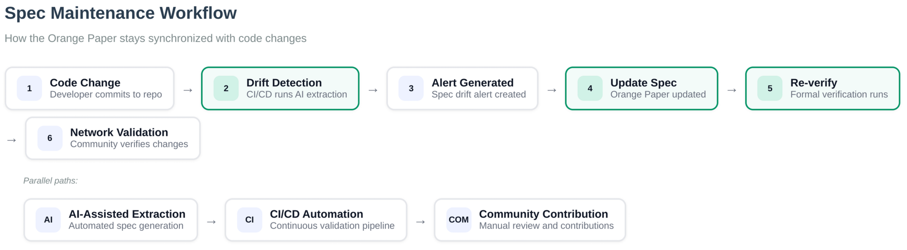

# Consensus Layer Overview

**blvm-consensus** answers one question: given a transaction, block, UTXO set, and activation flags, does Bitcoin consensus accept it? It does not open sockets, read `blvm.toml`, or choose mainnet vs regtest—that belongs to [blvm-protocol](../protocol/overview.md) and [blvm-node](../node/overview.md).

## What this layer is for

Consensus code is the **trust anchor** of the stack. Wallets, pools, and modules depend on the node reporting chain state that matches what every other Bitcoin mainnet participant would accept. If validation is wrong here, every higher layer is wrong.

The layer implements rules from the [Orange Paper](../reference/orange-paper.md) as deterministic Rust: script execution, block connection, subsidy and difficulty math, mempool acceptance rules used by the node, and soft-fork behavior at documented activation heights. Block and script logic live in `block/` and `script/` submodules; canonical types, serialization, and crypto come from **blvm-primitives** (re-exported by blvm-consensus for API stability).

## Relationship to the Orange Paper

The Orange Paper is the **specification** (treated as an intermediate representation). **blvm-consensus** is the **implementation**, checked by:

- Unit, integration, and [differential tests](../development/differential-testing.md) (full-chain harness in **blvm-bench**)
- [Formal verification](formal-verification.md) via **BLVM Specification Lock** on spec-locked functions (Z3)
- Review and CI gates on security-critical paths

Consensus code **verifies** signatures on public block data only; secret-path constant-time signing is **`blvm-secp256k1`**, not this crate. See [Formal Verification — scope](formal-verification.md#scope-and-limits).

The implementation is **not generated** from the Orange Paper; it is **validated against** it. Optimization passes (constant folding, batch script verification) speed the code without changing the specified meaning.

**Chain of trust:**

```
Orange Paper → blvm-consensus → tests + spec-lock → node deployment
```

Details: [VERIFICATION.md](https://github.com/BTCDecoded/blvm-consensus/blob/main/docs/VERIFICATION.md), [PROOF_LIMITATIONS.md](https://github.com/BTCDecoded/blvm-consensus/blob/main/docs/PROOF_LIMITATIONS.md).

## What lives here vs elsewhere

| Concern | Layer |
|---------|--------|
| Script/block/UTXO math | **blvm-consensus** (this page) |
| Network magic, ports, message serialization | [blvm-protocol](../protocol/overview.md) |
| Storage, P2P, RPC, modules | [blvm-node](../node/overview.md) |
| Fast sync (UTXO commitments, peer consensus, spam filtering) | [node docs](../node/utxo-commitments.md) (**blvm-protocol** / **blvm-node**, not consensus rules) |
| Orange Paper function catalog & Rust API names | [API Index — Consensus](../reference/api-index.md#consensus-layer-blvm-consensus) |

## Architecture position

**Stack layer 2** — between the Orange Paper (layer 1) and protocol abstraction (layer 3). Full stack: [Introduction](../introduction.md#what-is-blvm).

## Design principles

1. **Pure functions** — Deterministic validation; explicit inputs instead of hidden globals
2. **No rule interpretation in apps** — Node calls into consensus; modules never patch rules
3. **Controlled dependencies** — `Cargo.toml` pins and ranges are the source of truth for crypto and BLVM crates
4. **Testing in depth** — [Testing](../development/testing.md), [property-based tests](../development/property-based-testing.md), [differential testing](../development/differential-testing.md) via **blvm-bench**
5. **Formal verification** — Spec-lock proofs complement tests; see [Formal Verification](formal-verification.md)
6. **No consensus rule interpretation** — Only mathematical implementation of the Orange Paper
7. **Optimization passes** — Runtime optimizations speed the code without changing specified meaning; see [Optimization passes](#optimization-passes)

## Core functions

### Transaction validation
- Transaction structure and limit validation
- Input validation against UTXO set
- Script execution and verification

### Block validation
- Block connection and validation
- Transaction application to UTXO set
- Proof of work verification

### Economic model
- Block reward calculation
- Total supply computation
- Difficulty adjustment

### Mempool protocol
- Transaction mempool validation
- Standard transaction checks
- Transaction replacement (RBF) logic

### Mining protocol
- Block creation from mempool
- Block mining and nonce finding
- Block template generation

### Chain management
- Reorganization primitives in **blvm-consensus** (`reorganization.rs`); **blvm-node** wires them for the live `process_block` path (block index, chainwork tip selection, undo persistence, events — see **blvm-node** `docs/FORK_CHOICE_AND_REORG.md`)
- P2P network message processing

### Advanced features
- **SegWit**: Witness data validation and weight calculation (see [BIP141](https://github.com/bitcoin/bips/blob/master/bip-0141.mediawiki))
- **Taproot**: P2TR output validation and key aggregation (see [BIP341](https://github.com/bitcoin/bips/blob/master/bip-0341.mediawiki))

## Optimization passes {#optimization-passes}

The implementation is validated against the [Orange Paper](../reference/orange-paper.md); optimization passes optimize the implementation code (not the spec). Meaning is defined by the Orange Paper; see [compiler-like architecture](../reference/glossary.md#compiler-like-architecture). Production and Rayon feature flags: `blvm-consensus/docs/FEATURES.md`.

- **Constant folding** — Pre-computed constants and constant propagation
- **Memory layout optimization** — Cache-aligned structures and compact stack frames
- **SIMD vectorization** — Batch hash operations with parallel processing
- **Bounds check optimization** — Removes redundant runtime bounds checks using [BLVM Specification Lock](formal-verification.md)-proven bounds
- **Dead code elimination** — Removes unused code paths
- **Inlining hints** — Aggressive inlining of hot functions

## Spec maintenance workflow


*Figure: Specification maintenance workflow showing how changes are detected, verified, and integrated.*

## Formal verification (summary)

Critical properties (chain work, subsidy halving, proof of work, transaction structure, `connect_block` UTXO consistency) are among the primary verification targets. CI runs spec-lock on annotated functions; coverage and limitations are documented in the consensus repo.

## BIP implementation

Consensus integrates consensus-critical BIPs in validation paths—for example BIP30/34/66/90/147 in block connection and script verification. Activation heights and network variants are coordinated with **blvm-protocol** network parameters.

## Performance

Consensus hot paths support PGO builds (`./scripts/pgo-build.sh` in **blvm-consensus**), batch script verification, and [optimization passes](#optimization-passes). Optimize after correctness gates; measure on your workload.

Mathematical protection mechanisms and formal properties are documented in [Mathematical Specifications](mathematical-specifications.md).

## Dependencies

Declare versions from [`blvm-consensus` `Cargo.toml`](https://github.com/BTCDecoded/blvm-consensus/blob/main/Cargo.toml). **blvm-primitives** supplies shared types; consensus re-exports many for API stability.

## Source code

| Area | Repository path |
|------|-----------------|
| Crate root | [blvm-consensus](https://github.com/BTCDecoded/blvm-consensus) |
| Transactions / scripts | `src/transaction.rs`, `src/script/` |
| Blocks / chain | `src/block/` |
| Economic rules | `src/economic.rs` |
| Mempool rules | `src/mempool.rs` |
| Mining helpers | `src/mining.rs` |
| SegWit / Taproot | `src/segwit.rs` |
| Optimizations | `src/optimizations.rs` |

## See Also

- [API Index — Consensus functions](../reference/api-index.md#consensus-function-catalog-orange-paper-names)
- [Formal Verification](formal-verification.md) — Methodology
- [Mathematical Specifications](mathematical-specifications.md) — Formal properties
- [Orange Paper](../reference/orange-paper.md) — Normative spec
