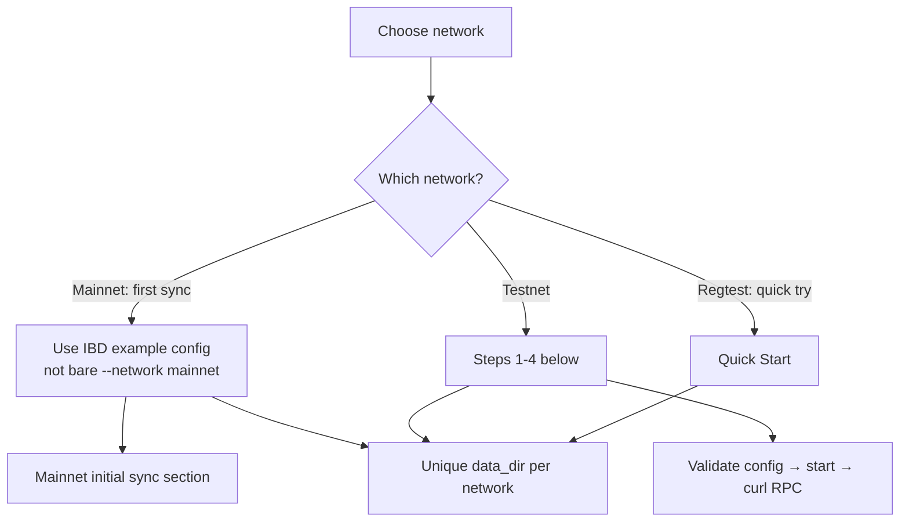

# First Node Setup

Config-file walkthrough: create `~/.config/blvm/blvm.toml`, validate it, start the node, and confirm RPC. For a five-minute regtest tutorial, use [Quick Start](quick-start.md) instead.

---

## Choose a network

| Network | `protocol_version` | Default P2P | Default RPC | Next step |
|---------|---------------------|-------------|-------------|-----------|
| **Mainnet** | `BitcoinV1` | `0.0.0.0:8333` | `127.0.0.1:8332` | [Mainnet initial sync](#mainnet-initial-sync) below |
| **Testnet** | `Testnet3` | `0.0.0.0:18333` | `127.0.0.1:18332` | Steps 1-4 below |
| **Regtest** | `Regtest` | `0.0.0.0:18444` | `127.0.0.1:18443` | [Quick Start](quick-start.md) |

Bind addresses and CLI defaults: [Node Configuration](../node/configuration.md#network-defaults-blvm-binary-no---rpc-addr-override). Wire magic bytes and ports: [Protocol variants](../protocol/overview.md#protocol-variants).

Use a **separate `[storage].data_dir` per network** so chain state never mixes.



---

## Step 1: Create configuration directory

```bash
mkdir -p ~/.config/blvm
```

## Step 2: Create `blvm.toml`

Example for **testnet** (`~/.config/blvm/blvm-testnet.toml`) or learning config shape:

```toml
transport_preference = "tcponly"
listen_addr = "0.0.0.0:18333"
protocol_version = "Testnet3"

[storage]
data_dir = "~/.local/share/blvm-testnet"
database_backend = "auto"

[logging]
level = "info"
```

For **mainnet first sync**, skip this minimal template: use the [IBD example config](#mainnet-initial-sync) (`blvm-mainnet-ibd.toml.example`) with pruning and parallel IBD instead.

- **`transport_preference`** is required in TOML (no serde default when loading a file).
- **RPC bind** uses `--rpc-addr` / `BLVM_RPC_ADDR`; the optional **`[rpc]`** table is limits only: see [Node Configuration](../node/configuration.md).
- **Production:** configure `[rpc_auth]` before exposing RPC beyond loopback. See [Deployment posture](../security/deployment-posture.md).

### Step 2b: Validate the file

```bash
blvm config validate ~/.config/blvm/blvm-testnet.toml
```

Expected: **`Configuration file is valid:`** (with the path).

## Step 3: Start the node

```bash
env -u BLVM_ASSUME_VALID_HEIGHT \
 blvm --config ~/.config/blvm/blvm-testnet.toml --verbose
```

Confirm in the first log lines: config loaded, **`Network: …`**, and `Data directory:` matches `[storage].data_dir`.

## Step 4: Verify RPC

Testnet **18332**; regtest **18443**; mainnet **8332**:

```bash
curl -s -X POST http://127.0.0.1:18332 \
 -H "Content-Type: application/json" \
 -d '{"jsonrpc":"2.0","method":"getblockchaininfo","params":[],"id":1}'
```

See [RPC API Reference](../node/rpc-api.md) for authentication and the full method list.

---

## Mainnet initial sync {#mainnet-initial-sync}

After [Installation](installation.md). **Do not** start first mainnet sync with bare `blvm --network mainnet`: use the release **IBD example config** (pruning, `[ibd].mode = "parallel"`, `[modules].enabled = false` during sync). Source: [blvm-mainnet-ibd.toml.example](https://github.com/BTCDecoded/blvm/blob/main/blvm-mainnet-ibd.toml.example).

**From a release directory** (contains `blvm`, `scripts/`, and the example TOML):

```bash
cd /path/to/your/blvm-release
./scripts/start-ibd-mainnet.sh
```

Seed `~/.config/blvm/blvm.toml` from the example: `./scripts/start-ibd-mainnet.sh --init-config`, edit peers if you have LAN Core, then run again.

**With `blvm` on PATH only:**

```bash
blvm --config /path/to/blvm-mainnet-ibd.toml.example \
 --network mainnet \
 --data-dir ~/.local/share/blvm-mainnet \
 --verbose
```

**What you should see:** config loads → `Network: Mainnet` → quiet 15-60s (peer discovery) → `IBD: <height> / <tip>` in logs. Plan for **~15 GB+** pruned disk, **hours** on WAN-only (faster with LAN Core). Validation slows near **~900k+** when assume-valid ends: expected.

**Monitor** (match start flags):

```bash
blvm --network mainnet \
 --config ~/.config/blvm/blvm.toml \
 --data-dir ~/.local/share/blvm-mainnet \
 sync
```

**Resume:** reuse the same `--data-dir`; never delete the active backend dir (`heed3/`, `rocksdb/`, …) mid-IBD.

**Tune when needed:** `BLVM_IBD_PEERS`, `BLVM_IBD_MODE`, `BLVM_IBD_WAN_SINGLE_PEER=1`, `BLVM_IBD_ENGINE=1`: see [Node configuration: IBD](../node/configuration.md#ibd-configuration), [IBD UTXO engine](../node/ibd-engine.md), [Troubleshooting: Mainnet IBD](../appendices/troubleshooting.md#mainnet-ibd).

---

## Other network examples

### Regtest (local dev)

```toml
transport_preference = "tcponly"
listen_addr = "127.0.0.1:18445" # default P2P is 18444
protocol_version = "Regtest"

[storage]
data_dir = "~/.local/share/blvm-regtest"
database_backend = "auto"

[rpc_auth]
admin_tokens = ["dev"]
```

No public seeds: see [Quick Start](quick-start.md) for `generatetoaddress`.

---

## Storage

Blocks, UTXO set, chain state, and indexes live under `[storage].data_dir`. See [Storage Backends](../node/storage-backends.md).

## Peers and sync

- **Mainnet / testnet:** DNS seeds and addr relay.
- **Regtest:** only configured peers; height stays at genesis until you add one.

## See also

- [Node Configuration](../node/configuration.md) · [Configuration Reference](../reference/configuration-reference.md)
- [Node Operations](../node/operations.md): backup, Core datadir import
- [Deployment posture](../security/deployment-posture.md): before exposing mainnet RPC
