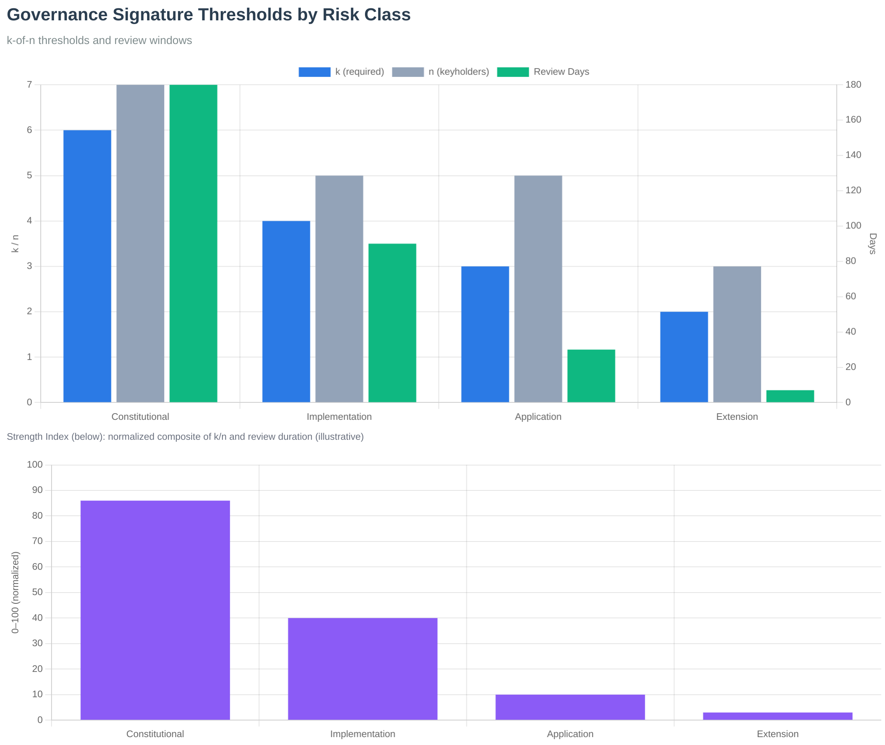
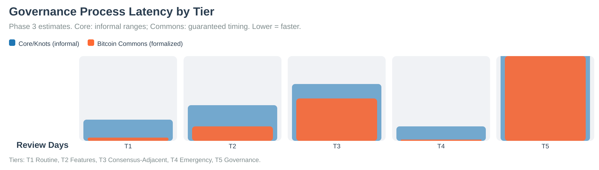
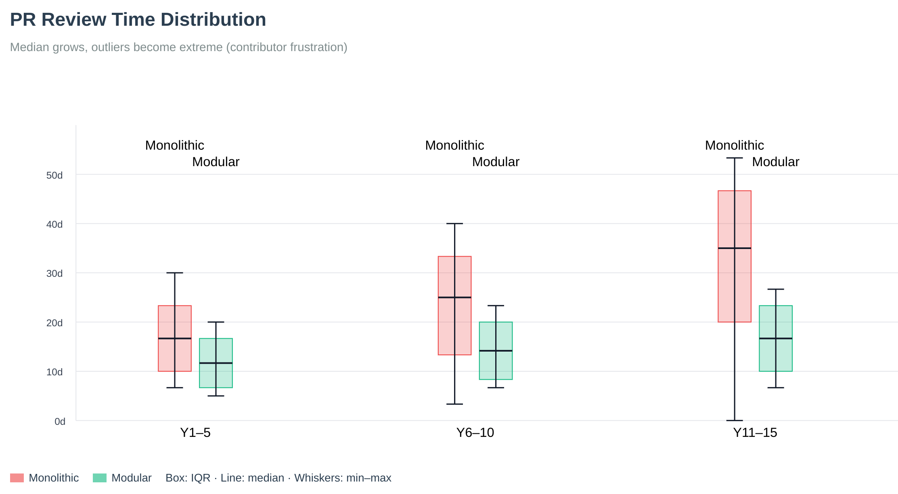

# Governance Model

Bitcoin Commons implements a constitutional governance model that makes Bitcoin governance 6x harder to capture.

{{#include ../../modules/governance/GOVERNANCE.md}}

## Governance Signature Thresholds

*Figure: Signature thresholds by layer showing the graduated security model. Constitutional layers require [[gov:layer_1_signatures]], while extension layers require [[gov:layer_5_signatures]].*

## Governance Process Latency

*Figure: Governance process latency showing review periods and decision timelines across different tiers.*

## PR Review Time Distribution

*Figure: Pull request review time distribution. Long tails reveal why throughput stalls without process and tooling. Bitcoin Commons addresses this through structured review periods and automated tooling.*

## See Also

### Operator quick answers (FAQ)

- [Do I need governance to run a node?](../appendices/faq.md#do-i-need-governance-to-run-a-node)
- [What is Bitcoin Commons vs BLVM?](../appendices/faq.md#what-is-bitcoin-commons-vs-blvm)
- [What are layers, tiers, and signatures?](../appendices/faq.md#what-are-layers-tiers-and-signatures)
- [Why “6x harder to capture”?](../appendices/faq.md#why-6x-harder-to-capture)
- [Is the system production ready?](../appendices/faq.md#is-the-system-production-ready) (governance is not universally activated)

### Governance docs

- [PR Process](../development/pr-process.md) - How governance applies to pull requests
- [Layer-Tier Model](layer-tier-model.md) - Layer and tier combination rules
- [Multisig Configuration](multisig-configuration.md) - Signature threshold configuration
- [Governance Overview](overview.md) - Governance system introduction
- [Keyholder Procedures](keyholder-procedures.md) - Maintainer responsibilities
