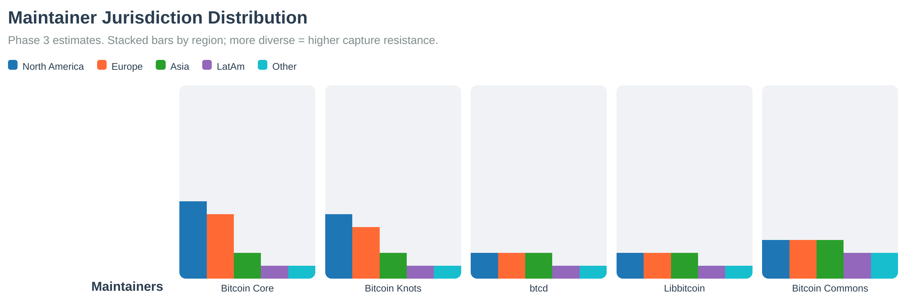

# Keyholder Procedures

Bitcoin Commons uses cryptographic keyholders (maintainers) to sign governance decisions. This section describes procedures for keyholders.

## Maintainer Responsibilities

Maintainers are responsible for:

- **Reviewing Changes**: Understanding the impact of proposed changes
- **Signing Decisions**: Cryptographically signing approved changes
- **Maintaining Keys**: Securely storing and managing cryptographic keys
- **Following Procedures**: Adhering to governance processes and review periods

## Signing Process

1. **Review PR**: Understand the change and its impact
2. **Generate Signature**: Use `bllvm-sign` from bllvm-sdk
3. **Post Signature**: Comment `/governance-sign <signature>` on PR
4. **Governance App Verifies**: Cryptographically verifies signature
5. **Status Check Updates**: Shows signature count progress

## Key Management

### Key Generation

```bash
bllvm-keygen --output maintainer.key --format pem
```

### Key Storage

- **Development**: Test keys can be stored locally
- **Production**: Keys should be stored in HSMs (Hardware Security Modules)
- **Backup**: Secure backup procedures required

### Key Rotation

Keys can be rotated through the governance process. See [MAINTAINER_GUIDE.md](../../modules/governance/guides/MAINTAINER_GUIDE.md) for detailed procedures.

## Emergency Keyholders

Emergency keyholders (5-of-7) can activate emergency mode for critical situations:

- **Activation**: 5-of-7 emergency keyholders required
- **Duration**: Maximum 90 days
- **Review Periods**: Reduced to 30 days during emergency
- **Signature Thresholds**: Unchanged

## Keyholder Diversity


*Figure: Keyholder diversity analysis showing distribution of maintainers across jurisdictions, backgrounds, and expertise areas.*

## Release Pipeline Gate Strength


*Figure: Gate strength across the release pipeline. Each gate requires specific signatures and review periods based on the change tier.*

## Maintainer Jurisdiction


*Figure: Maintainer jurisdiction concentration increases vulnerability to coordinated regulatory pressure or legal action when key decision-makers operate under similar legal frameworks.*

For detailed maintainer procedures, see [MAINTAINER_GUIDE.md](../../modules/governance/guides/MAINTAINER_GUIDE.md).

