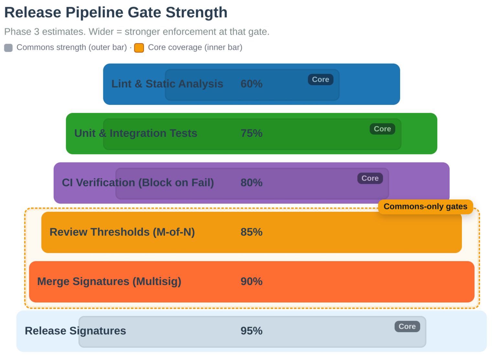

# Keyholder Procedures

Bitcoin Commons uses cryptographic keyholders (maintainers) to sign governance decisions. This section describes procedures for keyholders.

## Maintainer Responsibilities

Maintainers are responsible for:

- **Reviewing Changes**: Understanding the impact of proposed changes
- **Signing Decisions**: Cryptographically signing approved changes
- **Maintaining Keys**: Securely storing and managing cryptographic keys
- **Following Procedures**: Adhering to governance processes and review periods

## Signing Process

1. **Review PR**: Understand the change and its impact
2. **Generate Signature**: Use `blvm-sign` from blvm-sdk
3. **Post Signature**: Comment `/governance-sign <signature>` on PR
4. **Governance App Verifies**: Cryptographically verifies signature
5. **Status Check Updates**: Shows signature count progress

## Key Management

### Key Generation

```bash
blvm-keygen --output maintainer.key --format pem
```

### Key Storage

- **Development**: Test keys can be stored locally
- **Production**: Keys should be stored in HSMs (Hardware Security Modules)
- **Backup**: Secure backup procedures required

### Key Rotation

Keys can be rotated through the governance process. See [MAINTAINER_GUIDE.md](https://github.com/BTCDecoded/governance/blob/main/guides/MAINTAINER_GUIDE.md) for detailed procedures.

## Emergency Keyholders

Emergency keyholders can activate **emergency response classes** defined in `emergency-tiers.yml` (see [PR Process → Emergency Procedures](../development/pr-process.md#emergency-procedures)):

- **Activation** (all classes): [[gov:emergency_critical_activation]] emergency keyholders
- **Critical class**: [[gov:emergency_critical_signature]] maintainer signatures after activation; maximum [[gov:emergency_critical_max_days]] days
- **Urgent class**: [[gov:emergency_urgent_signature]] signatures; maximum [[gov:emergency_urgent_max_days]] days
- **Elevated class**: [[gov:emergency_elevated_signature]] signatures; maximum [[gov:emergency_elevated_max_days]] days

## Release Pipeline Gate Strength


*Figure: Gate strength across the release pipeline. Each gate requires specific signatures and review periods based on the change tier.*

For detailed maintainer procedures, see [MAINTAINER_GUIDE.md](https://github.com/BTCDecoded/governance/blob/main/guides/MAINTAINER_GUIDE.md).

## See Also

- [PR Process](../development/pr-process.md) - How maintainers sign PRs
- [Multisig Configuration](multisig-configuration.md) - Signature threshold requirements
- [Layer-Tier Model](layer-tier-model.md) - Governance tier system
- [Governance Model](governance-model.md) - Governance system
- [Governance Overview](overview.md) - Governance system introduction
