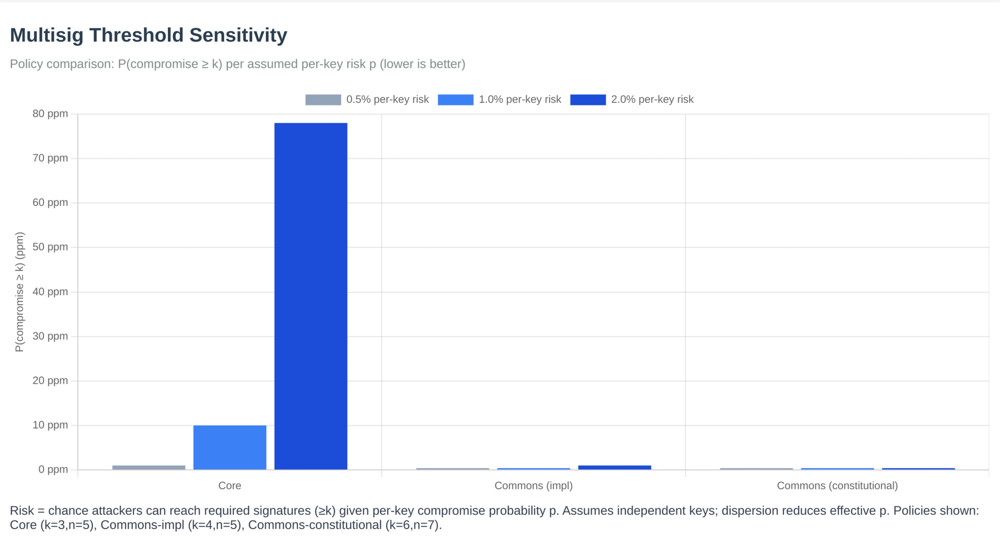

# Multisig Configuration

Bitcoin Commons uses multisig thresholds for governance decisions, with different thresholds based on the layer and tier of the change. See [Layer-Tier Model](layer-tier-model.md) for details.

Policy numbers below are expanded from governance YAML at book build time. **Action tiers** (PR classification 1-5) are documented separately in [governance action tiers](https://github.com/BTCDecoded/governance/blob/main/docs/ACTION_TIERS.md) and [config/action-tiers.yml](https://github.com/BTCDecoded/governance/blob/main/config/action-tiers.yml).

## Layer-Based Thresholds

### Constitutional Layers (Layer 1-2)
- **Orange Paper** (Layer 1): [[gov:layer_1_signatures]] maintainers, [[gov:layer_1_review_days]] days ([[gov:layer_1_consensus_review_days]] days for consensus changes)
- **blvm-consensus** (Layer 2): [[gov:layer_2_signatures]] maintainers, [[gov:layer_2_review_days]] days ([[gov:layer_2_consensus_review_days]] days for consensus changes)

### Implementation Layer (Layer 3)
- **blvm-protocol**: [[gov:layer_3_signatures]] maintainers, [[gov:layer_3_review_days]] days

### Application Layer (Layer 4)
- **blvm-node**: [[gov:layer_4_signatures]] maintainers, [[gov:layer_4_review_days]] days

### Extension Layer (Layer 5)
- **blvm-sdk**: [[gov:layer_5_signatures]] maintainers, [[gov:layer_5_review_days]] days
- **governance**: [[gov:layer_5_signatures]] maintainers, [[gov:layer_5_review_days]] days
- **blvm-commons**: [[gov:layer_5_signatures]] maintainers, [[gov:layer_5_review_days]] days

## Tier-Based Thresholds

### Tier 1: Routine Maintenance
- **Signatures**: [[gov:tier_1_signatures]] maintainers
- **Review Period**: [[gov:tier_1_review_days]] days
- **Scope**: Bug fixes, documentation, performance optimizations

### Tier 2: Feature Changes
- **Signatures**: [[gov:tier_2_signatures]] maintainers
- **Review Period**: [[gov:tier_2_review_days]] days
- **Scope**: New RPC methods, P2P changes, wallet features

### Tier 3: Consensus-Adjacent
- **Signatures**: [[gov:tier_3_signatures]] maintainers
- **Review Period**: [[gov:tier_3_review_days]] days
- **Scope**: Changes affecting consensus validation code

### Tier 4: Emergency Actions
- **Signatures**: [[gov:tier_4_signatures]] maintainers
- **Review Period**: [[gov:tier_4_review_days]] days (immediate)
- **Scope**: Critical security patches, network-threatening bugs

### Tier 5: Governance Changes
- **Signatures**: Special process: see [governance policy](https://github.com/BTCDecoded/governance/blob/main/GOVERNANCE.md) (not the `tier_5_governance` row in `action-tiers.yml` alone)
- **Review Period**: [[gov:tier_5_review_days]] days
- **Scope**: Changes to governance rules themselves

## Combined Model

When both layer and tier apply, the system uses **"most restrictive wins"** rule. See [Layer-Tier Model](layer-tier-model.md) for the decision matrix.

## Multisig Threshold Sensitivity

*Figure: Multisig threshold sensitivity analysis showing how different threshold configurations affect security and decision-making speed.*

## Governance Signature Thresholds

*Figure: Signature thresholds by layer showing the graduated security model.*

For configuration details, see the [governance config/ directory](https://github.com/BTCDecoded/governance/tree/main/config) in the governance repository.

## Nested multisig (SDK)

Flat **N-of-M** thresholds above describe maintainer rules per layer. The [SDK overview](../sdk/overview.md) also documents **nested multisig** for team-based and hierarchical governance setups using **`blvm-sdk`** primitives, see that chapter for APIs beyond a single flat quorum.

## See Also

- [Layer-Tier Model](layer-tier-model.md) - How layers and tiers combine
- [PR Process](../development/pr-process.md) - How thresholds apply to PRs
- [Governance Model](governance-model.md) - Governance system
- [Keyholder Procedures](keyholder-procedures.md) - Maintainer signing process
- [Governance Overview](overview.md) - Governance system introduction
