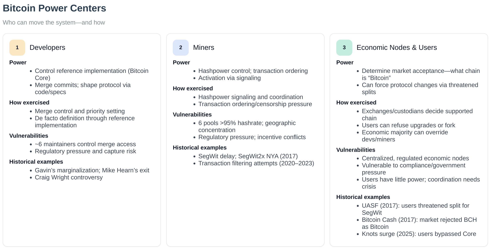

# Governance Overview

The governance system provides cryptographic enforcement of development processes across all Bitcoin Commons repositories.

{{#include ../../../modules/governance/README.md}}

## Attack Path Interception

*Figure: Risk interception points across GitHub, Nostr, and OpenTimestamps. Multiple layers of verification prevent single points of failure.*

## Single Point of Failure Analysis

*Figure: Single point of failure in maintainer-centric governance. Informal governance concentrates decision-making in a small number of maintainers, creating systemic vulnerability at scale.*

## Bitcoin Power Centers

*Figure: Power centers overview showing developers, miners, and economic nodes/users with their typical levers and resolution paths. When these centers disagree, there's no formal mechanism to resolve conflicts.*

