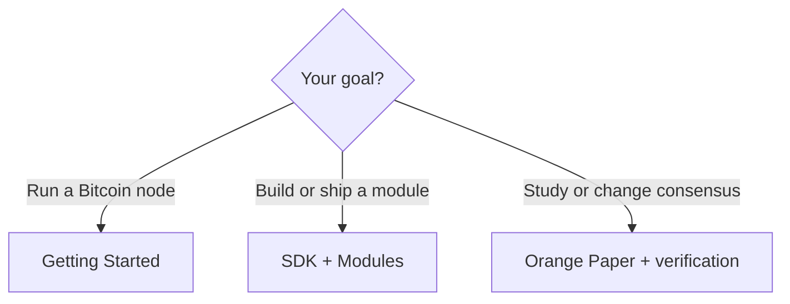

# Introduction

BLVM (Bitcoin Low-Level Virtual Machine) implements Bitcoin consensus from the [Orange Paper](reference/orange-paper.md), provides protocol abstraction for multiple Bitcoin variants, a **reference** full node with P2P networking, a developer SDK, and cryptographic governance for transparent development.

## Who is this for?

**Running a Bitcoin node?** [Operator guide](getting-started/operator-guide.md): [Installation](getting-started/installation.md), [Quick Start](getting-started/quick-start.md), [First Node Setup](getting-started/first-node.md) ([mainnet IBD hub](getting-started/operator-guide.md#initial-block-download-ibd)). Read [Deployment posture](security/deployment-posture.md) before exposing RPC on mainnet.

**Building a module or integrating with the SDK?** [Developer guide](getting-started/developer-guide.md): [Building your first module](getting-started/first-module.md), then [Building modules](sdk/module-development.md).

**Studying the spec or contributing to consensus?** The [Orange Paper](reference/orange-paper.md) is the normative spec. [Formal Verification](consensus/formal-verification.md) explains verification. Contributors: [Repository layout](development/repository-architecture.md), [Contributing](development/contributing.md).

## What is BLVM?

BLVM is compiler-like infrastructure for Bitcoin implementations. The [Orange Paper](reference/orange-paper.md) is the mathematical specification (IR), readable by mathematicians without implementation code. **blvm-consensus** implements those rules; [BLVM Specification Lock](https://github.com/BTCDecoded/blvm-spec-lock) (Z3), differential testing, fuzzing, and tests check the code against the spec. See [compiler-like architecture](reference/glossary.md#compiler-like-architecture), [Formal Verification](consensus/formal-verification.md#what-formal-verification-delivers), and the [six-layer stack](architecture/system-overview.md).

**Why "LVM"?** Like LLVM’s shared compiler infrastructure, BLVM provides shared infrastructure for Bitcoin implementations; the Orange Paper is the reference spec; node and consensus code is validated against it.

## Documentation Structure

The sidebar follows three paths from [Who is this for](#who-is-this-for):

- **Operators:** Getting Started → Node → Security
- **Developers:** Getting Started → SDK and modules → Module runtime (under Architecture)
- **Spec and consensus:** Architecture → Consensus → Protocol → Reference (Orange Paper)

Cross-cutting: Governance, Development, Appendices.

Documentation is maintained in source repositories alongside code and is aggregated at [docs.thebitcoincommons.org](https://docs.thebitcoincommons.org).

## Getting Help

Report bugs or request features via GitHub Issues, ask questions in GitHub Discussions, or report security issues to security@thebitcoincommons.org.
