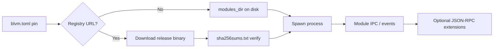

# Module catalog

BLVM node runs optional features as separate, process-isolated modules. See [Building modules](../sdk/module-development.md) to build your own.

## Available modules

**Core integration modules** (documented in this book):

- **[Lightning Network Module](lightning.md)**: Lightning payment processing (LNBits, LDK, Stub)
- **[Commons Mesh Module](mesh.md)**: Payment-gated mesh overlay; four JSON-RPC methods when loaded
- **[Stratum V2 Module](stratum-v2.md)**: Stratum V2 mining protocol
- **[Datum Module](datum.md)**: DATUM Gateway (with Stratum V2)
- **[Mining OS Module](miningos.md)**: MiningOS integration
- **[Selective Sync Module](selective-sync.md)**: IBD sync policy and witness filtering

**Registry modules** (bootstrap from `registry/modules.json`):

- **blvm-zmq**: ZMQ PUB notifications ([ZMQ module](zmq.md))
- **blvm-miniscript**: Descriptor / PSBT RPC overrides ([Miniscript module](miniscript.md))
- **blvm-governance**: On-chain proposal webhook module ([Governance module](governance-module.md))
- **blvm-marketplace**: Optional registry/payments ([Marketplace module](marketplace-module.md))
- **blvm-fibre**: FIBRE UDP/FEC block relay ([FIBRE module](fibre.md))

## Module system architecture



Modules run in separate processes with IPC ([Module System Architecture](../architecture/module-system.md)):

- **Process isolation**: Module crash does not take down the node
- **Consensus isolation**: Modules cannot alter consensus rules or the UTXO set
- **Defined APIs**: IPC, ModuleAPI, and optional JSON-RPC extension

## Installing modules

### Registry bootstrap (recommended)

Pin modules in `blvm.toml` under **`[modules]`** (merge into your existing file: a standalone snippet still needs `transport_preference` and network keys elsewhere in the file):

```toml
[modules]
registry_url = "https://raw.githubusercontent.com/BTCDecoded/blvm/main/registry/modules.json"
blvm-mesh = "0.1.*"
blvm-zmq = "0.1.*"
```

The node downloads version-pinned binaries from GitHub Releases (`sha256sums.txt` on each tag) when a pinned module is missing on disk. See [blvm README](https://github.com/BTCDecoded/blvm/blob/main/README.md) in the `blvm` repository for the full bootstrap contract.

### Build from source

```bash
cargo install blvm-lightning # when published on crates.io
# or clone BTCDecoded/blvm-<name>, cargo build --release, place binary per module.toml
```

### Manual placement

1. Build the module: `cargo build --release`
2. Place the binary and `module.toml` under the node module search path
3. Restart the node or load at runtime via configuration / module manager

## Module configuration

Each module uses `module.toml` plus optional `config.toml`. See per-module pages linked above and [Node configuration](../node/configuration.md).

- **Load** at startup when pinned under **`[modules]`** (inline `blvm-zmq = "0.1.*"`) or loaded at runtime via RPC
- **Unload** without stopping the base node
- **Reload** configuration where the module supports hot reload

## WASM modules (`wasm-modules`)

When the node loads **WebAssembly** guests (**`wasm-modules`** / **`blvm-sdk`** embedding), treat them as trusted only if your governance policy says so. The embedder applies **wasmtime fuel** and **store limits** with conservative defaults; override per module via **`[modules.<name>]`** keys in **[node configuration guide](https://github.com/BTCDecoded/blvm-node/blob/main/docs/CONFIGURATION_GUIDE.md)**.

## See Also

- [Module System Architecture](../architecture/module-system.md)
- [Building modules](../sdk/module-development.md)
- [SDK Overview](../sdk/overview.md)
- [Node Configuration](../node/configuration.md)
