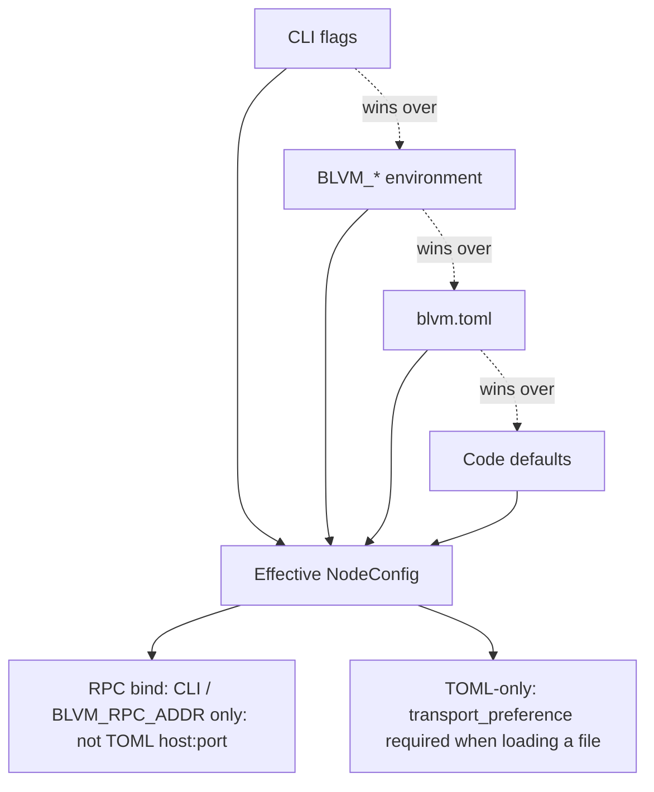

# Node Configuration

BLVM node configuration supports different use cases.

## Protocol Variants

The node supports multiple Bitcoin protocol variants: **Regtest** (default, regression testing network for development), **Testnet3** (Bitcoin test network), and **BitcoinV1** (production Bitcoin mainnet). See [Protocol Variants](../protocol/overview.md#protocol-variants) for details.

## Configuration Precedence

**CLI > ENV > config file > defaults**



Environment variables (e.g. `BLVM_DATA_DIR`, `BLVM_IBD_EVICTION`) override config file values. See [Environment variables](../reference/configuration-reference.md#environment-variables) in the configuration reference for the full list. Some options (relay, fibre, dandelion) are config-file-only; use CLI flags like `--enable-dandelion` for common overrides.

### Network defaults (`blvm` binary, no `--rpc-addr` override) {#network-defaults-blvm-binary-no-rpc-addr-override}

| Network | `protocol_version` | P2P (`--listen-addr`) | RPC (`--rpc-addr`) |
|---------|-------------------|------------------------|---------------------|
| Mainnet | `BitcoinV1` | `0.0.0.0:8333` | `127.0.0.1:8332` |
| Testnet | `Testnet3` | `0.0.0.0:18333` | `127.0.0.1:18332` |
| Regtest (CLI default) | `Regtest` | `0.0.0.0:18444` | `127.0.0.1:18443` |

Separate **`data_dir` per network**. REST bind (when enabled) derives from RPC port: **8080** (mainnet), **18080** (testnet), **28443** (regtest).

## Path Expansion

Config path fields (`storage.data_dir`, `modules.modules_dir`, `ibd.dump_dir`, etc.) support `~` expansion to the home directory when loading from file. Example: `data_dir = "~/.local/share/blvm-mainnet"` resolves to `/home/user/.local/share/blvm-mainnet` on Unix.

## Configuration File

Create a `blvm.toml` configuration file. Keys are **top-level** or in nested tables such as `[storage]`: there is **no** `[network]` wrapper.

**RPC bind address** is set by the **`blvm`** binary (`--rpc-addr` / `BLVM_RPC_ADDR`), not by a `port`/`host` table. The optional **`[rpc]`** table holds **RPC server limits** only (e.g. `max_request_size_bytes`, IP rate limits). **Auth** uses **`[rpc_auth]`**. See the [configuration reference](../reference/configuration-reference.md).

```toml
# P2P listen address (NodeConfig library default: 127.0.0.1:8333; `blvm` CLI without config file uses network-aware ports)
listen_addr = "127.0.0.1:8333"

# TOML uses serde enum tags (lowercase, no underscore): tcponly, irohonly, quinnonly, hybrid, all
# The `blvm` CLI and BLVM_NODE_TRANSPORT accept forms like tcp_only
transport_preference = "tcponly"

max_peers = 100
protocol_version = "BitcoinV1" # mainnet-style; use "Regtest" / Testnet3 naming per protocol variant docs
enable_self_advertisement = true

[storage]
data_dir = "/var/lib/blvm"
database_backend = "auto" # auto | rocksdb | tidesdb | heed3 | redb | sled: see storage docs

# Optional: RPC limits only (not bind address)
# [rpc]
# max_request_size_bytes = 1048576
```

**Defaults (two layers)**:
- **`blvm` operator binary** (no config file): default network **`regtest`**. RPC when `--rpc-addr` is omitted: mainnet **`127.0.0.1:8332`**, testnet **`127.0.0.1:18332`**, regtest **`127.0.0.1:18443`** (Core-aligned). P2P: mainnet **`0.0.0.0:8333`**, testnet **`0.0.0.0:18333`**, regtest **`0.0.0.0:18444`**. Override with `--listen-addr` / `BLVM_LISTEN_ADDR` and `--rpc-addr` / `BLVM_RPC_ADDR`.
- **`NodeConfig` library default** (used when embedding `blvm-node`): `listen_addr` localhost `8333`, `protocol_version` `"BitcoinV1"`, `transport_preference` TCP-only, `max_peers` 100.

Configuration is organized in logical sections (`storage`, `ibd`, `modules`, optional `[stratum_v2]`, etc.) in the node codebase. Initial block download uses parallel IBD only.

## Bitcoin Core bitcoin.conf versus BLVM

**BLVM does not read `bitcoin.conf`.** Runtime configuration is **`blvm.toml` / JSON**, **`blvm` CLI**, and **`BLVM_*`** environment variables.

| Bitcoin Core (`bitcoin.conf` or CLI) | BLVM |
|--------------------------------------|------|
| `rpcuser` / `rpcpassword` | **`[rpc_auth].username`** / **`password`** (HTTP Basic; password auto-granted admin), or **`tokens`** / **`admin_tokens`** with **`Authorization: Bearer …`** |
| `rpcbind` / `rpcport` | **`blvm --rpc-addr`** / **`BLVM_RPC_ADDR`** |
| `port` (P2P) | **`listen_addr`** (top-level TOML) or **`--listen-addr`** |
| `addnode=` | **`persistent_peers`** or the **`addnode`** RPC after startup |

To **draft** a `blvm.toml` from a Core config file, use **`blvm config convert-core <path/to/bitcoin.conf>`** (or the **`convert-bitcoin-core-config`** shell/Rust tools in the **`blvm-node`** repo). **Review and normalize** the output: remove legacy **`[network]`** wrappers and nested **`[transport_preference]`** blobs. **`[rpc_auth].username`** / **`password`** are valid for HTTP Basic (map from Core **`rpcuser`** / **`rpcpassword`**), or use **`tokens`** / **`admin_tokens`** for Bearer auth: see the [blvm-node Integration Guide: Migrating from bitcoin.conf](https://github.com/BTCDecoded/blvm-node/blob/main/docs/INTEGRATION_GUIDE.md#migrating-from-bitcoinconf). Always wire **`--rpc-addr`** and set **`storage.data_dir`** separately.

## IBD Configuration

Default **`mode = "parallel"`**. LAN peers are auto-preferred for download. On WAN-only sync, **`parallel` mode uses multi-peer work-stealing**; set **`BLVM_IBD_WAN_SINGLE_PEER=1`** to force a single download peer. Overrides: **`BLVM_IBD_PEERS`**, **`BLVM_IBD_MODE`**, **`BLVM_IBD_ENGINE`**. First sync: [First Node Setup: Mainnet IBD](../getting-started/first-node.md#mainnet-initial-sync). Engine details: [IBD UTXO engine](ibd-engine.md).

```toml
[ibd]
chunk_size = 128
max_blocks_in_transit_per_peer = 128
download_timeout_secs = 30
mode = "parallel"
eviction = "fifo"
headers_timeout_secs = 30
headers_max_failures = 10
```

ENV: `BLVM_IBD_*`: see [configuration reference](../reference/configuration-reference.md#environment-variables).

## Protocol Limits

Tune P2P message limits for constrained networks:

```toml
[protocol_limits]
max_protocol_message_length = 33554432 # 32 MB default
max_addr_to_send = 1000
max_inv_sz = 50000
max_headers_results = 2000
```

## Environment Variables

You can also configure via environment variables (ENV overrides config file):

```bash
export BLVM_NETWORK=testnet
export BLVM_DATA_DIR=/var/lib/blvm
# Use the RPC socket your node binds (example: mainnet 8332; testnet 18332; regtest 18443)
export BLVM_RPC_ADDR=127.0.0.1:8332
export BLVM_IBD_EVICTION=dynamic
export BLVM_NETWORK_TARGET_PEER_COUNT=125
```

**Common ENV vars:** `BLVM_DATA_DIR`, `BLVM_NETWORK`, `BLVM_LISTEN_ADDR`, `BLVM_RPC_ADDR`, `BLVM_LOG_LEVEL`, `BLVM_NODE_MAX_PEERS`, `BLVM_IBD_*`, `BLVM_NETWORK_TARGET_PEER_COUNT`, `BLVM_REQUEST_*`, `BLVM_MODULE_MAX_*`, `RPC_AUTH_TOKENS`, `COMMONS_API_KEY`, `RUST_LOG`.

See [Environment variables](../reference/configuration-reference.md#environment-variables) for the complete list.

## Command Line Options

**Precedence:** CLI > ENV > config file > defaults

### Global Options

| Option | Short | Default | Description |
|--------|-------|---------|-------------|
| `--network` | `-n` | `regtest` | Network: `regtest`, `testnet`, `mainnet` |
| `--rpc-addr` | `-r` | network-aware when omitted | RPC bind: mainnet `127.0.0.1:8332`; testnet `127.0.0.1:18332`; regtest `127.0.0.1:18443` |
| `--listen-addr` | `-l` | network-aware when omitted | P2P listen: mainnet `0.0.0.0:8333`, testnet `0.0.0.0:18333`, regtest `0.0.0.0:18444` |
| `--data-dir` | `-d` |: | Data directory (overrides ENV and config) |
| `--config` | `-c` |: | Configuration file path (TOML or JSON) |
| `--verbose` | `-v` | false | Enable verbose logging |
| `--no-auto-migrate` | | false | Do not auto-migrate from a Bitcoin Core datadir on start (requires `rocksdb`) |
| `--migrate-destination` | |: | BLVM store path when auto-migrating from Core (default: `<datadir>/blvm`) |
| `--migrate-core-only` | | false | Migrate from Core datadir and exit (no P2P/RPC start; requires `rocksdb`) |

### Feature Flags

`--enable-stratum-v2`, `--enable-dandelion`, `--enable-sigop` and corresponding `--disable-*` flags (each requires that **compile-time** feature in the binary).

**BIP158:** `--enable-bip158` / `--disable-bip158` adjust **logged** preference only, compact block filter code is compiled without a separate `bip158` Cargo feature (present in typical `blvm` / `blvm-node` builds).

**REST API:** enable in `blvm.toml` with **`[rest_api].enabled = true`** (requires **`rest-api`** in the binary). Binds a separate loopback port (default **8080** when RPC is **8332**, **18080** when RPC is **18332**, otherwise RPC port **+ 10000**: e.g. **28443** for regtest **18443**). See [RPC API: REST](rpc-api.md#rest-api).

### Advanced Options

`--assumevalid`, `--noassumevalid`, `--assumeutxo`, `--target-peer-count`, `--async-request-timeout`, `--module-max-cpu-percent`, `--module-max-memory-bytes`.

### Commands

`start` (default), `status`, `health`, `version`, `chain`, `peers`, `network`, `sync`, `config show|validate|path|set|convert-core`, `configpath <module>` (offline module config path), `load` / `unload` / `reload` / `module list` (admin RPC to a running node), `migrate core` (requires `rocksdb`), `rpc`, plus dynamic module CLI (e.g. `blvm sync-policy list` when selective-sync is loaded). Remote subcommands use **`[rpc_auth]` from the same `--config`** as the node (admin Bearer token or Basic password).

```bash
blvm --network mainnet -d /var/lib/blvm
blvm migrate core --source ~/.bitcoin --destination ~/.bitcoin/blvm --network mainnet --verify
blvm start --data-dir ~/.bitcoin --migrate-core-only # migrate only, then exit
blvm config show
blvm status --rpc-addr 127.0.0.1:8332
```

## Bitcoin Core drop-in

BLVM does not read Core chainstate in place. With **`rocksdb`**, a synced Core **`--data-dir`** triggers one-time migration into **`<datadir>/blvm/`** unless disabled. After migrate, point **`--data-dir`** at the BLVM store or keep the Core path (node opens `blvm/` when marked).

**Default behavior:** migrate UTXOs and indexes only; **do not copy** Core **`blocks/`** (~700 GB on mainnet). BLVM reads block bodies from the original Core **`blocks/`** directory via a fallback reader. Set **`storage.reuse_core_block_files = false`** (or **`BLVM_REUSE_CORE_BLOCK_FILES=0`**) only if you want a self-contained BLVM store that duplicates block files.

| Mechanism | Purpose |
|-----------|---------|
| `--data-dir` / `BLVM_DATA_DIR` | Core path for detect/migrate, or BLVM store after migrate |
| `--no-auto-migrate` | Skip auto-import |
| `--migrate-destination` | Override `<datadir>/blvm` |
| `--migrate-core-only` | Migrate and exit |
| `blvm migrate core` | Explicit import (`--verify` optional) |

```toml
[storage]
auto_migrate_core = true
# core_migrate_destination = "/var/lib/blvm-mainnet"
# reuse_core_block_files = true # default; set false to copy block bodies into BLVM store
```

ENV and reference: [Configuration Reference](../reference/configuration-reference.md) (`storage.auto_migrate_core`, `storage.reuse_core_block_files`, `BLVM_*`). Operator flow: [Operations](operations.md#starting-from-a-bitcoin-core-datadir). Storage details: [Storage Backends](storage-backends.md#bitcoin-core-drop-in-migrate-on-start). Map Core **`datadir=`** via **`blvm config convert-core`**: see [bitcoin.conf vs BLVM](#bitcoin-core-bitcoinconf-versus-blvm).

## Storage Backends

The node uses multiple [storage backends](storage-backends.md) with automatic fallback:

### Database Backends

- **auto** (default): Resolve by build features, heed3 when `heed3` feature enabled, then RocksDB, TidesDB, Redb, Sled (see [Configuration Reference](../reference/configuration-reference.md))
- **rocksdb**, **tidesdb**, **redb**, **sled**: Force a specific backend (see [Storage Backends](storage-backends.md)); **`auto`** matches `default_backend()` order in code

### Storage Configuration

```toml
[storage]
data_dir = "/var/lib/blvm"
database_backend = "auto" # or "rocksdb", "tidesdb", "heed3", "redb", "sled"

[storage.cache]
block_cache_mb = 100
utxo_cache_mb = 50
header_cache_mb = 10

# Pruning uses PruningConfig: see configuration reference. Example: normal mode with ~288 recent blocks
[storage.pruning]
mode = { type = "normal", keep_from_height = 0, min_recent_blocks = 288 }
auto_prune = true
min_blocks_to_keep = 144
```

### Backend Selection

When `database_backend = "auto"`, the node selects by build features: heed3 (LMDB, if `heed3` feature enabled: default), then RocksDB, TidesDB, Redb, Sled. Falls back to the next option if the preferred backend is unavailable.

### Cache Configuration

Storage cache sizes can be configured:
- **Block / UTXO / header cache**: See [Configuration Reference](../reference/configuration-reference.md) for canonical defaults (e.g. 100 / 50 / 10 MB).

### Pruning

Pruning reduces storage requirements by trimming old block data. **`PruningConfig`** defaults in code use an **aggressive-style** mode with UTXO-commitment expectations; **validate** your build features (`utxo-commitments` for aggressive) or choose **`type = "normal"`** / **`type = "disabled"`** explicitly. See [configuration reference](../reference/configuration-reference.md) and `blvm-node` pruning examples.

```toml
[storage.pruning]
mode = { type = "disabled" }
auto_prune = false
min_blocks_to_keep = 144
```

**Note**: Pruning reduces storage but limits ability to serve historical blocks to peers.

## Network Configuration

### Transport Options

Configure transport selection at the **top level** of `blvm.toml` (see [Transport Abstraction](transport-abstraction.md)):

```toml
# File (TOML): serde tags: tcponly | irohonly | quinnonly | hybrid | all
transport_preference = "tcponly"
```

**Mapping (CLI / ENV vs config file)**:
- **TOML/JSON** on `NodeConfig`: lowercase enum tags as above (`tcponly`, …).
- **`blvm` flags / `BLVM_NODE_TRANSPORT`:** e.g. `tcp_only`, `iroh_only`, `hybrid` (see `blvm --help`).

**Available Transport Options**:
- **TCP-only** (`tcponly` in file): default, Bitcoin P2P compatible
- **Iroh-only** (`irohonly`): requires `iroh` feature
- **Quinn-only** (`quinnonly`): requires `quinn` feature
- **Hybrid** (`hybrid`): TCP + Iroh; requires `iroh` feature
- **All** (`all`): requires both `quinn` and `iroh` features

**Feature Requirements**:
- `iroh` feature: Enables Iroh QUIC transport with NAT traversal
- `quinn` feature: Enables standalone Quinn QUIC transport

## RBF Configuration

Configure Replace-By-Fee (RBF) behavior with 4 modes: Disabled, Conservative, Standard (default), and Aggressive.

### RBF Modes

**Disabled**: No RBF replacements allowed
```toml
[rbf]
mode = "disabled"
```

**Conservative**: Strict rules with higher fee requirements
```toml
[rbf]
mode = "conservative"
min_fee_rate_multiplier = 2.0
min_fee_bump_satoshis = 5000
min_confirmations = 1
max_replacements_per_tx = 3
cooldown_seconds = 300
```

**Standard** (default): BIP125-compliant RBF
```toml
[rbf]
mode = "standard"
min_fee_rate_multiplier = 1.1
min_fee_bump_satoshis = 1000
```

**Aggressive**: Relaxed rules for miners
```toml
[rbf]
mode = "aggressive"
min_fee_rate_multiplier = 1.05
min_fee_bump_satoshis = 500
allow_package_replacements = true
```

See [RBF and Mempool Policies](rbf-mempool-policies.md) for complete configuration guide.

## Advanced Indexing

Enable address and value range indexing for efficient queries:

```toml
[storage.indexing]
enable_address_index = true
enable_value_index = true
strategy = "eager" # or "lazy"
max_indexed_addresses = 0 # 0 = unlimited
enable_compression = false # zstd index blobs; requires compression (blvm default features)
background_indexing = false # lazy only: index on txindex-bg thread
```

## Module Configuration

Configure process-isolated modules. **There is no hardcoded default module list in the node**: copy pins from `blvm.toml.example` or set your own. An empty pin map auto-discovers modules already on disk under `modules_dir` (no HTTP bootstrap).

```toml
[modules]
enabled = true # Enable module system (default: true)
modules_dir = "modules" # Directory containing module binaries (default: "modules")
data_dir = "data/modules" # Directory for module data/state (default: "data/modules")
socket_dir = "data/modules/sockets" # Directory for IPC sockets (default: "data/modules/sockets")
registry_url = "https://raw.githubusercontent.com/BTCDecoded/blvm/main/registry/modules.json"
# Version pins (wildcard or exact semver). Omit pins to load on-disk modules only.
blvm-miniscript = "0.1.*"
# When a module needs spawn overrides, put the pin in its table as `version`:
[modules.blvm-zmq]
version = "0.1.*"
hashblock = "tcp://127.0.0.1:28332"
# Legacy unpinned allowlist: enabled_modules = ["blvm-miniscript"]
```

See [Module System](../architecture/module-system.md) and [node modules README](https://github.com/BTCDecoded/blvm-node/blob/main/modules/README.md) for bootstrap and registry details. ZMQ topic endpoints: [ZMQ module](../modules/zmq.md).

**Module resource limits** (optional) use the **`[module_resource_limits]`** table on **`NodeConfig`**, not `[modules.resource_limits]`:

```toml
[module_resource_limits]
default_max_cpu_percent = 50
default_max_memory_bytes = 536870912
default_max_file_descriptors = 256
default_max_child_processes = 10
module_startup_wait_millis = 100
module_socket_timeout_seconds = 5
module_socket_check_interval_millis = 100
module_socket_max_attempts = 50
```

See [Module System](../architecture/module-system.md) for module configuration details.

## See Also

- [Node Overview](overview.md) - Node features and architecture
- [Node Operations](operations.md) - Running and managing your node
- [Storage Backends](storage-backends.md) - Detailed storage backend information
- [Transport Abstraction](../node/transport-abstraction.md) - Transport options
- [Network Protocol](../protocol/network-protocol.md) - Protocol variants and network configuration
- [Configuration Reference](../reference/configuration-reference.md) - Complete configuration reference
- [Getting Started](../getting-started/installation.md) - Installation guide
- [Troubleshooting](../appendices/troubleshooting.md) - Common configuration issues

