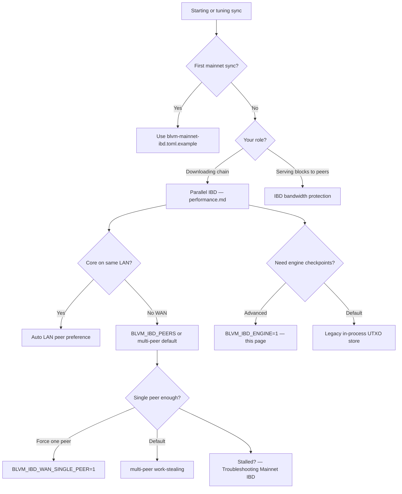

# IBD UTXO engine

## Sync tuning guide

Use this decision tree before changing IBD settings. First mainnet sync always starts from [First Node Setup — Mainnet IBD](../getting-started/first-node.md#mainnet-initial-sync) (release IBD example config).



| Topic | Page |
|-------|------|
| Parallel download, pipelining, assume-valid | [Performance optimizations](performance.md) |
| `[ibd]` keys and `BLVM_IBD_*` | [Configuration reference — IBD](../reference/configuration-reference.md#ibd-configuration) |
| Serving-side bandwidth limits | [IBD bandwidth protection](ibd-protection.md) |
| LAN Core / same-subnet peers | [LAN peering](lan-peering.md) |

## Overview

During parallel initial block download (IBD), the node validates blocks in height order while downloading from one or more peers. By default, UTXO updates use the legacy in-process store. When enabled, an **age-tiered UTXO engine** holds live UTXOs in memory and on disk under `storage/ibd_engine/`, with mid-sync checkpoints for crash-safe resume.

Enable the engine only when you understand checkpoint storage and disk use. The release mainnet IBD example config does **not** turn it on.


## Enable

Set before starting sync:

```bash
export BLVM_IBD_ENGINE=1
```

Optional environment variables:

| Variable | Purpose |
|----------|---------|
| `BLVM_IBD_ENGINE_PATH` | Directory for engine table files (default: temp dir per process) |
| `BLVM_IBD_CHECKPOINT_INTERVAL` | Fixed block interval for mid-IBD checkpoint export (engine mode) |
| `BLVM_IBD_DEFER_CHECKPOINT_INTERVAL` | RAM-tier default override for deferred checkpoint spacing |
| `BLVM_IBD_EXPORT_HEIGHT_OVERRIDE` | Force resume/export from a specific height (recovery / tests) |

Download scheduling still uses **[parallel IBD](performance.md#parallel-initial-block-download-ibd)** (`[ibd].mode = "parallel"`). The engine replaces how validated blocks apply UTXO changes during that pipeline.

## Architecture

1. **Index and table** — Age-tiered structures track live UTXOs and support fast spend lookups during validation.
2. **Spend session** — Batches spend/create operations per block and feeds the engine from the validation loop.
3. **Checkpoint export** — Periodic snapshots of engine state allow resume after interruption without re-downloading from genesis.
4. **Import / seed** — On restart, the node seeds validation from the last exported checkpoint height when present.


## Operator notes

- Use the **same** `storage.data_dir` on every run; do not delete the active database backend directory (`heed3/`, `rocksdb/`, …) mid-sync.
- On **SIGTERM** / **SIGINT** during parallel IBD, the node drains in-flight validation and flushes the UTXO watermark before exit when possible.
- **`io_uring`** accelerates engine table I/O on **Linux**; other platforms use a `pread` fallback (engine still runs on Windows).
- **[Assume-valid](../reference/configuration-reference.md#block_validationassume_valid_height)** skips signature verification below a configured height; block structure, Merkle roots, and proof-of-work are still checked.
- First mainnet sync: [First Node Setup — Mainnet IBD](../getting-started/first-node.md#mainnet-initial-sync). Tune `[ibd]` in config or `BLVM_IBD_*` overrides only when you need explicit peer or mode control.

## Configuration

See **[IBD Configuration](../reference/configuration-reference.md#ibd-configuration)** for `[ibd]` keys and **`BLVM_IBD_*`** environment variables shared with parallel download.

## Source

- [ibd_engine/](https://github.com/BTCDecoded/blvm-node/blob/main/src/storage/ibd_engine/), [parallel_ibd/validation_loop.rs](https://github.com/BTCDecoded/blvm-node/blob/main/src/node/parallel_ibd/validation_loop.rs)
- [ibd_engine/mod.rs](https://github.com/BTCDecoded/blvm-node/blob/main/src/storage/ibd_engine/mod.rs), [spend_session.rs](https://github.com/BTCDecoded/blvm-node/blob/main/src/storage/ibd_engine/spend_session.rs), [export.rs](https://github.com/BTCDecoded/blvm-node/blob/main/src/storage/ibd_engine/export.rs)

## See Also

- [Performance Optimizations](performance.md) — Parallel download, pipelining, reorder buffer
- [IBD Bandwidth Protection](ibd-protection.md) — Serving-side bandwidth limits
- [LAN Peering System](lan-peering.md) — LAN peer preference during download
- [Storage Backends](storage-backends.md) — `database_backend` and `data_dir`
