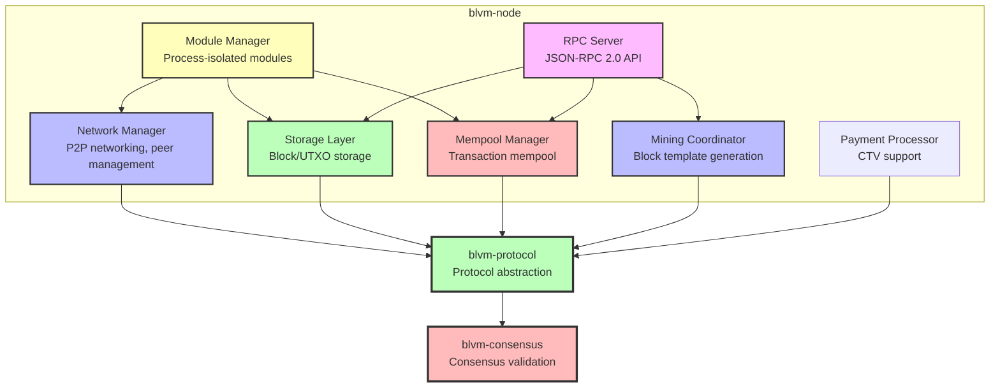

# Node Implementation Overview

The node implementation (`blvm-node`) is a minimal, production-ready Bitcoin node that adds only non-consensus infrastructure to the consensus and protocol layers. Consensus logic comes from [blvm-consensus](../consensus/overview.md), and protocol abstraction from [blvm-protocol](../protocol/overview.md).

## Architecture

The node follows a layered architecture:



## Key Components

### Network Manager
- P2P protocol implementation (Bitcoin wire protocol)
- Multi-transport support (TCP, Quinn QUIC, Iroh)
- Peer connection management
- Message routing and relay
- Privacy protocols (Dandelion++, Fibre)
- Package relay (BIP331)

**Code**: ```1:2680:blvm-node/src/network/mod.rs```

### Storage Layer
- Database abstraction with multiple backends (see [Storage Backends](storage-backends.md))
- Automatic backend fallback on failure
- Block storage and indexing
- UTXO set management
- Chain state tracking
- Transaction indexing
- Pruning support

**Code**: ```1:89:blvm-node/src/storage/mod.rs```

### RPC Server
- JSON-RPC 2.0 compliant API (see [RPC API Reference](rpc-api.md))
- REST API (optional feature, runs alongside JSON-RPC)
- Optional QUIC transport support (see [QUIC RPC](quic-rpc.md))
- Authentication and rate limiting
- Method coverage

**Code**: ```1:47:blvm-node/src/rpc/mod.rs```

### Module System
- Process-isolated modules (see [Module System Architecture](../architecture/module-system.md))
- IPC communication (Unix domain sockets, see [Module IPC Protocol](../architecture/module-ipc-protocol.md))
- Security sandboxing
- Permission-based API access
- Hot reload support

**Code**: ```1:520:blvm-node/src/module/manager.rs```

### Mempool Manager
- Transaction validation and storage
- Fee-based transaction selection
- RBF (Replace-By-Fee) support with 4 configurable modes (Disabled, Conservative, Standard, Aggressive)
- Comprehensive mempool policies and limits
- Transaction expiry
- Advanced indexing (address and value range indexing)

**Code**: ```1:200:blvm-node/src/node/mempool.rs```

### Mining Coordinator
- Block template generation
- Stratum V2 protocol support
- Mining job distribution

**Code**: ```1:531:blvm-node/src/node/miner.rs```

### Payment Processing
- CTV (CheckTemplateVerify) support
- Lightning Network integration
- Payment vaults
- Covenant support
- Payment state management

**Code**: ```1:10:blvm-node/src/payment/mod.rs```

### Governance Integration
- P2P governance message relay
- Webhook handlers for governance events
- User signaling support

**Code**: ```1:3:blvm-node/src/governance/mod.rs```

## Design Principles

1. **Zero Consensus Re-implementation**: All consensus logic delegated to [blvm-consensus](../consensus/overview.md)
2. **Protocol Abstraction**: Uses [blvm-protocol](../protocol/overview.md) for variant support (mainnet, testnet, regtest)
3. **Pure Infrastructure**: Adds storage, networking, RPC, orchestration only
4. **Production Ready**: Full Bitcoin node functionality with [performance optimizations](performance.md)

## Features

### Network Features
- [Multi-transport architecture](transport-abstraction.md) (TCP, QUIC)
- [Privacy-preserving relay](privacy-relay.md) (Dandelion++)
- High-performance block relay (Fibre)
- [Package relay](package-relay.md) (BIP331)
- [UTXO commitments](../consensus/utxo-commitments.md) support

### Storage Features
- [Multiple database backends](storage-backends.md) with abstraction layer (redb, sled, rocksdb)
- [Bitcoin Core compatibility](storage-backends.md#rocksdb-optional-bitcoin-core-compatible) via RocksDB backend
- Automatic backend fallback on failure
- Pruning support
- [Advanced transaction indexing](transaction-indexing.md) (address and value range indexes)
- UTXO set management

### Security Features
- [IBD bandwidth protection](ibd-protection.md) (per-peer/IP/subnet limits, reputation scoring)

### Module Features
- [Process isolation](../architecture/module-system.md#process-isolation)
- [IPC communication](../architecture/module-ipc-protocol.md)
- Security sandboxing
- Hot reload
- Module registry

### Mining Features
- Block template generation
- [Stratum V2 protocol](mining-stratum-v2.md)
- Merge mining support
- [Mining pool coordination](mining.md)

### Payment Features
- Lightning Network module support
- Payment vault management
- Covenant enforcement
- Payment state machines

### Integration Features
- Governance webhook integration
- ZeroMQ notifications (optional)
- REST API alongside JSON-RPC
- Module registry (P2P discovery)

## Node Lifecycle

1. **Initialization**: Load configuration, initialize storage, create network manager
2. **Startup**: Connect to P2P network, discover peers, load modules
3. **Sync**: Download and validate blockchain history
4. **Running**: Validate blocks/transactions, relay messages, serve RPC requests
5. **Shutdown**: Graceful shutdown of all components

**Code**: ```76:1094:blvm-node/src/node/mod.rs```

## Metrics and Monitoring

The node includes metrics collection:

- **Network Metrics**: Peer count, bytes sent/received, connection statistics
- **Storage Metrics**: Block count, UTXO count, database size
- **RPC Metrics**: Request count, error rate, response times
- **Performance Metrics**: Block validation time, transaction processing time
- **System Metrics**: CPU usage, memory usage, disk I/O

**Code**: ```1:71:blvm-node/src/node/metrics.rs```

## See Also

- [Installation](../getting-started/installation.md) - Installing the node
- [Quick Start](../getting-started/quick-start.md) - Running your first node
- [Node Configuration](configuration.md) - Configuration options
- [Node Operations](operations.md) - Node management and operations
- [RPC API Reference](rpc-api.md) - JSON-RPC API documentation
- [Mining Integration](mining.md) - Mining functionality
- [Module System](../architecture/module-system.md) - Module system architecture
- [Storage Backends](storage-backends.md) - Storage backend details

