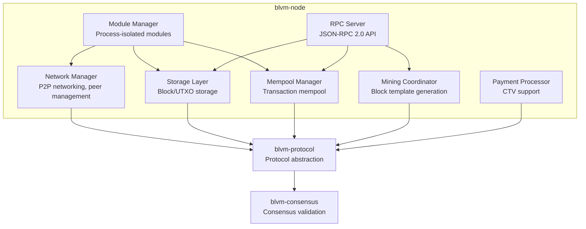

# Node Implementation Overview

The node implementation (`blvm-node`) is a minimal **reference** Bitcoin node: it adds only non-consensus infrastructure on top of the consensus and protocol layers. Treat mainnet and high-value deployments like any consensus-adjacent system—hardening, monitoring, and review are required. Consensus logic comes from [blvm-consensus](../consensus/overview.md), and protocol abstraction from [blvm-protocol](../protocol/overview.md).

**Release mainnet IBD:** [First Node Setup — Mainnet IBD](../getting-started/first-node.md#mainnet-initial-sync).

## Architecture

The node follows a layered architecture:

```mermaid
graph TB
    subgraph "blvm-node"
        NM[Network Manager<br/>P2P networking, peer management]
        SL[Storage Layer<br/>Block/UTXO storage]
        RS[RPC Server<br/>JSON-RPC 2.0 API]
        MM[Module Manager<br/>Process-isolated modules]
        MP[Mempool Manager<br/>Transaction mempool]
        MC[Mining Coordinator<br/>Block template generation]
        PP[Payment Processor<br/>CTV support]
    end
    
    PROTO[blvm-protocol<br/>Protocol abstraction]
    CONS[blvm-consensus<br/>Consensus validation]
    
    NM --> PROTO
    SL --> PROTO
    MP --> PROTO
    MC --> PROTO
    PP --> PROTO
    
    PROTO --> CONS
    
    MM --> NM
    MM --> SL
    MM --> MP
    
    RS --> SL
    RS --> MP
    RS --> MC
```

## Key Components

### Network Manager
- P2P protocol implementation (Bitcoin wire protocol)
- Multi-transport support (TCP, Quinn QUIC, Iroh)
- Peer connection management
- Message routing and relay
- Privacy protocols (Dandelion++ when `dandelion` feature enabled; FIBRE via **`blvm-fibre`** module)
- Package relay (BIP331)

### Storage Layer
- Database abstraction with multiple backends (see [Storage Backends](storage-backends.md))
- **Bitcoin Core drop-in**: one-time import from a synced Core datadir into `<datadir>/blvm/` when the `rocksdb` feature is enabled (see [Operations — Starting from a Core datadir](operations.md#starting-from-a-bitcoin-core-datadir))
- Automatic backend fallback on failure
- Block storage and indexing
- UTXO set management
- Chain state tracking
- Transaction indexing
- Pruning support

### RPC Server
- JSON-RPC 2.0 compliant API (see [RPC API Reference](rpc-api.md))
- **Bearer token RBAC** (`tokens`, `admin_tokens`) and **HTTP Basic** (`username`, `password`) for ckpool / Core-style clients
- Optional REST `/api/v1/*` when built with `rest-api` and **`[rest_api].enabled`** (separate bind; off by default — see [RPC API — REST](rpc-api.md#rest-api))
- Optional JSON-RPC over QUIC / HTTP/3 (see [RPC API — QUIC](rpc-api.md#quic-rpc))
- Authentication and rate limiting
- Method coverage

### Module System
- Process-isolated modules (see [Module System Architecture](../architecture/module-system.md))
- IPC communication (Unix domain sockets, see [Module IPC Protocol](../architecture/module-ipc-protocol.md))
- Security sandboxing
- Permission-based API access
- Hot reload support

### Mempool Manager
- Transaction validation and storage
- Fee-based transaction selection
- RBF (Replace-By-Fee) support with 4 configurable modes (Disabled, Conservative, Standard, Aggressive)
- Mempool policies and limits
- Transaction expiry
- Advanced indexing (address and value range indexing)

### Mining Coordinator
- Block template generation (RPC)
- Stratum V2 (optional `blvm-stratum-v2` module)

### Payment Processing
- CTV (CheckTemplateVerify) payment state machine when `ctv` compile-time feature is enabled
- BIP70 HTTP payment RPC when `bip70-http` is in the binary (**`blvm` default features**; omitted from portable release builds — see [Installation](../getting-started/installation.md))
- Lightning Network via optional **`blvm-lightning`** module (not core node RPC)
- Payment vaults / covenant tooling in `blvm-node` payment layer (CTV-gated at runtime)

### Governance Integration
- Optional `[governance]` configuration (e.g. Commons URL, relay toggles) and **`NODE_GOVERNANCE`** P2P capability for extensions such as **ban list sharing**
- Module-visible governance **events** (proposal lifecycle, webhooks, fork detection) for optional out-of-process modules

## Design Principles

1. **Zero Consensus Re-implementation**: All consensus logic delegated to [blvm-consensus](../consensus/overview.md)
2. **Protocol Abstraction**: Uses [blvm-protocol](../protocol/overview.md) for variant support (mainnet, testnet, regtest)
3. **Pure Infrastructure**: Adds storage, networking, RPC, orchestration only
4. **Feature-complete infrastructure**: Full node–style behavior (storage, P2P, RPC, modules) with [performance optimizations](performance.md); not a substitute for operational security review before production

## Features

### Network Features
- [Multi-transport architecture](transport-abstraction.md) (TCP, QUIC)
- [Transaction relay](privacy-relay.md) (Dandelion++; FIBRE via `blvm-fibre` module)
- High-performance block relay (FIBRE module)
- [Package relay](package-relay.md) (BIP331)
- [UTXO commitments](utxo-commitments.md) (compile-time feature in release binaries; enable at runtime when used)
- [Peer consensus protocol](peer-consensus.md), [spam filtering](spam-filtering.md) (bandwidth optimization during sync)
- [LAN peering system](lan-peering.md) (automatic local network discovery for faster IBD when LAN peers exist)
- [Parallel IBD](performance.md#parallel-initial-block-download-ibd) with optional [IBD UTXO engine](ibd-engine.md) (`BLVM_IBD_ENGINE=1`)

### Storage Features
- [Multiple database backends](storage-backends.md) with abstraction layer (**`auto` → heed3 (LMDB)** in typical release builds; optional RocksDB, redb, sled, tidesdb)
- [Common on-disk chain layouts](storage-backends.md#bitcoin-core-drop-in-migrate-on-start) via RocksDB backend
- Automatic backend fallback on failure
- Pruning support
- [Advanced transaction indexing](transaction-indexing.md) (address and value range indexes)
- UTXO set management

### Security Features
- [IBD bandwidth protection](ibd-protection.md) (per-peer/IP/subnet limits, reputation scoring)

### Module Features
- [Process isolation](../architecture/module-system.md#process-isolation)
- [IPC communication](../architecture/module-ipc-protocol.md)
- Security sandboxing
- Hot reload
- Module registry

### Mining Features
- Block template generation
- [Stratum V2 protocol](mining-stratum-v2.md) (optional `blvm-stratum-v2` module)
- Merge mining (optional `blvm-merge-mining` plugin)
- [Mining pool coordination](mining.md)

### Payment Features
- Lightning Network via optional **`blvm-lightning`** module
- CTV payment vaults and covenant proofs (requires `ctv` feature at build time)
- BIP70 payment RPC (requires `bip70-http` in the binary)
- Payment state machines (BIP70 / on-chain verify paths)

### Integration Features
- Governance webhook integration
- ZeroMQ notifications (optional **`blvm-zmq`** module — see [ZMQ module](../modules/zmq.md))
- Optional REST `/api/v1/*` (same caveats as [RPC Server](#rpc-server))
- Module registry (P2P discovery)

## Node Lifecycle

1. **Initialization**: Load configuration, initialize storage, create network manager
2. **Startup**: Connect to P2P network, discover peers, load modules
3. **Sync**: Download and validate blockchain history
4. **Running**: Validate blocks/transactions, relay messages, serve RPC requests
5. **Shutdown**: Graceful shutdown of all components

## Metrics and Monitoring

The node includes metrics collection:

- **Network Metrics**: Peer count, bytes sent/received, connection statistics
- **Storage Metrics**: Block count, UTXO count, database size
- **RPC Metrics**: Request count, error rate, response times
- **Performance Metrics**: Block validation time, transaction processing time
- **System Metrics**: CPU usage, memory usage, disk I/O

## Source

- [network/mod.rs](https://github.com/BTCDecoded/blvm-node/blob/main/src/network/mod.rs) (module root), [network_manager.rs](https://github.com/BTCDecoded/blvm-node/blob/main/src/network/network_manager.rs) (connection and message handling)
- [mod.rs](https://github.com/BTCDecoded/blvm-node/blob/main/src/storage/mod.rs)
- [mod.rs](https://github.com/BTCDecoded/blvm-node/blob/main/src/rpc/mod.rs)
- [manager.rs](https://github.com/BTCDecoded/blvm-node/blob/main/src/module/manager.rs)
- [mempool.rs](https://github.com/BTCDecoded/blvm-node/blob/main/src/node/mempool.rs)
- [miner.rs](https://github.com/BTCDecoded/blvm-node/blob/main/src/node/miner.rs)
- [mod.rs](https://github.com/BTCDecoded/blvm-node/blob/main/src/payment/mod.rs)
- [config/governance.rs](https://github.com/BTCDecoded/blvm-node/blob/main/src/config/governance.rs), [network/peer_manager.rs](https://github.com/BTCDecoded/blvm-node/blob/main/src/network/peer_manager.rs) (`governance` feature), [P2P governance extensions](../governance/p2p-governance-messages.md)
- [mod.rs](https://github.com/BTCDecoded/blvm-node/blob/main/src/node/mod.rs)
- [metrics.rs](https://github.com/BTCDecoded/blvm-node/blob/main/src/node/metrics.rs)
## See Also

- [Installation](../getting-started/installation.md) - Installing the node
- [Quick Start](../getting-started/quick-start.md) - Running your first node
- [Node Configuration](configuration.md) - Configuration options
- [Node Operations](operations.md) - Node management and operations
- [RPC API Reference](rpc-api.md) - JSON-RPC API documentation
- [Mining Integration](mining.md) - Mining functionality
- [Module System](../architecture/module-system.md) - Module system architecture
- [Storage Backends](storage-backends.md) - Storage backend details
