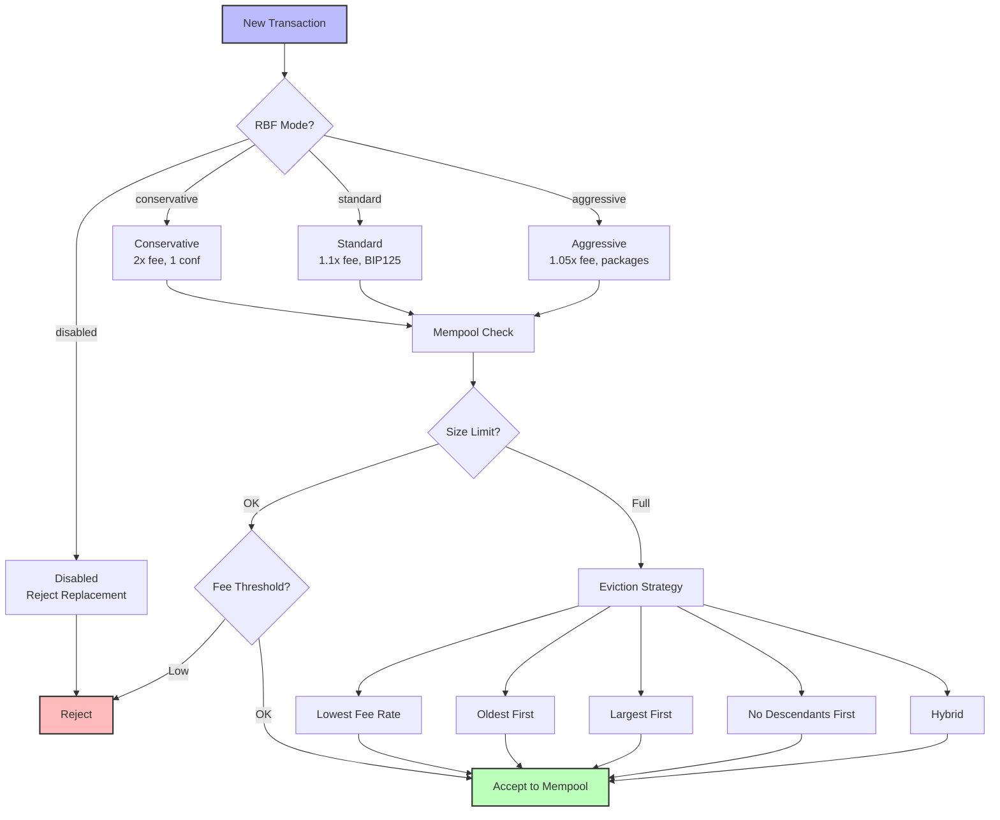

# RBF and Mempool Policies

Configure Replace-By-Fee (RBF) behavior and mempool policies to control transaction acceptance, eviction, and limits.

## RBF and Mempool Flow



## RBF Configuration

RBF allows transactions to be replaced by new transactions that spend the same inputs but pay higher fees. BLVM supports 4 configurable RBF modes.

### RBF Modes

#### Disabled

No RBF replacements are allowed. All transactions are final once added to the mempool.

**Use Cases:**
- Enterprise/compliance requirements
- Nodes that prioritize transaction finality
- Exchanges with strict security policies

**Configuration:**
```toml
[rbf]
mode = "disabled"
```

#### Conservative

Strict RBF rules with higher fee requirements and additional safety checks.

**Features:**
- 2x fee rate multiplier (100% increase required)
- 5000 sat minimum absolute fee bump
- 1 confirmation minimum before allowing replacement
- Maximum 3 replacements per transaction
- 300 second cooldown period

**Use Cases:**
- Exchanges
- Wallets prioritizing user safety
- Nodes that want to prevent RBF spam

**Configuration:**
```toml
[rbf]
mode = "conservative"
min_fee_rate_multiplier = 2.0
min_fee_bump_satoshis = 5000
min_confirmations = 1
max_replacements_per_tx = 3
cooldown_seconds = 300
```

#### Standard (Default)

BIP125-compliant RBF with standard fee requirements.

**Features:**
- 1.1x fee rate multiplier (10% increase, BIP125 minimum)
- 1000 sat minimum absolute fee bump (BIP125 MIN_RELAY_FEE)
- No confirmation requirement
- Maximum 10 replacements per transaction
- 60 second cooldown period

**Use Cases:**
- General purpose nodes
- Default configuration
- Bitcoin Core compatibility

**Configuration:**
```toml
[rbf]
mode = "standard"
min_fee_rate_multiplier = 1.1
min_fee_bump_satoshis = 1000
```

#### Aggressive

Relaxed RBF rules for miners and high-throughput nodes.

**Features:**
- 1.05x fee rate multiplier (5% increase)
- 500 sat minimum absolute fee bump
- Package replacement support
- Maximum 10 replacements per transaction
- 60 second cooldown period

**Use Cases:**
- Mining pools
- High-throughput nodes
- Nodes prioritizing fee revenue

**Configuration:**
```toml
[rbf]
mode = "aggressive"
min_fee_rate_multiplier = 1.05
min_fee_bump_satoshis = 500
allow_package_replacements = true
max_replacements_per_tx = 10
cooldown_seconds = 60
```

### RBF Configuration Parameters

| Parameter | Description | Default |
|-----------|-------------|---------|
| `mode` | RBF mode: `disabled`, `conservative`, `standard`, `aggressive` | `standard` |
| `min_fee_rate_multiplier` | Minimum fee rate multiplier for replacement | Mode-specific |
| `min_fee_bump_satoshis` | Minimum absolute fee bump in satoshis | Mode-specific |
| `min_confirmations` | Minimum confirmations before allowing replacement | `0` |
| `allow_package_replacements` | Allow package replacements | `false` |
| `max_replacements_per_tx` | Maximum replacements per transaction | Mode-specific |
| `cooldown_seconds` | Replacement cooldown period | Mode-specific |

### BIP125 Compliance

All modes enforce BIP125 rules:
- Existing transaction must signal RBF (sequence < 0xffffffff)
- New transaction must have higher fee rate
- New transaction must have higher absolute fee
- New transaction must conflict with existing transaction
- No new unconfirmed dependencies

Mode-specific requirements are applied in addition to BIP125 rules.

## Mempool Policies

Configure mempool size limits, fee thresholds, eviction strategies, and transaction expiry.

### Size Limits

```toml
[mempool]
max_mempool_mb = 300      # Maximum mempool size in MB (default: 300)
max_mempool_txs = 100000  # Maximum number of transactions (default: 100000)
```

### Fee Thresholds

```toml
[mempool]
min_relay_fee_rate = 1    # Minimum relay fee rate (sat/vB, default: 1)
min_tx_fee = 1000         # Minimum transaction fee (satoshis, default: 1000)
incremental_relay_fee = 1000  # Incremental relay fee (satoshis, default: 1000)
```

### Eviction Strategies

Choose from 5 eviction strategies when mempool limits are reached:

#### Lowest Fee Rate (Default)

Evicts transactions with the lowest fee rate first. Maximizes average fee rate of remaining transactions.

**Best for:**
- Mining pools
- Nodes prioritizing fee revenue
- Bitcoin Core compatibility

```toml
[mempool]
eviction_strategy = "lowest_fee_rate"
```

#### Oldest First (FIFO)

Evicts the oldest transactions first, regardless of fee rate.

**Best for:**
- Nodes with strict time-based policies
- Preventing transaction aging issues

```toml
[mempool]
eviction_strategy = "oldest_first"
```

#### Largest First

Evicts the largest transactions first to free the most space quickly.

**Best for:**
- Nodes with limited memory
- Quick space recovery

```toml
[mempool]
eviction_strategy = "largest_first"
```

#### No Descendants First

Evicts transactions with no descendants first. Prevents orphaning dependent transactions.

**Best for:**
- Nodes prioritizing transaction package integrity
- Preventing cascading evictions

```toml
[mempool]
eviction_strategy = "no_descendants_first"
```

#### Hybrid

Combines fee rate and age with configurable weights.

**Best for:**
- Custom eviction policies
- Balancing multiple factors

```toml
[mempool]
eviction_strategy = "hybrid"
```

### Ancestor/Descendant Limits

Prevent transaction package spam and ensure mempool stability:

```toml
[mempool]
max_ancestor_count = 25      # Maximum ancestor count (default: 25)
max_ancestor_size = 101000   # Maximum ancestor size in bytes (default: 101000)
max_descendant_count = 25   # Maximum descendant count (default: 25)
max_descendant_size = 101000 # Maximum descendant size in bytes (default: 101000)
```

**Ancestors**: Transactions that a given transaction depends on (parent transactions)  
**Descendants**: Transactions that depend on a given transaction (child transactions)

### Transaction Expiry

```toml
[mempool]
mempool_expiry_hours = 336  # Transaction expiry in hours (default: 336 = 14 days)
```

### Mempool Persistence

Persist mempool across restarts:

```toml
[mempool]
persist_mempool = true
mempool_persistence_path = "data/mempool.dat"
```

## Configuration Examples

### Exchange Node (Conservative)

```toml
[rbf]
mode = "conservative"
min_fee_rate_multiplier = 2.0
min_fee_bump_satoshis = 5000
min_confirmations = 1
max_replacements_per_tx = 3
cooldown_seconds = 300

[mempool]
max_mempool_mb = 500
max_mempool_txs = 200000
min_relay_fee_rate = 2
eviction_strategy = "lowest_fee_rate"
max_ancestor_count = 25
max_descendant_count = 25
persist_mempool = true
```

### Mining Pool (Aggressive)

```toml
[rbf]
mode = "aggressive"
min_fee_rate_multiplier = 1.05
min_fee_bump_satoshis = 500
allow_package_replacements = true
max_replacements_per_tx = 10
cooldown_seconds = 60

[mempool]
max_mempool_mb = 1000
max_mempool_txs = 500000
min_relay_fee_rate = 1
eviction_strategy = "lowest_fee_rate"
max_ancestor_count = 50
max_descendant_count = 50
```

### Standard Node (Default)

```toml
[rbf]
mode = "standard"

[mempool]
max_mempool_mb = 300
max_mempool_txs = 100000
min_relay_fee_rate = 1
eviction_strategy = "lowest_fee_rate"
max_ancestor_count = 25
max_descendant_count = 25
```

## Best Practices

1. **Exchanges**: Use conservative RBF and higher fee thresholds
2. **Miners**: Use aggressive RBF and larger mempool sizes
3. **General Users**: Use standard/default settings
4. **High-Throughput Nodes**: Increase size limits and use aggressive eviction

## Bitcoin Core Compatibility

Default values match Bitcoin Core defaults:
- `max_mempool_mb`: 300 MB
- `min_relay_fee_rate`: 1 sat/vB
- `max_ancestor_count`: 25
- `max_ancestor_size`: 101 kB
- `max_descendant_count`: 25
- `max_descendant_size`: 101 kB
- `eviction_strategy`: `lowest_fee_rate`

## See Also

- [Node Configuration](configuration.md) - Complete node configuration guide
- [Node Overview](overview.md) - Node features and architecture
- [Mempool Manager](../node/overview.md#mempool-manager) - Mempool implementation details

