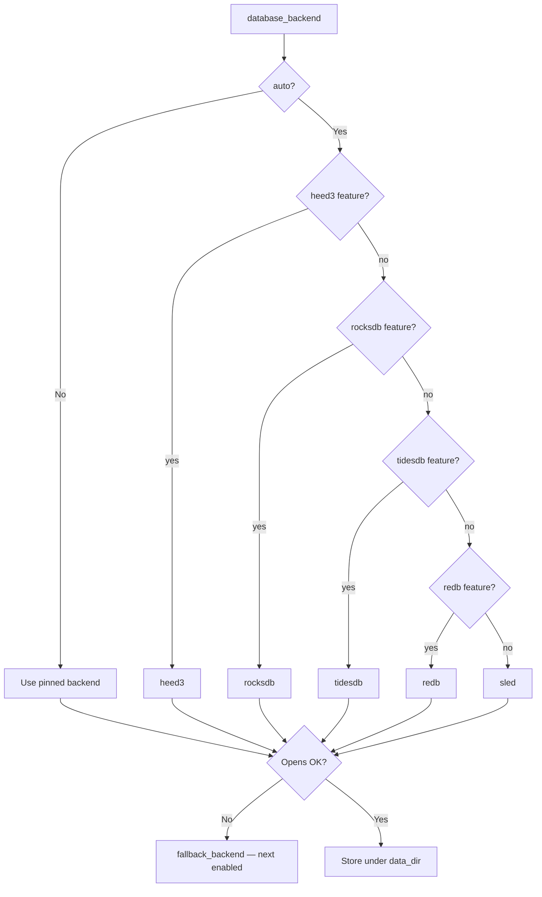

# Storage Backends

## Overview

The node supports multiple database backends for persistent storage of blocks, UTXO set, and chain state. When `database_backend = "auto"` (the default), the backend is chosen by **build features** via `default_backend()` — **not** by host OS. **heed3 (LMDB)** wins when the `heed3` feature is compiled in, then RocksDB, TidesDB, Redb, Sled. **`blvm` / `blvm-node` Cargo.toml defaults enable `heed3`**, so **`auto` → heed3** on a normal local build and on **Linux x86_64** release artifacts. **Windows portable** release CI omits heed3/rocksdb (`redb` + `sled` only) — there **`auto` → redb**. **Linux aarch64** should match other Linux builds (`auto` → heed3); the cross-compiled release artifact currently ships a minimal feature set without heed3 until CI links **liblmdb** for `aarch64-unknown-linux-gnu` (native `cargo build` on a Pi with default features already gets heed3). See [Configuration Reference](../reference/configuration-reference.md).

## Supported Backends

| Backend | Typical `auto` rank | Production | Core migrate | Notes |
|---------|---------------------|------------|--------------|-------|
| **heed3** (LMDB) | 1st (default builds) | Yes | No | `{datadir}/heed3/`; needs liblmdb |
| **rocksdb** | 2nd | Yes | **Yes** | Explicit or fallback; needs libclang |
| **tidesdb** | 3rd | When enabled | No | Optional feature |
| **redb** | 4th (Windows portable) | Yes | No | Pure Rust |
| **sled** | Last | Dev / fallback | No | Not recommended for production |

### rocksdb (optional; explicit config or fallback)

**RocksDB** remains available when the `rocksdb` feature is enabled (default builds include both `heed3` and `rocksdb`). Use **`database_backend = "rocksdb"`** to keep or create a RocksDB store, or when migrating from Core LevelDB layouts:

- **High performance** for large chain state
- **Interop**: Can work with **typical** LevelDB-format chain state and `blk*.dat` layouts where supported
- **Build**: Requires system **libclang** / LLVM for the `librocksdb-sys` stack
- **Feature**: `rocksdb` (on by default in `blvm-node` / `blvm` default features)


**Note**: RocksDB and **erlay** features are mutually exclusive in this tree (dependency conflicts).

### redb (pure Rust)

**redb** is a production-ready embedded database. It is chosen by **`auto` only when** RocksDB and TidesDB are **not** in the build (or you set `database_backend = "redb"`):

- **Pure Rust**: No C dependencies
- **ACID Compliance**: Full ACID transactions
- **Typical use**: `--no-default-features` / minimal builds that omit RocksDB, or explicit operator choice


### tidesdb

**TidesDB** is optional; in **`auto`** it is preferred over Redb/Sled **only when** RocksDB is not enabled. See crate features and [Configuration Reference](../reference/configuration-reference.md).

### heed3 (LMDB mdb.master3)

**heed3** wraps LMDB with MVCC concurrent readers (`WithoutTls` read transactions). **Default backend** when `database_backend = "auto"` in standard builds (`heed3` feature enabled):

- **MVCC**: Many concurrent read transactions; single writer (LMDB model)
- **rkyv UTXO encoding**: Zero-copy field access from mmap'd pages (`storage/rkyv_codec.rs`, `storage/utxo_value_codec.rs`)
- **Build**: Requires system **liblmdb**
- **Data directory**: `{datadir}/heed3/`
- **Feature**: `heed3` (enabled in default `blvm` / `blvm-node` features)

LMDB map size defaults to **64 GiB** (`max(65536, dbcache_mb × 128)` MB). Override only if you know your UTXO footprint:

```toml
[storage]
database_backend = "heed3"

[storage.heed3]
# map_size_mb = 65536   # default; required headroom for mainnet UTXO set
max_readers = 512
```

**Existing RocksDB datadir:** `auto` on a tree that already has `{datadir}/rocksdb/` does not migrate it. Use a fresh datadir for heed3, or set `database_backend = "rocksdb"` to keep the existing store.


### sled (Fallback)

**sled** is available as a fallback option:

- **Beta Quality**: Not recommended for production
- **Pure Rust**: No C dependencies
- **Performance**: Good for development and testing
- **Storage**: Key-value storage with B-tree indexing


## Backend Selection

When `database_backend = "auto"`, the node picks the **first compiled-in backend** below (not OS). Explicit values skip this chain.



**Core chainstate import** requires the **`rocksdb`** feature — use `blvm migrate core` / auto-migrate, independent of `auto` selection above.

### Selection order (`auto`)

1. **heed3 / LMDB** (if the `heed3` feature is enabled — default in standard builds)
2. **RocksDB** (if the `rocksdb` feature is enabled)
3. **TidesDB** (if the `tidesdb` feature is enabled and neither heed3 nor RocksDB is)
4. **Redb** (if the `redb` feature is enabled and no higher-priority backend is)
5. **Sled** (if the `sled` feature is enabled and no other backend is)

At least one backend feature must be enabled at build time. If the chosen backend fails to open (e.g. missing data dir or lock), the node may fall back to another enabled backend where implemented.

**Interop:** When RocksDB is enabled, the node may detect and use existing LevelDB-format chain data. That is separate from the `auto` selection order above.

### Core LevelDB interop {#core-leveldb-interop}

Bitcoin Core **`chainstate/`** uses **LevelDB** (`.ldb` / `.log` files). BLVM’s **`rocksdb`** migration path reads typical Core layouts via a dedicated LevelDB reader — **not** by opening chainstate as a native RocksDB database.

| Layout | Expected use |
|--------|----------------|
| Core **`chainstate/`** + **`blocks/`** | **`blvm start --data-dir …`** or **`blvm migrate core`** with **`rocksdb`** feature; imports into **`<datadir>/blvm/`** |
| Mixed or corrupt index (`.ldb` + stray `.sst`, wrong magic) | Migration fails — **do not** `rm -rf` blindly; stop the node, back up the datadir, fix or use a fresh Core sync |
| Existing **`{datadir}/heed3/`** or **`rocksdb/`** BLVM store | Core drop-in does **not** overwrite; use a fresh datadir or explicit backend choice |

Portable Windows/aarch64 builds without **`rocksdb`** cannot run Core chainstate migration — use Linux x86_64 / default-feature builds or sync without Core import.

See [Starting from a Bitcoin Core datadir](operations.md#starting-from-a-bitcoin-core-datadir) and [Troubleshooting — Corrupted database](../appendices/troubleshooting.md#corrupted-database).


### Automatic Fallback

If the backend chosen by `auto` fails to open, the node may fall back to another enabled backend (see `fallback_backend()` in code).

```rust
// Backend is chosen by default_backend() when using "auto"; fallback on open failure
let storage = Storage::new(data_dir)?;
```


## Database Abstraction

The storage layer uses one database abstraction interface:

### Database Trait

```rust
pub trait Database: Send + Sync {
    fn open_tree(&self, name: &str) -> Result<Box<dyn Tree>>;
    fn flush(&self) -> Result<()>;
}
```


### Tree Trait

```rust
pub trait Tree: Send + Sync {
    fn insert(&self, key: &[u8], value: &[u8]) -> Result<()>;
    fn get(&self, key: &[u8]) -> Result<Option<Vec<u8>>>;
    fn remove(&self, key: &[u8]) -> Result<()>;
    fn contains_key(&self, key: &[u8]) -> Result<bool>;
    fn len(&self) -> Result<usize>;
    fn iter(&self) -> Box<dyn Iterator<Item = Result<(Vec<u8>, Vec<u8>)>> + '_>;
}
```


## Storage Components

### BlockStore

Stores blocks by hash:

- **Key**: Block hash (32 bytes)
- **Value**: Serialized block data
- **Indexing**: Hash-based lookup


### UtxoStore

Manages UTXO set:

- **Key**: OutPoint (36 bytes: txid + output index)
- **Value**: UTXO data (script, amount)
- **Operations**: Add, remove, query UTXOs


### ChainState

Tracks chain metadata:

- **Tip Hash**: Current chain tip
- **Height**: Current block height
- **Chain Work**: Cumulative proof-of-work
- **UTXO Stats**: Cached UTXO set statistics


### TxIndex

Transaction indexing:

- **Key**: Transaction ID (32 bytes)
- **Value**: Transaction data and metadata
- **Lookup**: Fast transaction retrieval


## Configuration

### Backend Selection

```toml
[storage]
data_dir = "/var/lib/blvm"
database_backend = "auto"  # typical release: heed3 (LMDB); or "rocksdb" | "tidesdb" | "redb" | "sled"
```

**Options**:
- `"auto"`: Select by build features (heed3 when `heed3` enabled, then RocksDB, TidesDB, Redb, Sled)
- `"heed3"`: Force heed3 / LMDB (requires `heed3` feature; rkyv UTXO encoding)
- `"rocksdb"`: Force RocksDB (requires `rocksdb` feature)
- `"tidesdb"`: Force TidesDB (requires `tidesdb` feature)
- `"redb"`: Force redb backend
- `"sled"`: Force sled backend


### RocksDB Configuration

The **`rocksdb`** feature is **enabled by default** in `blvm-node` / `blvm`; you only need flags when building a **minimal** tree without RocksDB:

```bash
cargo build -p blvm-node --features rocksdb
```

**System Requirements**:
- `libclang` must be installed (required for RocksDB FFI bindings)
- On Ubuntu/Debian: `sudo apt-get install libclang-dev`
- On Arch: `sudo pacman -S clang`
- On macOS: `brew install llvm`

**Default data directories** (common layouts):
The system can detect typical Bitcoin-style data directories:
- Mainnet: `~/.bitcoin/` or `~/Library/Application Support/Bitcoin/`
- Testnet: `~/.bitcoin/testnet3/` or `~/Library/Application Support/Bitcoin/testnet3/`
- Regtest: `~/.bitcoin/regtest/` or `~/Library/Application Support/Bitcoin/regtest/`


### Cache Configuration

```toml
[storage.cache]
block_cache_mb = 100
utxo_cache_mb = 50
header_cache_mb = 10
```

**Cache Sizes**: See [Configuration Reference](../reference/configuration-reference.md) for canonical defaults (e.g. block 100 MB, UTXO 50 MB, header 10 MB).


## Performance Characteristics

### redb Backend

- **When**: Explicit `database_backend = "redb"` or `auto` without RocksDB/TidesDB in the build
- **Read Performance**: Excellent for sequential and random reads
- **Write Performance**: Good for batch writes
- **Production**: A solid **pure-Rust** choice when you are not using RocksDB

### heed3 (LMDB) Backend

- **When**: Default **`auto`** path in standard `blvm` builds (`heed3` feature enabled)
- **Read/Write**: LMDB + rkyv UTXO encoding; mmap-friendly reads for IBD

### RocksDB Backend

- **When**: Explicit `database_backend = "rocksdb"`, or **`auto`** when the `heed3` feature is absent from the build (Windows portable CI). Standard Linux / default-feature builds use heed3 for `auto`.
- **Read/Write**: Tuned for large chain-state workloads; required for Core LevelDB migration reader

### sled Backend

- **Read Performance**: Good for sequential reads
- **Write Performance**: Good for batch writes
- **Storage Efficiency**: Efficient with B-tree indexing
- **Memory Usage**: Higher memory footprint
- **Production Ready**: Beta quality, not recommended for production

## Migration

### Bitcoin Core drop-in (migrate on start)

With the **`rocksdb`** feature (**`blvm` default features**; omitted from portable Windows/aarch64 release builds), point **`--data-dir`** at a **synced Core** tree (`chainstate/` + `blocks/`) to import once into **`<datadir>/blvm/`**. Stop **`bitcoind`** first; match **`--network`** to the datadir.

**Operator steps:** [Starting from a Bitcoin Core datadir](operations.md#starting-from-a-bitcoin-core-datadir). **Flags and ENV:** [Bitcoin Core drop-in](configuration.md#bitcoin-core-drop-in). **Config keys:** `storage.auto_migrate_core`, `core_migrate_destination`, `storage.reuse_core_block_files`.

After success, **`blvm_meta/migration.json`** marks the store; interrupted runs resume via **`blvm_meta/migration_checkpoint.json`**.

**Reuse Core block files (default):** `storage.reuse_core_block_files` defaults to **`true`**. Migration converts the UTXO set and builds indexes under **`blvm/`** but **leaves Core `blocks/` in place** — BLVM reads **`blk*.dat`** via a fallback reader. **Do not delete** the Core **`blocks/`** directory while this mode is active. Disable with **`storage.reuse_core_block_files = false`** or **`BLVM_REUSE_CORE_BLOCK_FILES=0`** to copy block bodies into the BLVM store (requires roughly double disk space for blocks).

**Pruned Core:** migration may fail if block files do not cover the chain tip; use a full node datadir or disable reuse and accept limited coverage.

**Limits:** no concurrent Core + BLVM on the same chainstate; no write-back into Core LevelDB.

**Code:** [bitcoin_core_migrate.rs](https://github.com/BTCDecoded/blvm-node/blob/main/src/storage/bitcoin_core_migrate.rs), [storage/mod.rs](https://github.com/BTCDecoded/blvm-node/blob/main/src/storage/mod.rs) (`open_for_node`).

### Backend migration

To migrate between backends:

1. **Export Data**: Export all data from current backend
2. **Import Data**: Import data into new backend
3. **Verify**: Verify data integrity

**Note**: Manual migration is supported. Export data from the current backend and import into the new backend.

## Pruning Support

All backends support pruning:

```toml
[storage.pruning]
mode = { type = "normal", keep_from_height = 0, min_recent_blocks = 288 }
auto_prune = true
auto_prune_interval = 144
```

**Pruning Modes**:
- **Disabled**: Keep all blocks (archival node)
- **Normal**: Conservative pruning (keep recent blocks)
- **Aggressive**: Prune with UTXO commitments (requires utxo-commitments feature)
- **Custom**: Fine-grained control over what to keep


## Error Handling

The storage layer handles backend failures gracefully:

- **Automatic Fallback**: Falls back to alternative backend if primary fails
- **Error Recovery**: Attempts to recover from transient errors
- **Data Integrity**: Verifies data integrity on startup
- **Corruption Detection**: Detects and reports database corruption


## Source

- [database/mod.rs](https://github.com/BTCDecoded/blvm-node/blob/main/src/storage/database/mod.rs) (`default_backend()`, `fallback_backend()`, `Database` / `Tree` traits)
- [heed3_impl.rs](https://github.com/BTCDecoded/blvm-node/blob/main/src/storage/database/heed3_impl.rs)
- [storage/mod.rs](https://github.com/BTCDecoded/blvm-node/blob/main/src/storage/mod.rs), [bitcoin_core_migrate.rs](https://github.com/BTCDecoded/blvm-node/blob/main/src/storage/bitcoin_core_migrate.rs)
- [blockstore.rs](https://github.com/BTCDecoded/blvm-node/blob/main/src/storage/blockstore.rs), [utxostore.rs](https://github.com/BTCDecoded/blvm-node/blob/main/src/storage/utxostore.rs), [chainstate.rs](https://github.com/BTCDecoded/blvm-node/blob/main/src/storage/chainstate.rs), [txindex.rs](https://github.com/BTCDecoded/blvm-node/blob/main/src/storage/txindex.rs)
- [config/storage.rs](https://github.com/BTCDecoded/blvm-node/blob/main/src/config/storage.rs), [bitcoin_core_detection.rs](https://github.com/BTCDecoded/blvm-node/blob/main/src/storage/bitcoin_core_detection.rs)
## See Also

- [Node Configuration](configuration.md) - Storage configuration options
- [Node Operations](operations.md) - Storage operations and maintenance
- [Pruning](#pruning-support) — pruning configuration on this page; see also [Node configuration](configuration.md)
