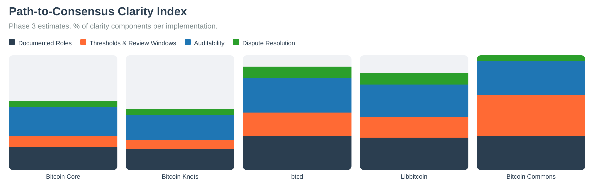

# Orange Paper

The Orange Paper provides the mathematical specification of Bitcoin consensus.

{{#include ../../../modules/bllvm-spec/THE_ORANGE_PAPER.md}}

## Principles of Bitcoin Commons

*Figure: Principles of Bitcoin Commons showing the synthesis of Bitcoin's cryptographic enforcement, Hayek's competitive discovery, and Ostrom's institutional structure.*

## Path to Clarity

*Figure: Path from codebase to mathematical specification. The Orange Paper extracts consensus rules from Bitcoin Core's implementation, creating a formal mathematical specification that enables independent implementations.*

